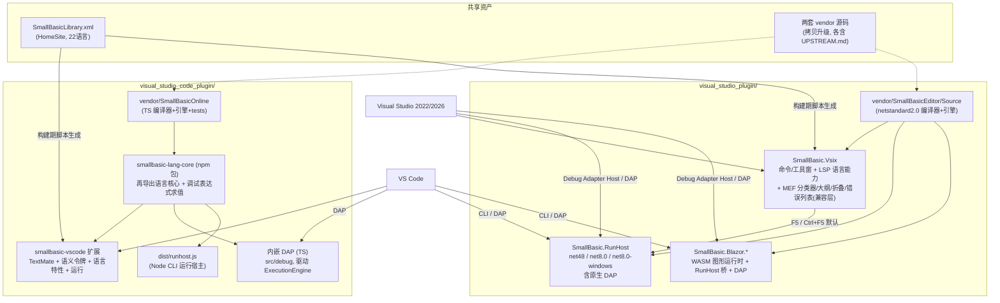

# 02 技术选型与总体架构

> **2026-09-28 现状校准**
>
> - 后端由最初的“TS / .NET 二选一”扩展为**三后端**：JavaScript、C#、Blazor（见下方 ADR-5）。Blazor 后端用浏览器内 WASM 解释器 + SVG 渲染图形，解决 JS 后端无法承载 `GraphicsWindow` 的缺口（见 [09](./09-Blazor与Web运行宿主.md)）。
> - 源码消费落地为**拷贝到 `vendor/` + 再包一层**（见下方 ADR-4），而非拷贝进包/`src` 目录。
> - 调试适配器是**三个内嵌实现**（TS 内嵌于 VS Code 扩展、C# 内嵌于 `SmallBasic.RunHost`、Blazor 内嵌于 `SmallBasic.Blazor.RunHost`），不是两个独立可执行包。
> - 语言智能仍严格遵循“各 IDE 用自身原生引擎”，不受后端选择影响。

## 1. 决策问题

用户提出的选型问题：**dotnet 与 JS 运行时，二选一还是两者都支持？**

拆解为两个子决策：

1. **语言智能**（着色/补全/悬停/诊断）用什么运行时承载？
2. **编译运行与调试**用什么引擎承载？

## 2. 候选方案对比

### 方案 A：双宿主原生复用（推荐）

VS Code 插件复用 TS 编译器（SmallBasicOnline），VS 插件复用 .NET 编译器（SmallBasicEditor），各自在宿主进程内直接调用，调试各自实现 DAP 适配器。

| 维度 | 评估 |
|---|---|
| 性能 | **最优**：进程内调用，无 IPC；编译是微秒~毫秒级同步调用 |
| 代码复用 | 两套编译器都**已存在且有测试**，复用率最高 |
| 部署 | VS Code 扩展是 JS 单包（另内置各后端宿主载荷）；VSIX 含 .NET 程序集 + JS bundle + Blazor 发布输出 |
| 维护成本 | 语言演进需改两处（但 SB 语言已冻结多年，风险低） |
| 行为一致性 | 有风险 → 用共享一致性测试集对冲（见 07） |

### 方案 B：单一 .NET 核心 + LSP/DAP 服务，两端共享

把 `SmallBasic.Compiler` 现代化为 net8.0，包成 LSP 服务器；VS Code 扩展做 LSP 客户端，VS 2026 走 `Microsoft.VisualStudio.LanguageServer.Client`。

| 维度 | 评估 |
|---|---|
| 性能 | 差于 A：JSON-RPC IPC + 序列化开销；冷启动多一个进程 |
| 代码复用 | 单核维护友好，但 TS 编译器资产被废弃 |
| VS 侧可行性 | **差**：VS 的 LSP 客户端扩展点能力有限且生态冷门；语法着色分类器仍需 MEF 原生代码，无法绕开 |
| 部署 | VS Code 扩展需捆绑 .NET 运行时或要求用户安装，包体积与首装体验变差 |

### 方案 C：单一 TS 核心，两端共享

VS 侧用 JS 引擎（如通过 Jint/Node 子进程）跑 TS 编译器。

| 维度 | 评估 |
|---|---|
| VS 侧可行性 | **差**：VS 扩展进程（.NET Framework 4.8）内嵌 JS 引擎有互操作与性能问题；MEF 分类器每次击键跨语言调用不可行 |
| 结论 | 否决 |

### 决策：**采用方案 A**

理由：

1. 两套编译器均已功能完整、带测试，**分别在目标宿主的母语运行时下**——这是历史代码给的天然禀赋。
2. 性能最优（语言服务全在进程内，无序列化）。
3. VS 的编辑器扩展（分类器、补全）无论如何都要写原生 MEF 代码，LSP 无法省掉这部分工作量。
4. Small Basic 语言语法已多年冻结，双实现的发散风险主要落在**库行为**，用共享一致性测试集覆盖。
5. 调试协议（DAP）层面统一：VS 2026 内置 **Debug Adapter Host**，可直接挂载 VS Code 风格的调试适配器，因此调试 UX 两端一致。

## 3. 总体架构

## 4. 关键架构决策记录（ADR）

### ADR-1 语言核心：双引擎原生复用
见第 2 节。VS Code 侧把 `official_repo/online/src/compiler`（连同 `src/strings`、`tests/compiler`）拷贝到 `visual_studio_code_plugin/vendor/SmallBasicOnline`（升级至 TS 5.x，去除 React/Monaco 依赖——`services/` 本就与 Monaco 解耦），再由 npm 包 `packages/smallbasic-lang-core` 统一再导出供扩展与调试代码使用。VS 侧把 `SmallBasic.Compiler` + `SmallBasic.Utilities`（连同 `SmallBasic.Editor/Libraries`）拷贝到 `visual_studio_plugin/vendor/SmallBasicEditor/Source` 并以项目引用方式编译。

### ADR-2 调试协议：DAP 统一，三适配器实现
三个后端各有一个 DAP 调试适配器，全部复用引擎原生的行级暂停钩子，断点吸附在适配器层实现：
- **JavaScript**：内嵌于 VS Code 扩展（`packages/smallbasic-vscode/src/debug/`），直接驱动 TS `ExecutionEngine`；桌面以子进程 DAP 运行，Web 以 `DebugAdapterInlineImplementation` 内联运行。
- **C#**：内嵌于 `SmallBasic.RunHost`（`debug` 子命令，stdio 原生 DAP），由 VS Code 以 `DebugAdapterExecutable` 启动，或由 VS 经 Debug Adapter Host 启动。
- **Blazor**：内嵌于 `SmallBasic.Blazor.RunHost`（`debug` 子命令），文本程序在宿主内调试、图形程序经 WebSocket 桥接到浏览器 WASM 解释器。

VS 2022/2026 通过内置 Debug Adapter Host 消费 .NET 适配器，避免编写 AD7 调试引擎（工作量减少约一个数量级）。详见 [05-调试架构设计.md](./05-调试架构设计.md)。

### ADR-3 不引入 LSP
VS Code 侧语言特性在扩展进程内直接调用编译器（功能等价、性能更好、少一个进程）；若未来出现第三方编辑器需求，再基于 `smallbasic-lang-core` 包一层 LSP 服务器即可，核心代码零改动。

### ADR-4 源码消费方式：拷贝出子模块 + 升级现代化（不使用子模块引用）

两个子模块的源码**拷贝**到插件仓库内独立维护，并升级适配最新编译器/运行时/IDE。不以 git 子模块方式直接引用。理由：

1. 上游仓库（sb/SmallBasic-Online、sb/smallbasic-editor）已 6+ 年停更，无同步需求；拷贝后可自由重构。
2. 旧工程锁定过期工具链（.NET Core SDK 2.1.816 / TypeScript 2.5.3 / webpack 3），在现代 IDE 与 CI 上无法直接构建，**必须升级**，升级改动不应污染子模块。
3. 插件的发布物必须是自包含的（vsix / VSIX 单包），拷贝内置消除外部依赖。

拷贝时在每个目标目录记录 `UPSTREAM.md`（来源仓库名 + 本地拷贝源路径 + 拷贝日期 + 拷贝子集 + 目的），保留追溯能力。

**拷贝与升级清单（实际落地）**：

| 源 | 拷贝到 | 拷贝范围 | 升级内容 |
|---|---|---|---|
| `official_repo/online/src/compiler` + `src/strings` + `tests/compiler` | `visual_studio_code_plugin/vendor/SmallBasicOnline` | 全部（syntax/binding/emitting/runtime/services/utils + strings + 测试） | 提升到 TS 5.x 工具链；测试直接由仓库根 vitest 接管（`tests/legacy-compiler.spec.ts` 再导出 vendor 的 `tests-list`）；`packages/smallbasic-lang-core` 仅做**再导出**与调试表达式求值扩展，不再是拷贝目标 |
| `official_repo/editor/Source`（`SmallBasic.Compiler` + `SmallBasic.Utilities` + `SmallBasic.Tests` + `SmallBasic.Editor/Libraries` + `SmallBasic.Analyzers` + `Directory.Build.props` + `stylecop.json`） | `visual_studio_plugin/vendor/SmallBasicEditor/Source` | 全部 .cs + resx + 生成用 XML + 分析器 + 构建属性 | 目标框架 `netstandard2.0`（由 VSIX 与各 RunHost 引用）；保留原 StyleCop/`SmallBasic.Analyzers` 分析器链与 `IsBuildingForDesktop` 开关；测试项目为 `tests/SmallBasic.Compiler.Tests`（`net8.0-windows`，xunit 2.9.2 + FluentAssertions 7.0.0） |

> 注意：实际落地**没有**独立出 `SB.Compiler`/`SB.Utilities`/`SB.DebugAdapter` 项目，也没有把 TS 编译器拷进 `packages/sb-lang-core`；`SB.DebugAdapter` 的职责由 `SmallBasic.RunHost debug` 与 `SmallBasic.Blazor.RunHost debug` 承担。

**不拷贝**：`SmallBasic.Editor`（Blazor 0.7 UI 主体）、`SmallBasic.Server`、`SmallBasic.Bridge`（Electron 桥）、`SmallBasic.Client`（webpack/TS 前端）、SmallBasicOnline 的 `src/app`、`electron`、`build`。这些与插件无关或已被新宿主取代；`SmallBasic.Editor/Libraries` 与 `SmallBasic.Analyzers` 则**随编译器一起拷贝**（前者作为宿主库实现参考，后者供 vendor 项目构建使用）。

**升级验证门禁**：升级完成以"既有测试套件在新工具链下全绿 + 一致性测试集通过"为唯一验收，功能零改动（纯工程化升级，不改语言语义）。

### ADR-5 三后端可选：运行/调试后端可配置（JavaScript / C# / Blazor）

两端 IDE 的**语言智能固定用原生后端**（VS Code 用 TS 引擎、VS 用 .NET 引擎，性能最优），但**运行与调试的后端做成可配置选项**——每个 IDE 都能选择用 JS、C# 或 Blazor 引擎执行/调试当前 `.sb` 文件：

- **统一 CLI 契约**：三个后端各自提供命令行运行宿主与调试适配器——
  - JS 后端：`smallbasic-runhost.js`（Node 20，`packages/smallbasic-vscode` 打包产物）+ 内嵌 TS DAP。
  - C# 后端：`SmallBasic.RunHost`（VS Code 用 net8.0-windows/net8.0；VS 用随 VSIX 分发的 net48）+ `debug` 子命令内嵌的 DAP。
  - Blazor 后端：`SmallBasic.Blazor.RunHost`（net8.0）+ `debug` 子命令内嵌的 DAP。
  - 契约相同：`run --file <file.sb> [--pause]` 走 stdin/stdout 交互；`debug` 走 stdio 上的 DAP。
- **后端选择方式**：
  - VS Code：三个显式运行命令 `smallbasic.runJavaScript` / `smallbasic.runCSharp` / `smallbasic.runBlazor`；`launch.json` 用 `backend: "javascript" | "csharp" | "blazor"` 选择后端，用 `mode: "cli" | "web"` 选择命令行或浏览器运行模式。`mode` 默认 `cli`；Web 模式支持 JavaScript/Blazor，C# 仅支持 CLI。VS Code for Web 会强制使用 Web 模式。未指定 `backend` 时仍按「Windows 且有 C# 宿主 → `csharp`，否则 `javascript`」选择（Blazor 只支持显式指定）。
  - VS：默认 `F5`/`Ctrl+F5` 走 C#；Tools → Small Basic 子菜单提供 C#/JS/Blazor 的运行与调试入口（无选项页）。
- **默认后端**：VS Code 桌面 Windows 默认 C#（有内置宿主时），其余平台默认 JS；VS 默认 C#。
- **备选后端的投递**：VS Code 扩展实际已内置 windows/portable/blazor 三份宿主载荷（在扩展 `runhost/` 目录下），VS 侧 JS 后端只捆 `runhost/javascript/smallbasic-runhost.js` 并复用系统 Node 20+（不内置 Node）。
- **主要价值**：JS 后端跨平台（含 VS Code for the Web）但无图形；C# 后端在 Windows 提供原生 `GraphicsWindow`；Blazor 后端跨平台用浏览器 WASM + SVG 提供图形，弥补 JS 的缺口（见 [09](./09-Blazor与Web运行宿主.md)）。
- **能力差异**：JS 与便携 C# 宿主遇图形程序会**显式拒绝**并提示切换后端，而不是运行期崩溃。

### ADR-6 文件与语言标识
- 扩展名：`.sb`（与官方一致）。
- 语言 ID：`smallbasic`（VS Code / VS 两侧统一；Monaco 时代的 `sb` 弃用）。
- 无项目系统：`*.sb` 单文件程序（`.sb` 原生即单文件），VS 侧走"打开文件夹/杂项文件"即可编辑调试，暂不提供 `.sbproj`。

### ADR-7 运行时库分期（实际完成情况）
- **已实现（三后端一致）**：`TextWindow` 与纯计算库 `Array/Clock/Dictionary/Math/Program/Stack/Text/Timer`。
- **已实现（图形，后端相关）**：Windows C# 宿主经官方 `Microsoft.SmallBasic.Library` 提供桌面 `GraphicsWindow/Shapes/Turtle`；Blazor 后端在浏览器内以 SVG/Canvas 提供同样的图形能力（跨平台）。
- **未实现**：`Controls/Desktop/File/Flickr/ImageList/Mouse/Network/Sound` 等仍为占位实现，被调用时抛明确的 `NotSupportedException`（而非静默失败）。
- **JS 与便携 C# 宿主为纯文本**：遇到图形程序在启动前拒绝并提示切换后端。

详见 [06-运行时库与宿主集成.md](./06-运行时库与宿主集成.md)。

## 5. 性能设计原则（详见 07 文档）

1. **编译结果缓存 + 防抖**：以文档版本号为键缓存 `Compilation`，诊断防抖 150ms，补全同步计算（SB 程序小，全量编译成本 <10ms@10k 行量级，实测预算见 07）。
2. **零 IPC**：语言智能全在宿主进程内。
3. **后台化**：VS 侧解析在后台线程；VS Code 侧大文件可选 web worker（二期）。
4. **调试开销可控**：断点命中判定在适配器循环内 O(1) 集合查找。

## 6. 风险与对策

| 风险 | 影响 | 对策 |
|---|---|---|
| 多引擎行为发散 | 同一程序不同后端运行结果不同 | 各引擎保留 vendor 既有测试；以官方 Small Basic 1.2 行为为准绳；同一 `.sb` 可多后端对跑人工/自动比对（统一的一致性测试集尚未落地，见 [07](./07-测试与性能方案.md)） |
| 拷贝后脱离上游，错过上游修复 | 缺陷需自行维护 | 上游已 6+ 年停更，实际风险极低；各 vendor 目录的 `UPSTREAM.md` 记录来源与拷贝日期，保留追溯与再同步能力 |
| 旧代码升级引入回归（TS 2.5→5.x） | 语言服务出错 | 升级门禁：既有测试套件先在新工具链下全绿再做任何重构；升级期不改语言语义。.NET 编译器保持 `netstandard2.0`，由 xunit 测试守护 |
| VS Debug Adapter Host 对 DAP 子集支持不全 | 调试功能降级 | 已实测 `setBreakpoints/launch/stackTrace/variables/continue/next/stepIn/stepOut/pause/terminate/evaluate` 可用；VS 侧改用 `DebugAdapterHost.Launch` + 临时 launch.json，不依赖 `vsdconfig` |
| JS 后端无图形能力 | 图形程序在跨平台/Web 场景不可用 | 跨平台图形由 Blazor 后端（WASM + SVG）覆盖；Windows 由 C# 图形宿主覆盖；JS/便携 C# 遇图形程序显式拒绝并提示切换后端 |
