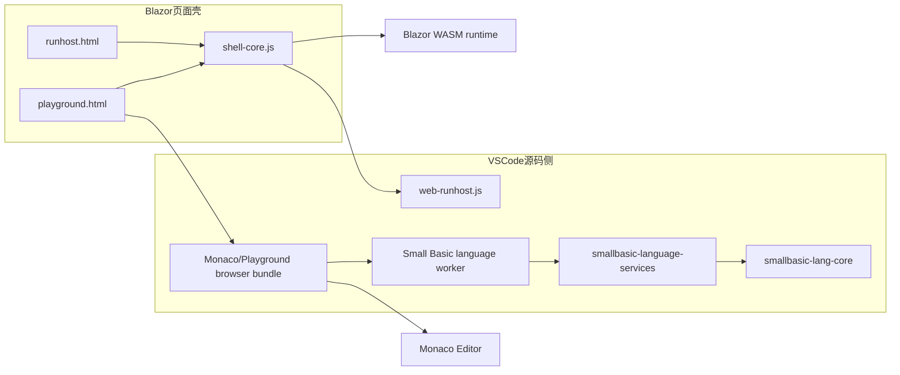

# 10 Playground 与 Tauri 本地应用设计

> **从 09 拆分（2026-10-02）**
>
> 本文集中描述 Monaco Playground 的页面入口、共享语言 Worker、构建分发、页内调试与实测状态，并在第 17–19 节加入 Tauri v2 本地应用方案。Blazor / CLI RunHost、静态 Web RunHost 与 VS Code Web 模式保留在 [09-Blazor与Web运行宿主.md](./09-Blazor与Web运行宿主.md)。
>
> 当前浏览器 Playground 已落地；Tauri 桌面集成已于 2026-10-02 按 §17–19 设计落地第一到四阶段（桌面壳与能力探测、三类 CLI sidecar Run、通用 DAP 桥、Blazor 图形会话握手），实现位于 `visual_studio_code_plugin/packages/smallbasic-playground-desktop/`，跨平台发布矩阵（第五阶段）仍待 CI 建设。桌面侧已补齐单元、契约与载荷边界测试（§13.4），并在该轮测试中修复了 Blazor CLI 断点早于 `launch` 到达时无法验证的问题（§19.3）。文档会明确区分“已完成的 Web 能力”和“桌面能力当前进度”。
>
> **2026-10-03 重要变更**：桌面 CLI 后端先收敛为仅 C#——CLI Blazor 在打包后的应用里调用不成功，CLI JavaScript（Node sidecar）随之一并移除（Node/Blazor sidecar 打包、Blazor 图形 Webview 握手与 `smallbasic/blazorSession` 通知均删除）；随后 C# 又拆成 **`.NET Framework 4.8`** 与 **`.NET 8.0`** 两个下拉选项，Backend 选项目前为 `JavaScript (TextWindow)` / `Blazor WASM (GraphicsWindow)` / `C# (.NET Framework 4.8)` / `C# (.NET 8.0)`。net48 是 Windows 独有的文件夹部署，因此 `resources/` 载荷树与资源目录解析以「只承载 net48 宿主」的形式恢复，并由仅 Windows 生效的 `tauri.windows.conf.json` 声明。§17–19 中描述三后端/图形会话的段落保留了当时的设计意图，并在对应位置标注为历史或已移除；当前实现口径以本节与 §13.5、§17.2、§18.1、§18.5、§19.3 的说明为准。

> **2026-10-01 新增，同日实施落地。**
>
> 目标是在 `runhost/web` 产物中新增 `playground.html`，提供“浏览器内编辑 + 运行”入口；把当前 `index.html` 的纯运行职责沉淀为 `runhost.html`；Monaco 编辑器与 Small Basic 语言能力统一从 `visual_studio_code_plugin/` 下的源码构建并复制过来，避免再造一套网页版语言层。Playground 专属的 Monaco / TextMate / Worker 资源只进入 `runhost/web`，不默认塞入 CLI 与 VSIX 共用的 `runhost/blazor` 载荷。
>
> 关联文档：
>
> - [03-VSCode插件设计.md](./03-VSCode插件设计.md)
> - [05-调试架构设计.md](./05-调试架构设计.md)
> - [09-Blazor与Web运行宿主.md](./09-Blazor与Web运行宿主.md) 第一部分“Blazor WASM 与 CLI RunHost”
> - [09-Blazor与Web运行宿主.md](./09-Blazor与Web运行宿主.md) 第二部分“静态 Web RunHost 与 VS Code Web 模式”
>
> **实施状态（2026-10-01）**：第 15 节实施顺序的 1–5 步与第 6 步的折叠、定义跳转、引用查找均已落地——
>
> - 入口重构：`runhost.html`（原 `index.html`）、薄路由 `index.html`、`shell-core.js` + `runhost-page.js` 拆分、CLI 会话显式指向 `runhost.html`；
> - 共享语言层：`smallbasic-language-services` 中立包（补全 / 悬停 / 签名帮助 / 诊断 / 文档符号 / 语义令牌 / 折叠 / 导航）+ `language.worker.ts` 专用 Worker；
> - Monaco 集成：TextMate + Oniguruma 桥接、language-configuration / snippets 适配、已实现 provider 注册、`playground.html` 编辑 + 运行；
> - 构建链：`npm run build:playground` 产出 `playground-dist/**`，`Build-RunHost.ps1` 硬校验并做负向载荷检查；
> - 测试：language-services 单元测试 + `tests/webview/runhost-web.spec.ts` 页面级 E2E；
> - 界面提示按浏览器语言本地化：偏好语言列表中出现任意 `zh-*` 即显示页面内置中文，否则显示英文；页头提供 中/EN 切换按钮，选择存入 `localStorage`（`smallbasic.uiLocale`）并优先于检测（机制见 `shell-core.js` 的 `SmallBasicRunHostShell.applyStaticText` 与各页面文案字典）；语言 Worker 通过 `configure` 请求接收同一 locale 决定，调用 `setDocumentationLocale` 让悬停/补全的 API 文档同步切换；状态栏短关键词（Loaded/Running/Completed 等）保持语言中立；
> - 页内调试已落地（第 11 节二阶段，双后端）：`PlaygroundDebugController` 驱动 web 调试协议——glyph margin 断点（VS Code 配色：已验证实心红点 / 未验证灰色空心圈 / codicon 栈帧箭头，会话结束即清除）、常驻悬浮调试工具条（codicon 图标：继续⇄暂停、单步、重启、停止，非调试时整条禁用，F5/F10/F11/Shift+F11/Shift+F5 快捷键）、当前栈帧高亮、调用堆栈与变量面板、调试期间 TextWindow 输出进面板、编辑首次修改自动终止会话。JS 后端引擎在页面内直连；Blazor 后端经 `SetSession(debug)` + `DispatchDebugCommand` interop 驱动 WebAssembly 会话（注意：C# 会话用 start 消息携带的断点覆盖断点集合，因此 start 必须随行携带断点；同理，单步 control 必须携带暂停栈的帧数作为 depth——两端都以 `depth <= startingDepth` 判定步过落点，缺失时 JS 会话回退为当前栈深），图形窗口在调试期间保持渲染。
>
> 重命名与常驻 Outline 面板按第 8.2 节边界暂缓。

## 1. 目标与非目标

### 1.1 目标

1. 在最终分发目录 `runhost/web/` 中新增 `playground.html`，作为静态站点默认的“编辑 + 运行”页面。
2. 将当前 `index.html` 的运行页职责下沉为 `runhost.html`，保留其现有 UI、后端选择、输出面板、输入行、JS/Blazor 运行能力。
3. 让 `playground.html` 在视觉和交互上**复用现有 RunHost 页面逻辑与 UI**，只增量叠加 Monaco 编辑器，而不是再做第二套网页壳子。
4. Small Basic 语言能力统一复用 `visual_studio_code_plugin/` 下的源码与构建产物，并通过独立语言 Worker 接入 Monaco，至少覆盖：
   - 语法着色
   - 语义着色
   - 诊断
   - 补全
   - 悬停
   - 签名帮助
   - 文档符号 / Quick Outline
5. 明确折叠、定义跳转、引用、重命名、页内调试等能力的**可行性、边界与分阶段落地方式**，不夸大当前已有能力。
6. 保持构建链单向：**源码只改源目录，不手改 `runhost/web/` 生成物**。
7. 保持载荷边界：Playground 专属依赖不随 `runhost/blazor` 进入 VS Code VSIX，除非未来明确决定让 CLI 宿主也提供 Playground。

### 1.2 当前边界

1. `playground.html`、`runhost.html`、Monaco 集成与双后端页内调试均已落地；本部分保留方案比较与分阶段过程，作为架构决策记录。
2. VS Code / Visual Studio 扩展的既有 CLI 运行与调试行为不因 Playground 改变。
3. Monaco 只提供能力挂接点；重命名、通用表达式求值等尚未由共享层实现的高级特性，不应宣称为现有能力。
4. 不引入“内嵌完整 VS Code 工作台”；产品仍是轻量、静态、可离线部署的浏览器页面。
5. `runhost/blazor` 的 CLI 会话继续直接进入纯运行页 `runhost.html`，不会装载 Playground 专属资源。

## 2. 调研结论速览

结合仓库现状、官方历史实现与外部文档，先给出结论，免得后文看着像连续剧：

1. **Monaco 原生可以承接大量编辑能力，但不是完整 IDE，也不是调试器。**
   Monaco 官方 `languages` 命名空间提供了 `registerCompletionItemProvider`、`registerHoverProvider`、`registerSignatureHelpProvider`、`registerDefinitionProvider`、`registerReferenceProvider`、`registerRenameProvider`、`registerFoldingRangeProvider`、`registerDocumentSemanticTokensProvider`、`registerDocumentSymbolProvider` 等 API；这意味着 provider 挂接点齐全。但 `DocumentSymbolProvider` 不会凭空生成 VS Code 那样的常驻 Outline 侧栏，Monaco 也**没有内置 DAP UI、变量窗、调用栈、断点面板**，这些产品界面都要自己做或明确不做。

2. **共享语言层已覆盖主要编辑能力，但 VS Code 与 Monaco 的注册面仍有差异。**
   `smallbasic-language-services` 已提供诊断、补全、悬停、签名帮助、语义令牌、文档符号、语法感知折叠、定义跳转和引用查找；Monaco 已注册这些 provider。VS Code 当前仍只注册原有编辑能力，没有注册折叠、定义与引用 provider；重命名在两端都未实现。

3. **当前代码库已经有两条 Monaco 经验可借鉴，但都不能直接照搬。**
   - `official_repo/online`：旧版 React + Monaco 网页编辑器，已直接注册 Monaco 的 completion / hover provider；优点是轻，缺点是年代老、能力少、与现有插件分叉。
   - `official_repo/editor`：旧版 Blazor + Monaco 方案，也走 Monaco 直连，但围绕旧 C# 编译器与互操作生成代码，和当前 `runhost/web` 的页面壳与构建链不一致。

4. **“直接在网页里运行现有 VS Code 扩展 API”并非不可能，但不应作为第一选择。**
   `@codingame/monaco-vscode-api` 可以把 VS Code service / extension host 能力带入 `monaco-editor`，甚至允许浏览器侧 `import * as vscode from 'vscode'`。但它需要 service override、虚拟文件系统、worker / iframe、本地 extension host 初始化等额外复杂度；对一个静态 RunHost 页面来说，作为保底或二阶段增强方案更合理，而不是基线方案。

5. **页内调试 technically 可行，但不应和“先把编辑器放上去”绑成一坨。**
   当前仓库已经有：
   - JS 侧宿主无关的 `src/debug/engine-driver.ts`
   - 浏览器侧 JS 调试会话 `src/runhost/web-debug.ts`
   - Web 调试协议 `src/web/debug-protocol.ts`
   - Blazor 侧 `Protocol.cs` / `BrowserEngineSession` / `DispatchDebugCommand`
   因此页内调试不是从零开始；但 Monaco 本身不提供原生调试 UI，必须做自定义 gutter、当前行高亮、工具条、变量/调用栈面板，因此建议明确分期。

6. **“复用 VS Code 资产”不等于“原文件可直接交给 Monaco”。**
   `language-configuration.json` 中的正则是 JSON 字符串，而 Monaco 的 `setLanguageConfiguration` 要求 `RegExp`；VS Code snippets 也需要转换成 Monaco completion item。TextMate grammar 则要通过 `vscode-textmate` + `vscode-oniguruma`（或等价桥接）注册 tokenizer，并正确装载 `onig.wasm`。这些都应落在一层可测试的适配代码中。

7. **语言分析必须移出页面主线程。**
   现有 VS Code provider 运行在扩展宿主中；如果照搬到 Monaco 页面，`Compilation`、诊断与语义令牌会默认在 UI 线程执行。Playground 应使用专用 Small Basic language Worker，并用 model URI + version 过滤过期结果；Monaco 自带的 editor worker 不能替代这层语言 Worker。

## 3. 当前基线与约束

### 3.1 现有页面与构建来源

| 产物 / 源码 | 当前职责 | 备注 |
|---|---|---|
| `SmallBasic.Blazor.Client/wwwroot/runhost.html` | CLI 会话与纯运行页源码 | 只加载运行壳，不加载 Monaco |
| `SmallBasic.Blazor.Client/wwwroot/shell-core.js` / `runhost-page.js` | 共享运行核心与 RunHost 页面绑定 | `shell.js` 仅保留兼容入口 |
| `smallbasic-vscode/src/playground/` | Playground 页面、入口、语言 Worker 与调试控制器源码 | 与 Monaco adapter 一起由 `build-playground.mjs` 构建 |
| `smallbasic-language-services/` | 与 UI 无关的语言能力与 Worker DTO | VS Code 与 Monaco 共同消费 |
| `smallbasic-vscode/playground-dist/` | Playground 中间构建产物 | 由 `npm run build:playground` 生成 |
| `runhost/web/` | 最终静态分发生成物 | 不应手改，由 `Build-RunHost.ps1` 组装 |
| `runhost/Build-RunHost.ps1` | 合并 Blazor、JS、Playground 与样例 | 校验必需资源并阻止 Playground 资源进入纯 Blazor 载荷 |

### 3.2 共享语言能力真实状态

| 能力 | 共享层 | Monaco Playground | VS Code 扩展 |
|---|---|---|---|
| 补全 / 悬停 / 签名帮助 / 诊断 | 已实现 | 已注册 | 已注册 |
| 文档符号 / 语义着色 | 已实现 | 已注册，另有 Quick Outline | 已注册 |
| 语法感知折叠 | 已实现 | 已注册 | 尚未注册 |
| 定义跳转 / 引用查找 | 已实现 | 已注册 | 尚未注册 |
| 重命名 | 未实现 | 未注册 | 未注册 |

“Monaco 有 API”与“Small Basic 已实现 provider”仍需分开描述；当前唯一明确缺失的计划内导航能力是重命名。

### 3.3 历史 Monaco 实现现状

仓库自带的上游历史代码给出两个事实：

1. `official_repo/online/src/app/components/common/custom-editor/` 已证明 Small Basic 语言核心曾直接接入 Monaco，且当年至少落地了：
   - `registerCompletionItemProvider`
   - `registerHoverProvider`
   - `glyphMargin`
   - `deltaDecorations`（诊断与当前行高亮）
2. 这些代码基于旧 UI 和旧工程结构，不能直接拿来当新的网页入口，但可以作为“Monaco 直连轻量方案”的历史参考。

### 3.4 当前语言代码的耦合边界

- `smallbasic-language-services` 是中立核心，包含诊断、补全、悬停、签名帮助、文档符号、语义令牌、折叠和文档内导航 DTO；
- VS Code 的 `providers.ts` 只负责把中立结果映射为 VS Code API 类型；
- Monaco 的 `register-providers.ts` 与 `language-client.ts` 只负责 provider 注册、坐标转换和 Worker 通信；
- `language.worker.ts` 持有 `SmallBasicLanguageService`，主线程不直接构建 `Compilation`；
- Worker 请求携带 URI、源码与 model version，诊断回写再次核对当前 version；Monaco cancellation token 负责丢弃已取消的交互结果。

## 4. 入口文件与兼容性设计

### 4.1 目标页面角色

| 页面 | 角色 | 是否直接暴露给用户 |
|---|---|---|
| `playground.html` | `runhost/web` 的浏览器内编辑 + 运行主入口 | 是，静态站点默认入口 |
| `runhost.html` | 纯运行页面（保留现有 `index.html` 逻辑和 UI） | 是，也是 CLI 会话入口 |
| `index.html` | 仅 `runhost/web` 需要的轻量分发入口 / 兼容路由页 | 是，保持静态站点根路径稳定 |

### 4.2 `index.html` 的处理原则

用户诉求是“将原来的 `index.html` 改为 `runhost.html`”。如果机械地只做重命名，会直接打断下面这些现有路径：

- `run.bat` / `run.ps1` / `serve.mjs` 默认打开的根页面
- `runhost/Build-RunHost.ps1` 的校验逻辑
- CLI / Blazor 宿主的 fallback 与会话 URL
- 文档中大量“访问 `index.html`”的既有描述

因此设计上建议：

1. **原有页面源码改名为 `runhost.html`**，满足“原始运行页职责被明确命名”的要求。
2. **CLI 宿主显式改用 `runhost.html`**：`BlazorRuntimeServer.GetSessionUrl()` 生成 `/runhost.html?session=...`，`MapFallbackToFile` 也指向 `runhost.html`。这样 CLI 不依赖静态站点路由，更不会因为 Playground 资源未打入 `runhost/blazor` 而进入重定向循环。
3. **`runhost/web` 新增一个极薄的 `index.html`** 作为稳定入口，而不是彻底删掉根入口。
4. `index.html` 只做路由，不承载实际运行逻辑，并用 `location.replace` 保留原 query/hash：
   - 兼容旧链接：`?session=...` 跳转到 `runhost.html`；
   - 显式 `?view=runhost` 时跳转到 `runhost.html`；
   - 其余情况跳转到 `playground.html`；
   - 同时提供 `<noscript>` 下的两个普通链接。

这样既满足“原来运行页改名为 `runhost.html`”，又保持静态站点根入口兼容。CLI 与静态站点的默认页从此不再隐式绑在一起。

### 4.3 源码落点

虽然用户表述的是 `runhost/web/playground.html`，但 `runhost/web/` 仍是生成目录，不接受手工编辑。源码建议按载荷边界拆开：

- `visual_studio_plugin/src/SmallBasic.Blazor.Client/wwwroot/runhost.html`：原 `index.html` 改名，继续进入 `runhost/blazor` 与 `runhost/web`；
- `visual_studio_plugin/src/SmallBasic.Blazor.Client/wwwroot/app.css`、`shell-core.js`、`runhost-page.js`：两页共享的运行壳与纯运行页绑定；
- `visual_studio_code_plugin/packages/smallbasic-vscode/src/playground/`：`playground.html`、薄 `index.html`、Playground 页面入口、Monaco 适配与 Worker 源码；统一构建为 `playground-dist/**`；
- `runhost/Build-RunHost.ps1`：先复制 Blazor 发布的共享壳，再把 `playground-dist/**` 叠加到 `runhost/web`，不叠加到 `runhost/blazor/wwwroot`。

若实现时更希望 HTML 留在 `visual_studio_plugin`，也必须通过项目文件排除 Playground 专属文件的普通 Blazor publish，再由 `Build-RunHost.ps1` 显式复制；不能让 Monaco 资源无意中跟随 VSIX 的 `runhost/blazor/**` 膨胀。

## 5. 方案比较与最终选型

### 5.1 备选方案

| 方案 | 描述 | 复用度 | 复杂度 | 适配 `runhost/web` 静态站点 | 结论 |
|---|---|---:|---:|---:|---|
| A. Monaco Standalone + 共享语言服务 + 专用 Worker + TextMate 桥接 | 页面直接使用 `monaco-editor`；Small Basic 语言算法提取为中立包并在 Worker 中运行；语法着色复用现有 grammar，language config / snippets 经适配后复用 | 高 | 中 | 高 | **推荐** |
| B. Monaco + `@codingame/monaco-vscode-api` 跑最小 VS Code service / extension host | 在浏览器里提供 `vscode` API 兼容层，尽量原样复用现有 `providers.ts` 和扩展注册逻辑 | 很高 | 高 | 中 | 作为增强 / 兜底方案保留 |
| C. 页面内嵌完整 VS Code 工作台 | 把网页做成简化版 vscode.dev | 最高 | 很高 | 低 | 否决 |

### 5.2 选择方案 A 的原因

#### 一、最符合“高效、结构清晰、复用优先”

- Monaco 只负责编辑器壳与 provider 注册；
- Small Basic 语言能力由共享源码与专用 Worker 负责；
- RunHost 壳逻辑继续保留并复用；
- 构建链仍然是“`visual_studio_code_plugin` 统一产出、`Build-RunHost.ps1` 复制到网页分发”，不会在生成目录另起炉灶。

#### 二、不会把 `runhost/web` 变成“半个 vscode.dev”

`runhost/web` 的核心价值是：

- 静态部署
- 无后端依赖
- 双后端（JS / Blazor）浏览器运行
- 页面职责单纯

直接引入完整 VS Code service / workbench 会明显放大心智负担、构建复杂度与静态资源体积。

#### 三、语法着色可以复用现有资产，不必手写第二套规则

方案 A 的“TextMate 桥接”意味着：

- `syntaxes/smallbasic.tmLanguage.json` 继续作为词法高亮来源；
- `language-configuration.json` 继续作为缩进 / 注释 / 配对规则来源，但由构建期或启动期适配器把正则字符串转换成 Monaco 所需的 `RegExp`；
- `snippets/smallbasic.json` 经转换后注册为 completion item，不假设 Monaco 会自动读取 VS Code contribution；
- 语义着色仍来自 Small Basic 自己的语义令牌 provider；
- 网页侧不需要维护一份独立的 Monarch 语法并长期双修。

#### 四、为后续切换到方案 B 保留余地

如果未来强需求是“尽可能一行不改地运行更多现有 VS Code provider / contribution 逻辑”，可以再引入 `@codingame/monaco-vscode-api`。方案 A 的页面壳、运行逻辑、文件结构与构建拷贝流程都不需要推倒重来；变化主要集中在语言层 bootstrap。

### 5.3 不直接选方案 B 的原因

`@codingame/monaco-vscode-api` 的 README 明确说明了它可以把“full VSCode functionality”带进 `monaco-editor`，甚至允许在浏览器里 `import * as vscode from 'vscode'`。但它同时带来了以下结构成本：

1. 需要 service override 初始化，且 `initialize()` 只能调用一次；
2. 建议使用 overlay filesystem / `createModelReference`，模型生命周期比单页 playground 更复杂；
3. 需要额外处理 worker、CSS、TextMate、主题、扩展宿主等问题；
4. README 还专门提到调试 demo 需要额外 debug server，说明“编辑器 + 扩展兼容层”与“运行/调试壳”是两层复杂度；
5. 对 Windows 主开发环境而言，这条路并非不能走，但不适合作为最小闭环的第一步。

一句话概括：**它很强，但不够轻。**

## 6. 源码归属与目录规划

### 6.1 最终产物与源码一一对应

| 最终产物 | 源码归属 | 说明 |
|---|---|---|
| `runhost/web/runhost.html` | `visual_studio_plugin/src/SmallBasic.Blazor.Client/wwwroot/runhost.html` | 现有运行页，保留原逻辑与 UI；同时进入 CLI Blazor 载荷 |
| `runhost/web/playground.html` | `visual_studio_code_plugin/packages/smallbasic-vscode/src/playground/playground.html` | 新增编辑 + 运行页，只进入静态 Web 分发 |
| `runhost/web/index.html` | `visual_studio_code_plugin/packages/smallbasic-vscode/src/playground/index.html` | 轻量兼容路由页，只进入静态 Web 分发 |
| `runhost/web/app.css` | `visual_studio_plugin/src/SmallBasic.Blazor.Client/wwwroot/app.css` | 共享外壳样式 |
| `runhost/web/shell-core.js` | `visual_studio_plugin/src/SmallBasic.Blazor.Client/wwwroot/shell-core.js` | 从现有 `shell.js` 拆出的共享运行壳逻辑 |
| `runhost/web/runhost-page.js` | `visual_studio_plugin/src/SmallBasic.Blazor.Client/wwwroot/runhost-page.js` | 纯运行页绑定逻辑 |
| `runhost/web/playground.js` | `visual_studio_code_plugin/packages/smallbasic-vscode/src/playground/entry.ts` | Playground 页面绑定 + Monaco 入口 |
| `runhost/web/smallbasic-js.js` | `visual_studio_code_plugin/packages/smallbasic-vscode/dist/web-runhost.js` | 现有浏览器 JS 后端 bundle |
| `runhost/web/editor/**` | `visual_studio_code_plugin/packages/smallbasic-vscode/playground-dist/editor/**` | Monaco worker、Small Basic language worker、TextMate / Oniguruma 与字体等资源 |

> 说明：`shell-core.js` / `runhost-page.js` 已按表中命名落地；共享运行壳与页面专属绑定保持分离，Playground 专属载荷只进入 `runhost/web`。

### 6.2 已落地模块

当前 workspace 已包含独立的中立语言服务包，避免“共享层”反向依赖 `vscode`：

```text
visual_studio_code_plugin/packages/
├── smallbasic-lang-core/                 # 现有：编译器、运行时与基础服务
├── smallbasic-language-services/         # 已实现：不依赖 vscode / monaco / DOM
│   └── src/
│       ├── service.ts                    # 按 source/version 建 Compilation 与缓存
│       ├── protocol.ts                   # Worker 请求/响应 DTO
│       ├── diagnostics.ts
│       ├── completions.ts
│       ├── hover.ts
│       ├── signature-help.ts
│       ├── document-symbols.ts
│       ├── semantic-tokens.ts
│       ├── folding.ts                    # 语法感知折叠
│       └── navigation.ts                 # 单文档定义与引用
└── smallbasic-vscode/
    └── src/
        ├── language/
        │   └── providers.ts              # VS Code 适配层
        ├── monaco/
        │   ├── register-language.ts      # config / grammar / snippets 适配
        │   ├── register-providers.ts     # Monaco 适配层
        │   ├── language-client.ts        # Worker RPC、取消与版本校验
        │   └── textmate.ts
        └── playground/
            ├── entry.ts
            ├── language.worker.ts
            ├── debug-controller.ts
            ├── playground.html
            └── index.html
```

#### 设计原则

1. `smallbasic-language-services` 不依赖 `vscode`、`monaco`、DOM 或 Node API；只返回可结构化克隆的 DTO。
2. `providers.ts` 继续负责把中性 DTO 映射到 VS Code API。
3. `monaco/register-providers.ts` 负责通过 Worker client 把同一套 DTO 映射到 Monaco API。
4. `language.worker.ts` 是唯一在 Playground 中创建 `Compilation` 的语言分析入口；主线程不直接编译。
5. VS Code 与 Monaco 的坐标边界各自显式转换：编译器 0-based，Monaco 1-based，协议 DTO 固定使用编译器的 0-based 坐标。
6. 诊断同步响应带 model URI + version，主线程丢弃与当前 model version 不匹配的结果；交互 provider 请求携带源码/version，并在返回后检查 Monaco cancellation token。

## 7. 页面与运行时架构



### 7.1 页面职责拆分

#### `runhost.html`

- 完整保留现有 `index.html` 的结构与逻辑：
  - Program 选择
  - 选择本地 `.sb`
  - Backend 切换
  - Run / Stop
  - 状态栏
  - 输出 / 输入 / Blazor 图形面板
- 继续承担 CLI 会话模式（`?session=`）的宿主页。
- 不加载 Monaco 相关静态资源。

#### `playground.html`

- 复用 `runhost.html` 的页头、运行控制、输出面板、输入行与 Blazor 图形面板。
- 在主体区域新增 Monaco 编辑器 pane。
- 运行来源改为“当前编辑器 model 文本”，而不是仅依赖 `state.program.source`。
- 示例选择、本地打开行为从“直接运行文件”改为“把文件装入编辑器”。
- 通过 `type="module"` 加载 `playground.js`；所有 Worker 与 WASM URL 以 `import.meta.url` 解析，保证子目录部署不依赖站点根路径。

### 7.2 UI 布局建议

建议采用“两栏 + 响应式回退”布局：

- 宽屏：左侧 Monaco 编辑器，右侧输出 / 图形 pane；
- 窄屏：上编辑器、下输出；
- 页头沿用现有 `web-header` 风格，新增的 editor 操作放在 Program / Backend / Run 之间，不重做整套导航；
- 主体使用稳定的 CSS Grid 尺寸约束，编辑器容器设明确 `min-width` / `min-height`，并通过 `ResizeObserver` 调用 `editor.layout()`，避免输出或图形内容变化时挤压错位；
- New / Open / Save 优先使用熟悉的图标按钮，并提供 `aria-label`、tooltip 与可见焦点；Run / Stop 保留现有语义与禁用状态。

#### 建议新增按钮

| 按钮 | 作用 |
|---|---|
| `New` | 清空编辑器并装入模板 |
| `Open` | 打开本地 `.sb` 文件到编辑器 |
| `Save` | 把当前内容下载为 `.sb` |
| `Run` / `Stop` | 完全沿用当前运行行为 |

其中 `Open` / `Run` 可以复用现有本地文件选择和程序装载逻辑；`Save` 只是 `playground.html` 新增。

### 7.3 运行逻辑复用方式

当前 `shell.js` 已经管理了：

- Program 列表
- 本地文件装载
- JS / Blazor 后端切换
- 输出镜像
- 输入阻塞
- Stop 行为
- Blazor 按需启动

推荐把这些逻辑提炼成 `shell-core.js`，通过工厂创建页面实例，避免把更多可变状态挂到 `window`。接口语义例如：

- `createRunHostController({ getProgramSnapshot, outputView, diagnosticsView })`
- `controller.loadProgramList()`
- `controller.selectBackend()`
- `controller.run()`
- `controller.stop()`
- `controller.dispose()`

这样：

- `runhost-page.js` 只负责把“示例列表 / 本地文件”的数据源传给核心；
- `playground.js` 只负责把 Monaco model 的**运行时快照**交给核心，并在语言 diagnostics 变化时更新 markers / 摘要。

运行开始时一次性抓取 `{ name, source, modelVersion }`。运行期间继续编辑不会改变正在执行的源码，状态栏显示正在运行的 model version。页内调试时编辑会导致行号映射失效；当前实现会在首次修改时自动终止调试会话，避免断点继续绑定旧源码。

## 8. 语言能力复用设计

### 8.1 总体策略

语言能力的单一事实来源（single source of truth）放在 `visual_studio_code_plugin/packages/smallbasic-language-services/`，而不是 `runhost/web/` 或 Monaco adapter。

复用链路如下：

1. `smallbasic-lang-core` 继续承载编译器、运行时、Completion/Hover 等核心能力；
2. `smallbasic-language-services` 承载中性 DTO、缓存与面向编辑器的组合算法；
3. VS Code 适配层在扩展宿主中直接消费该包；
4. Monaco 适配层通过 `language.worker.ts` 消费该包；
5. `playground.html` 主线程只加载 Monaco adapter，编译与索引留在 Worker。

### 8.2 能力矩阵

| 能力 | 当前实现 | 说明 |
|---|---|---|
| 语言注册、注释、缩进、括号 | 已完成 | 转换 `language-configuration.json` 中的正则后注册 |
| TextMate 词法高亮 | 已完成 | `vscode-textmate` + `vscode-oniguruma`，本地加载 `onig.wasm` |
| 语义高亮 | 已完成 | 共享语义令牌 DTO + Monaco provider |
| 补全、悬停、签名帮助、诊断 | 已完成 | 共享语言服务在专用 Worker 中计算 |
| 文档符号 / Quick Outline | 已完成 | 没有常驻 Outline 面板 |
| Snippets | 已完成 | VS Code snippet JSON 转换为 Monaco completion item |
| 语法感知折叠 | 已完成 | shared folding provider + Monaco folding provider |
| 定义跳转 / 引用查找 | 已完成 | 当前范围为单文档 Sub 与变量 |
| 重命名 | 未完成 | 协议、共享服务和 Monaco provider 均无 rename 请求 |
| 断点、当前行、变量、调用栈 | 已完成 | `PlaygroundDebugController` 自定义 UI，非 Monaco 内置能力 |
| Debug Console / 任意表达式求值 | 未完成 | 当前 Web 协议只提供停止快照中的变量 |

### 8.3 现有代码的抽取边界

推荐把以下能力从“VS Code API 直接拼装”改为“先产出中性结果，再分别映射”：

| 现有位置 | 现状 | 建议改造 |
|---|---|---|
| `providers.ts` 补全拼装 | 直接 new `vscode.CompletionItem` | 抽出排序、去重、替换区间与 DTO；VS Code / Monaco 只映射 API 类型 |
| `CompletionService` / `HoverService` | 核心计算已中立，包装仍在 `providers.ts` | 在 language-services 中统一返回 completion / hover DTO |
| `signature-help.ts` | 直接依赖 `vscode.TextDocument` / `vscode.SignatureHelp` | 复用中立的 `method-signatures.ts`，把结果 DTO 移到 language-services |
| `document-symbols.ts` | 已基本独立 | 移到 language-services 或由其导出，两个适配器共用 |
| `CompilationCache` | 以 `vscode.TextDocument.version` 为键 | 抽成以 URI + version + source 为输入的中立缓存；Worker 与 VS Code 各自管理生命周期 |
| semantic tokens 构造 | 直接 `vscode.SemanticTokensBuilder` | 抽出语义分类与 0-based token DTO；VS Code / Monaco 各自组装数据 |
| diagnostics 发布 | 直接创建 `vscode.Diagnostic` | 抽出 range / message / severity DTO；两端分别映射 |

### 8.4 语法着色推荐策略

#### 推荐：复用现有 TextMate grammar + 语义令牌

原因：

1. 当前 VS Code 已有 `syntaxes/smallbasic.tmLanguage.json`；
2. Small Basic 关键字集合不大，但如果再维护一份 Monarch 规则，长期一定会漂移；
3. `playground.html` 追求的是和 VS Code 插件**尽量同感**，而不是“差不多”。

因此建议：

- 词法层：用 `vscode-textmate` 读取现有 `tmLanguage`，用 `vscode-oniguruma` 加载随包分发的 `onig.wasm`，注册 Monaco tokens provider；
- 语义层：继续由 Small Basic 编译器判定 `class/function/variable`；
- 主题层（实施修订，2026-10-02）：**不要**给 TextMate registry 配独立 `IRawTheme` 并 `setColorMap`——颜色字符串不带 `#` 时 vscode-textmate 会丢弃整张表（实测 `getColorMap()` 回退为 `[null, "#000000", "#FFFFFF"]`），而 Monaco `Color.fromHex` 对非法值静默回退 `Color.red`，两张表极易漂移。实际落地为：TextMate 只产出 scope（取最内层 scope 字符串，Monaco 主题匹配只消费点分字符串），颜色统一由 `monaco.editor.defineTheme` 的 rules + colors 决定（Dark Modern 编辑器配色 + Dark+ token 色），单一颜色来源；
- 配置层：构建时校验、启动时读取 `language-configuration.json`，显式转换 `wordPattern`、`indentationRules` 等正则字段；
- snippets 层：读取 `snippets/smallbasic.json`，转换为 Monaco snippet completion item，并与语义补全做大小写不敏感去重；
- 离线边界：以上脚本、字体、grammar、snippet 与 WASM 都随 `runhost/web` 分发，运行时不访问 CDN。

启动顺序应是：注册 language id 与配置，加载 `onig.wasm` / grammar / token color map，注册 providers，最后创建 model 与 editor。初始化期间显示固定尺寸的 loading 状态，避免先按纯文本渲染再闪烁重排。

#### 备选：Monarch 兜底

如果 TextMate 桥接在工程上超出预期，也可以先用一份很小的 Monarch 规则做词法高亮，再叠加语义令牌；但这只作为落地兜底，不作为长期推荐路径。

### 8.5 Small Basic language Worker 协议

Monaco 的 editor worker 只负责编辑器内部服务，不会替我们运行 Small Basic 编译器。建议单独构建 `language.worker.js`，最小协议如下：

| 请求 | 输入 | 输出 |
|---|---|---|
| `sync` | `uri`、`version`、完整 `source` | 对应版本的 diagnostics / semantic tokens 就绪通知 |
| `completion` | `uri`、`version`、0-based position | completion DTO |
| `hover` | `uri`、`version`、0-based position | hover DTO |
| `signature` | `uri`、`version`、0-based position | signature DTO |
| `symbols` | `uri`、`version` | document symbol DTO |
| `dispose` | `uri` | 释放 Compilation 与索引缓存 |

第一阶段是单 model，全文 `sync` 足够简单可靠；不必过早实现增量文本协议。主线程对 `sync` 做约 150ms debounce，但 completion / hover 等交互请求必须先确保 Worker 已同步到当前 version。所有响应带 `requestId`、`uri`、`version`：Monaco cancellation token 被取消，或 model version 已变化时，adapter 直接丢弃响应。Worker 异常时清空该 owner 的 markers、禁用语言增强并显示一次可恢复错误，不能影响 Run / Stop。

### 8.6 生命周期与 provider 细节

- 所有 `register*Provider`、model listener、Worker client 都保存 `IDisposable`，页面卸载时统一释放；
- semantic tokens provider 实现 Monaco 要求的结果释放回调，不长期持有旧 token 数组；
- markers 使用固定 owner（例如 `smallbasic.language`），运行期错误使用另一个 UI 通道，互不清除；
- 页面生命周期内只创建一个 URI 为 `file:///program.sb` 的 model；逻辑文件名作为独立元数据用于状态栏、运行名与下载名，不能为改名重建同 URI / 同 version 的 model；
- completion provider 只把 `.` 作为 Monaco trigger character，普通标识符输入依赖 Monaco 的 quick suggestions；不要照搬 VS Code 适配层把 A-Z / a-z 全注册为 trigger；
- provider 返回 Markdown 时默认禁止原始 HTML / command URI，只展示受控文本。

## 9. 构建与复制链路

### 9.1 总体原则

- **所有共用编辑器能力都从 `visual_studio_code_plugin/` 统一构建出来。**
- `runhost/web/` 只接收复制结果，不持有手写业务源码。
- Playground 专属的 Monaco / TextMate / Worker 资源只复制到 `runhost/web/`。`runhost/blazor/wwwroot/` 是 CLI 与 VSIX 共用载荷，维持纯运行页，避免把大型编辑器依赖重复打入扩展。

### 9.2 构建产物

`visual_studio_code_plugin/packages/smallbasic-vscode/` 已使用独立 browser build 输出目录：

```text
playground-dist/
├── index.html
├── playground.html
├── third-party-notices.txt
├── playground.js
└── editor/
    ├── editor.worker.js
    ├── language.worker.js
    ├── onig.wasm
    ├── language-configuration.json
    ├── grammar/...
    ├── snippets/...
    └── fonts/...
```

说明：

- 现有 `dist/` 继续放扩展 bundle（`extension.js` / `web/extension.js` / `runhost.js` / `web-runhost.js`）；
- `playground-dist/` 放仅供静态网页消费的编辑器资源，避免把所有 Monaco 静态资源都塞进 VSIX 的 `dist/**` 或 `runhost/blazor/**`；
- `monaco-editor`、`vscode-textmate`、`vscode-oniguruma` 使用锁定版本，并把适用的许可证汇总到 `third-party-notices.txt`；
- 当前工程使用 tsup/esbuild，不假设 Vite 的 `?worker` 语义。Monaco editor worker 与 Small Basic language worker 应作为显式 entry 构建，入口用 `new URL(..., import.meta.url)` 或构建生成的 manifest 定位。
- 专用 `build:playground` 脚本先清理 `playground-dist`，再构建 ESM 主入口与两个 Worker，最后复制 HTML、grammar、language configuration、snippets、`onig.wasm`、字体和 notices；任何静态资产缺失都会使构建失败。

### 9.3 `Build-RunHost.ps1` 的复制顺序

当前装配顺序：

1. `dotnet publish SmallBasic.Blazor.RunHost` 生成 `runhost/blazor/`；其 `wwwroot` 保留纯运行页、共享壳、启动脚本与 Blazor runtime，但不包含 Playground 专属资产；
2. 只要没有 `-SkipWeb`，就执行 Web 前端构建，生成 `dist/web-runhost.js` 与 `playground-dist/**`。这不能受当前 `-SkipJavaScript` 分支控制，否则一次干净构建可能得到缺少 Playground bundle 的 `runhost/web`；
3. 新建 `runhost/web/`，复制 `runhost/blazor/wwwroot/**` 作为共享运行基础；
4. 把 `dist/web-runhost.js` 复制为 `runhost/web/smallbasic-js.js`；
5. 把 `playground-dist/index.html`、`playground.html`、`playground.js`、`editor/**` 和 notices 叠加到 `runhost/web/`；
6. 最后复制样例并生成 `samples/index.json`；
7. 对所有必需资源做硬校验；缺少 Web bundle 时构建失败，不再只 warning 后产出半功能站点。

`-SkipJavaScript` 现在只跳过 `runhost/javascript` 的 Node.js 产物；只要未指定 `-SkipWeb`，脚本仍会构建 Web 前端，避免干净构建得到缺少 Playground bundle 的站点。

### 9.4 构建产物校验

`runhost/Build-RunHost.ps1` 当前硬校验：

- `index.html`
- `runhost.html`
- `playground.html`
- `app.css`
- `shell-core.js`
- `runhost-page.js`
- `playground.js`
- `smallbasic-js.js`
- `editor/editor.worker.js`
- `editor/language.worker.js`
- `editor/onig.wasm`
- `editor/language-configuration.json`
- `editor/grammar/smallbasic.tmLanguage.json`
- `editor/snippets/smallbasic.json`
- `third-party-notices.txt`
- `samples/index.json`
- `_framework/blazor.webassembly.js`

脚本还会负向校验 `runhost/blazor/wwwroot` 不出现静态站点路由 `index.html`、`playground.html`、`editor/**` 或 `onig.wasm`，从而阻止 CLI fallback 被路由页接管，并避免 Playground 依赖无意间膨胀 VSIX。

## 10. `playground.html` 页面行为设计

### 10.1 编辑器模型

建议用“单活动模型”作为第一阶段设计：

- 示例选择：把示例文件内容装入当前 model；
- 打开本地文件：把本地文件内容装入当前 model；
- 运行：永远运行当前 model 内容；
- Save：把当前 model 内容导出。

页面启动时创建唯一的 `file:///program.sb` model，并在整个页面生命周期内复用；装入示例或本地文件时清理 markers、用 `model.setValue()` 更新内容，再立即把新的递增 version 同步给 Worker。逻辑文件名独立保存，不参与缓存键。只有页面卸载时才 dispose model / Worker 缓存，这样旧响应不可能因“同 URI + 重置后的同 version”撞到新文件。页面维护 `dirty` 状态：示例 / 本地文件刚装入时为 clean，用户编辑后为 dirty；New、Open 或切换示例覆盖未保存内容前都需要确认。

这样能最大限度复用现有“单页单程序”假设，不急着引入多标签、多文件工作区。

### 10.2 程序来源优先级

`playground.html` 中，程序来源从高到低建议为：

1. 当前 Monaco model 文本（真正运行源）
2. 最近选择的样例或本地文件名（仅作显示名 / 下载名 / 状态提示）
3. 没有文件名时回退为 `program.sb`

也就是说，“程序选择器”在 Playground 里变成“装入模板/样例”的入口，而不是“直接运行该文件”的入口。

点击 Run 时获取一次不可变快照；运行结束前后续编辑只影响下一次运行。Save 使用当前 model，不使用运行快照。

### 10.3 诊断与运行时错误显示

页面中的 diagnostics 区域继续承担两类错误：

1. **编辑期诊断**：来自 language Worker，显示为 Monaco markers + 页面顶部/侧边摘要；
2. **运行期错误**：来自 JS/Blazor 后端，与当前 `runhost.html` 一样显示在 diagnostics 区域。

两者不能互相覆盖：

- 编译错误优先属于“编辑期”；
- 运行异常属于“执行期”；
- 页面上应该能区分来源，不要都挤成同一段纯文本。

markers 只接受当前 model version 的结果；装入新内容、Worker 重启或 model dispose 时立即清理。Run 不必强制等待防抖诊断，但运行后端仍以自己的编译结果为准，避免“界面显示无错误”被误当成执行许可。

## 11. 页内调试设计与实施结果

### 11.1 结论

**已落地，但仍不是 Monaco 原生能力。**

Monaco 只承载 glyph margin、装饰与定位；`PlaygroundDebugController` 提供会话状态机、调试工具条、变量与调用栈面板，并把 JavaScript / Blazor 两个后端映射到统一 Web 调试协议。

### 11.2 可复用的现有调试资产

#### JavaScript 后端

当前仓库已有：

- `visual_studio_code_plugin/packages/smallbasic-vscode/src/debug/engine-driver.ts`
- `visual_studio_code_plugin/packages/smallbasic-vscode/src/runhost/web-debug.ts`

这意味着：

- JS 后端在浏览器页内已经有“调试驱动 + 浏览器会话”这套组合；
- `smallbasic-js.js` 已导出 `SmallBasicWeb.debugStart` / `debugCommand` / `debugStop`，`playground.html` 若要接页内调试，不需要重写执行引擎；
- 页面侧 `PlaygroundDebugController` 已消费 ready / stopped / input / terminated / breakpoint validation 事件，并维护断点、当前栈帧、工具条、变量与调用栈。

#### Blazor 后端

当前仓库已有：

- `visual_studio_code_plugin/packages/smallbasic-vscode/src/web/debug-protocol.ts`
- `visual_studio_plugin/src/SmallBasic.Blazor.Shared/Protocol.cs`
- `SmallBasic.Blazor.Client/Runtime/WebRunHost.cs`
- `BrowserEngineSession` / `WebShellTransport`

这意味着：

- Blazor WASM 侧已经有“页面内引擎 + 调试协议 + 宿主命令通道”的基础设施；
- VS Code Webview 调试只是它当前最成熟的消费者；
- `playground.html` 已成为第二个消费者，通过 `BlazorDebugTransport` 调用 `SetSession(debug)` / `DispatchDebugCommand`；
- TypeScript / C# 协议镜像仍需同步维护；现有调试协议单元测试和双后端页面 E2E 覆盖主要事件、断点与单步路径。

### 11.3 页内调试 UI 与协议对接

| 组件 | 是否 Monaco 原生提供 | 需要我们做什么 |
|---|---|---|
| 行号 gutter 断点图标 | 否（但有 glyph margin / decorations 基础能力） | 自己处理点击、断点状态与样式 |
| 当前执行行高亮 | 否（但有 decorations） | 自己维护当前行装饰 |
| Continue / Pause / Step In / Step Over / Step Out | 否 | 自己做工具条，调用现有 debug command |
| Variables 面板 | 否 | 展示当前快照中的变量树 |
| Call Stack 面板 | 否 | 展示当前帧栈 |
| 程序输入 | 否 | 复用现有 TextWindow 输入通道 |
| Debug Console / 表达式求值 | 否 | 当前 Web 协议没有通用 evaluate 命令；一阶段最多查询 stopped snapshot 中已有变量，完整表达式求值需扩协议 |
| 断点吸附回显 | 否 | 按运行时返回的已校验行更新断点显示 |

行号转换必须集中在页面 debug adapter：Monaco 行号是 1-based，现有 Web 调试协议内部是 0-based。断点发送、当前行 decoration、调用栈跳转都不能各自散落 `+1/-1`。

### 11.4 当前实现与边界

- JavaScript 与 Blazor 均支持普通断点、Continue / Pause / Step In / Step Over / Step Out、重启和停止；
- 调试工具条常驻但在非调试状态禁用，支持 F5、F10、F11、Shift+F11、Shift+F5；
- 页面展示当前栈帧、调用栈、变量和调试期间的 TextWindow 输出；编辑源码会终止当前会话；
- JavaScript 引擎在页面内直连，Blazor 经 `SetSession(debug)` 与 `DispatchDebugCommand` 驱动 WASM 会话；
- 通用表达式求值、Debug Console 与条件断点编辑 UI 尚未实现。

### 11.5 与基础 Web RunHost 的关系

- `runhost.html` 是 CLI 与纯运行入口，只提供 Run / Stop，不装载 Monaco；
- `playground.html` 是独立编辑入口，提供 Monaco、共享语言服务与双后端页内调试；
- VS Code `mode: "web"` 继续使用 Webview 内运行时和 VS Code 原生调试 UI，不与 Playground 自定义调试 UI 混用。

## 12. 性能与加载策略

### 12.1 强制要求

1. `runhost.html` 不能因为新增 Playground 而变慢。
2. `playground.html` 之外的页面不加载 Monaco 资源。
3. Blazor WASM 仍保持按需加载；Monaco 的引入不能破坏当前 JS/Blazor backend 的 lazy-load 边界。
4. Small Basic 编译、诊断、语义令牌与文档符号不在页面主线程执行。
5. `runhost/blazor` 与 VSIX 不携带 Playground 专属资源。

### 12.2 具体策略

| 项 | 策略 |
|---|---|
| Monaco 主包 | 仅 `playground.html` 引入 |
| Monaco editor worker | 独立产物，按需由编辑器拉起；URL 相对 bundle 解析 |
| Small Basic language worker | 独立产物；维护单 model Compilation 缓存，响应带 version |
| TextMate / Oniguruma 资源 | 仅 `playground.html` 引入 |
| Blazor WASM | 保持当前仅在选择 / 自动切换到 Blazor backend 时加载 |
| 编译/诊断 | Worker 内缓存 + 150ms 左右防抖；丢弃旧 version 结果 |
| 样例文件读取 | 继续按需 fetch，不在首屏一次性全量加载源码 |
| 离线运行 | 禁止 CDN；Playwright 记录并断言没有跨源网络请求 |
| 体积回归 | 构建日志记录 Playground 主 bundle、Worker、WASM 的原始与 Brotli 大小；评审时对异常增长设门槛，不把未使用的 Monaco 内置语言打包进来 |

## 13. 测试与验收结果

### 13.1 2026-10-02 实测

| 验证 | 结果 |
|---|---|
| `npm run typecheck` | 通过，三个 workspace 均成功 |
| `npm test -- --reporter=dot` | 通过，24 个测试文件、587 项测试全绿 |
| `npm run build:playground --workspace smallbasic-tools-vsc` | 通过，产出 Monaco 主包、编辑器 Worker、语言 Worker、Oniguruma WASM 与第三方许可证清单 |
| `npm run test:web -- tests/webview/runhost-web.spec.ts` | 通过，5 项页面 E2E 全绿 |
| 完整 `Build-RunHost.ps1 -Configuration Release` | .NET 与前端编译完成，但 `runhost/web` 被正在运行的 `serve.mjs` 占用，重建生成目录时退出；失败前产生的生成物已还原 |

### 13.2 已覆盖的页面路径

- 根入口路由到 Playground，`?view=runhost` 路由到纯运行页，并保留 query / hash；
- JavaScript 页内断点、暂停、单步、变量、继续和会话清理；
- Blazor 页内断点、继续与图形能力共存；
- 旧 `runhost.html` 样例运行回归；
- Monaco 加载、Quick Outline、诊断、编辑后运行、中英文切换与悬停文档本地化。

### 13.3 尚未自动化覆盖

- Open / New 覆盖 dirty model 的确认流程与 Save 下载内容；
- 快速连续输入时旧 diagnostics / semantic tokens 不回写；
- Playground 无跨源请求、`-SkipJavaScript` + Web 的干净构建，以及 VSIX / `runhost/blazor` 的负向载荷断言；
- Monaco 补全、签名帮助、折叠、定义与引用的页面级交互；
- 重命名能力本身尚未实现。

因此结论是：**核心运行、编辑、语言 Worker、构建和双后端调试已完成；原计划的全部能力与验收项尚未 100% 收口。**

### 13.4 2026-10-02 桌面（Tauri）增量验证

本轮在补齐桌面测试时新增了以下自动化覆盖与实测：

| 验证 | 结果 |
|---|---|
| `npm run typecheck`（含 `smallbasic-playground-desktop`） | 通过 |
| `npm test -- --reporter=dot` | 通过，29 个测试文件、620 项测试全绿（较基线 +33） |
| `cargo test --lib`（`smallbasic-playground-desktop/src-tauri`） | 通过，7 项；编译零警告 |
| `npm run build:playground` 与 `npm run build`（含 `desktop.js`） | 通过 |
| 三套 CLI sidecar 文本运行冒烟（Node / C# / Blazor，`test/hello/hello.sb`） | 输出一致，退出码 0 |
| Blazor 图形 run 冒烟（`--no-open`，`test/tutorial/level1.sb`） | stderr 输出一行版本化 JSON 控制消息，stdout 保持人类可读文案 |
| CLI 调试适配器进程级契约（三套后端，`setBreakpoints` 先于 `launch`） | 断点均验证为真并在该行停下，调用栈可用 |
| `playwright test runhost-web.spec.ts playground-desktop.spec.ts` | 6 项通过（Web 回归 5 + 桌面暂存页 1） |

新增测试文件（`packages/smallbasic-playground-desktop/tests/`）：

- `backend-capabilities.spec.ts`：CLI 后端可用性与图形矩阵（2026-10-03 收敛为单一 C# 后端）；
- `desktop-bridge.spec.ts`：`isTauriRuntime` 只在注入 IPC 桥时为真，浏览器构建保持纯 Web 后端；
- `local-cli-debug-transport.spec.ts`：Web 调试协议与 DAP 的双向映射（行号 0/1 基、断点验证、停止/输入分类、控制命令、调用栈与变量、早到响应关联、错误上报）；
- `staging-boundary.spec.ts`：浏览器构建不含 Tauri 桥、`runhost/web` 无 `desktop.js`/桥标记、暂存 app 恰好一个 `desktop.js` 脚本标签、manifest 路径唯一且共享资源不含 target triple、`bin/` 仅当前 triple 的 sidecar（原为三个，2026-10-03 收敛为一个 C#，并新增“`resources/` 不得出现”的断言）；
- `cli-debug-contract.spec.ts`：以 Rust 侧固定 argv 启动 C# 适配器，验证 `initialized` → `setBreakpoints` → `launch` → `configurationDone` 流程（暂存产物缺失时自动跳过；原覆盖三套适配器，2026-10-03 收敛为一套）。

### 13.5 2026-10-03 CLI 收敛与 C# 双宿主验证

在移除 CLI JavaScript / CLI Blazor、并把 C# 拆成 net48 与 net8 两个宿主后重跑：

| 验证 | 结果 |
|---|---|
| `npm run typecheck`（四个 workspace） | 通过 |
| `npm test -- --reporter=dot` | 通过，29 个测试文件、620 项全绿 |
| `cargo test --lib` | 通过，4 项；编译零警告 |
| `npm run build:playground` 与桌面 `desktop.js` 重建 | 通过 |
| 暂存产出 | `bin/` 仅 `smallbasic-csharp-net8-<triple>.exe`；`resources/` 仅 `dotnet/csharp-net48/**`（20 个文件，已剔除 pdb）；manifest 分节 app 144 / bin 1 / resources 20 |
| CLI 调试适配器进程级契约 | `cli-csharp-net8` 与 `cli-csharp-net48` 两个目标均实跑：断点验证为真并在该行停下，调用栈可用 |
| `Build-PlaygroundApp.ps1 -SkipSidecars` | 通过：`--skip-sidecars` 保留了 `resources/` 载荷，Windows 的 resources glob 仍有匹配，产出 MSI 79.07 MiB / NSIS 77.11 MiB 并归档为 `SmallBasic.Playground-0.1.5-*` |
| `playwright test playground-desktop.spec.ts` | 2 项通过：浏览器中桥仍惰性、注入 IPC 后下拉框恰为 `JavaScript (TextWindow)` / `Blazor WASM (GraphicsWindow)` / `C# (.NET Framework 4.8)` / `C# (.NET 8.0)` |
| 便携可执行程序冒烟 | `runhost/playground/SmallBasic.Playground.exe` 启动后 12 秒仍存活，关闭后无残留进程 |

## 14. 风险与对策

| 风险 | 影响 | 对策 |
|---|---|---|
| 手工改了 `runhost/web` 生成物 | 下次构建全丢失 | 文档中明确 `wwwroot` / `visual_studio_code_plugin` 才是源码源头 |
| 为 Monaco 再写一套语言逻辑 | VS Code / 网页结果漂移 | 抽 shared 层，VS Code / Monaco 只保留适配器 |
| 语法高亮维护两套（TextMate + Monarch） | 长期漂移 | 优先复用现有 grammar，Monarch 只作兜底 |
| 把 VS Code JSON contribution 当成 Monaco 配置直接加载 | 正则、snippet 或主题行为失效 | 对 language config / snippets / TextMate theme 分别做显式 adapter 与契约测试 |
| 在页面主线程构建 `Compilation` | 输入卡顿、语义结果乱序 | 专用 language Worker + URI/version/requestId + cancellation |
| 把页内调试和编辑器接入同时做 | 范围失控 | 明确分阶段，先编辑+运行，后调试 |
| 入口直接从 `index.html` 改名 | 破坏已有脚本 / 文档 / 会话链路 | 保留薄 `index.html` 兼容路由 |
| 把 editor 复制进 `runhost/blazor` | CLI 与 VSIX 体积显著增加 | Playground 资源只叠加到 `runhost/web`，增加负向分发测试 |
| `-SkipJavaScript` 跳过了 Web 前端构建 | 干净构建产出半功能站点 | 将 Web 前端构建条件与 Node.js 宿主开关拆开，缺资源时硬失败 |
| 重建 `runhost/web` 时目录被占用（如运行中的 `serve.mjs`），留下不完整生成物 | 缺失 `samples/index.json` 时页面回退内置样例并在 `TextWindow.Read()` 阻塞，表现为“状态一直 Running” | 重建前停止占用进程；`runhost-web.spec.ts` 已断言默认样例能跑到 `Completed` |
| 直接引入完整 VS Code service 层 | 资源体积与初始化复杂度飙升 | 第一阶段用轻量 Monaco 直连方案，兼容层只做保底 |

## 15. 实施顺序与当前完成状态

1. **入口重构：已完成。** 原运行页下沉为 `runhost.html`，新增薄 `index.html`，运行壳拆为共享核心与页面绑定。
2. **共享语言服务与 Worker：已完成。** `smallbasic-language-services`、专用语言 Worker、URI / version / request id 与过期诊断过滤均已落地。
3. **编辑器闭环：已完成。** Monaco 已接入诊断、补全、悬停、签名帮助、文档符号和语义令牌，并可运行程序。
4. **语法与配置对齐：已完成。** TextMate grammar、Oniguruma、language configuration、snippets 与主题色映射均复用现有资产。
5. **构建与分发收口：代码已完成，完整重建本次因运行中的静态服务占用目录未能复验。**
6. **高级语言特性：部分完成。** 折叠、定义跳转与引用已实现；重命名未实现。
7. **页内调试：当前范围已完成。** 双后端支持断点、单步、调用栈、变量与调试输出；通用表达式求值和条件断点编辑 UI 未实现。

## 16. 当前结论

**现有实现已经形成“纯 RunHost + Monaco Playground + 独立语言 Worker + VS Code/Monaco 共用语言服务”的稳定分层，无需引入完整 VS Code service 层。**

浏览器版下一步应优先补齐重命名与缺失的自动化验收；只有在明确需要时，再扩展 Debug Console、表达式求值或条件断点 UI。桌面交付是并行演进方向，按第 17–19 节的 Tauri 方案实施，不改变现有静态 Web 分发。

## 17. Tauri 本地 Playground 可行性

### 17.1 结论

**方案可行，建议把 Tauri v2 作为独立桌面分发目标，并把 CLI 后端接入现有 Playground，而不是替换浏览器版。**（原计划接入三种 CLI 后端，2026-10-03 收敛为仅 C#，见 §17.2。）

Tauri 自身只解决桌面窗口、安装包和本机命令边界。仓库已有 Monaco、语言 Worker、运行/调试 UI 和 CLI 实现，因此页面层可以复用；新增工作的主体是 sidecar 发布、进程生命周期与 DAP 消息桥接。

统一输出目录同样可行：构建源和归档统一落在 `runhost/playground/`，目标相关二进制用后端名 + target triple 区分。Tauri 构建每次从该目录选择当前 target 所需文件，不要求为 Windows、macOS、Linux 分别复制完整资源树。

截至 2026-10-02，本节方案已按 §19.3 的 1–4 阶段实现：新增 `visual_studio_code_plugin/packages/smallbasic-playground-desktop/`（TS 桥接层 + Tauri Rust 壳 + staging 脚本）。Windows x64 已完成 sidecar 冒烟验证；DAP 断点/单步在桌面宿主下的端到端验收与跨平台 CI（第五阶段）仍未收口。2026-10-03 收敛后，第 4 阶段（Blazor 图形会话）随 CLI Blazor 一并移除，`smallbasic/blazorSession` 通知不再存在。

### 17.2 产品边界

同一套 Playground UI 保留四个可选执行目标（2026-10-03 起 CLI 只剩两种 C# 宿主）：

| 目标 | 运行位置 | 运行 | 调试 | 图形 |
|---|---|---:|---:|---:|
| Web JavaScript | 主 Webview 内 | 是 | 是 | 否 |
| Web Blazor | 主 Webview 的 WASM | 是 | 是 | 是 |
| C# (.NET Framework 4.8) | CLI 宿主（`SmallBasic.RunHost`，net48，仅 Windows） | 是 | 是 | Windows 原生宿主支持 |
| C# (.NET 8.0) | CLI 宿主（`SmallBasic.RunHost`，net8.0-windows / 便携 net8.0） | 是 | 是 | Windows 原生；其它平台文本模式 |

浏览器静态站点只显示两个 Web 目标；Tauri 构建在相同页面上增量启用两个 C# 目标。页面通过运行环境能力查询决定选项，不用 UA 判断，也不让普通 Web 部署看到无效的本机入口。

C# 后端的图形能力必须按平台明确展示：Windows 的 `net8.0-windows` / `net48` 宿主可使用原生 `GraphicsWindow`，跨平台 `net8.0` 宿主仍是文本模式。跨平台图形统一由 Web Blazor 提供。

**2026-10-03 收敛与拆分**：原先的 CLI JavaScript（Node sidecar + 共享 JS bundle）与 CLI Blazor（.NET sidecar + localhost 会话）已移除——CLI Blazor 在打包后的应用里调用不成功，两者合计还让每个安装包多背约 147 MB 的 sidecar 载荷。随之删除的还有 Node/Blazor sidecar 的打包、Blazor 图形 Webview 会话握手（§18.4）。随后 C# 又拆成 `.NET Framework 4.8` 与 `.NET 8.0` 两个下拉选项：前者是 Windows 独有的文件夹部署（经 `bundle.resources` 分发），后者是自包含单文件 sidecar（经 `bundle.externalBin` 分发），因此 `resources/` 载荷树与资源目录解析以「只承载 net48 宿主」的形式恢复。Web JavaScript 后端不受影响，它仍由页面内的 `smallbasic-js.js` 提供。

### 17.3 推荐架构

```text
Monaco / Playground UI
        |
        | 受类型约束的 Tauri invoke + Channel
        v
Rust session manager
  |- scratch .sb file / session directory
  |- stdout, stderr, stdin and child lifetime
  |- DAP Content-Length framing
  |- backend availability and capability matrix
  |
  +-- C# RunHost sidecar
```

推荐由 Rust 暴露 `run_program`、`start_debug`、`send_input`、`debug_request`、`terminate_session` 等窄命令，并用 Tauri Channel 顺序推送输出、状态与调试事件。不要把不受约束的 shell 执行权限直接交给 Playground 页面。

主 Webview 只加载打包进应用的静态资源。Blazor CLI 的 localhost 图形页面放在独立、无 Tauri capability 的 WebviewWindow 中，避免远程/本地服务内容继承主页面的本机权限。

## 18. CLI 执行与调试集成

### 18.1 现有命令契约核对

代码核对确认 C# 后端可以由桌面壳启动，且调试链能归一到 DAP：

| 后端 | 当前运行入口 | 当前调试入口 | Tauri 集成要点 |
|---|---|---|---|
| C# (.NET 8.0) | `SmallBasic.RunHost run --file <program.sb> [--pause]` | `SmallBasic.RunHost debug`，stdio DAP | 按 RID 发布自包含**单文件**宿主，无需任何同目录载荷；Windows 图形（`net8.0-windows`）与跨平台文本（`net8.0`）载荷分开 |
| C# (.NET Framework 4.8) | `SmallBasic.RunHost run --file <program.sb> [--pause]` | `SmallBasic.RunHost debug`，stdio DAP | 仅 Windows；**不能**单文件发布（`PublishSingleFile` 是 .NET Core 特性、net48 也无 RID 概念），因此按文件夹载荷经 `bundle.resources` 分发，并以该目录为工作目录启动 |

该运行入口要求文件路径，因此运行和调试前应把编辑器当前快照写入应用缓存下的会话目录，例如 `sessions/<id>/program.sb`。这不是“保存文件”：编辑器 dirty 状态不变，用户主动 Save 仍遵循现有下载/文件保存语义。会话结束时清理临时目录。

### 18.2 进程与输出模型

每个会话只允许一个受管理子进程，并具有明确状态机：

```text
idle -> starting -> running <-> waitingInput
                  -> paused (debug)
                  -> stopping -> terminated
```

- stdout / stderr 以有序 Channel 推送到现有输出面板；TextWindow 输入通过子进程 stdin 写入。
- Stop 先发送协议级 disconnect / terminate，超时后再终止子进程树；窗口关闭和应用退出执行同一清理路径。
- Rust 侧持有 child handle，页面只能使用随机 session id，不能传任意命令、可执行文件或工作目录。
- CLI 运行输出与 DAP 控制流必须分离。调试模式下 stdout 专用于 DAP 帧，日志写 stderr 或独立 Channel。
- 为避免多字节文本被截断，进程层按字节读取并做增量 UTF-8 解码；DAP 层按 `Content-Length` 对原始字节分帧。

### 18.3 DAP 到现有 Playground 的桥接

现有 `PlaygroundDebugController` 面向浏览器自定义 `DebugTransport`，CLI 调试适配器使用 stdio DAP。新增 `LocalCliDebugTransport`，把两者连接起来：

1. Rust 进程层负责 DAP 帧编码/解码和请求序号，不在页面暴露原始 stdin/stdout。
2. 前端 transport 将断点、启动、继续、暂停、单步、调用栈、变量和停止动作映射为 DAP 请求。
3. DAP 的 `stopped`、`output`、`breakpoint`、`terminated` 事件转换为控制器已有事件模型。
4. 共享调试 UI 不区分 Web / CLI；只有 transport 和能力矩阵不同。
5. 启动新会话、切换后端或首次编辑源码时，沿用当前规则终止旧会话并清除暂停装饰。

C# CLI 直接按上述桥接接入；共享调试 UI 只按 transport 区分 Web / CLI。CLI Blazor 的图形扩展见 §18.4——该方案已随 CLI 收敛一并移除。

### 18.4 Blazor 图形会话握手（已于 2026-10-03 移除）

原方案要求 Blazor RunHost 把 `127.0.0.1` 随机端口的图形会话 URL 交给桌面壳，由桌面壳创建无 capability 的独立图形 Webview：DAP 侧用自定义事件 `smallbasic/blazorSession`，普通 run 模式用一行带版本号的 JSON 控制消息走 stderr。

随 CLI Blazor 一并删除：桌面壳不再创建任何 `WebviewWindow`，`SessionManager` 不再维护 graphics 注册表，`open_graphics_window` / `close_graphics_window` 与 `on_window_event` 处理逻辑均不存在，stderr 也不再做控制消息扫描。桌面端的跨平台图形统一走 Web Blazor（页面内 WASM），不需要本机会话。

### 18.5 Sidecar 与打包矩阵

本地 Playground 的统一生成根目录固定为 `runhost/playground/`。Tauri `bundle.externalBin` 原生支持在同一目录按文件名区分平台：配置只写不带后缀的基础名称，构建时自动选择 `<name>-$TARGET_TRIPLE[.exe]`。因此不同平台、架构和后端的可执行文件可以平铺在同一个 `bin/`，不需要为每个平台复制一套 Playground 或公共资源。

```text
runhost/playground/
|- app/                                # playground-dist，所有目标共用一份
|- bin/                                # 当前目标的 .NET 8 自包含单文件 sidecar
|  |- smallbasic-csharp-net8-x86_64-pc-windows-msvc.exe
|  \- smallbasic-csharp-net8-aarch64-apple-darwin
|- resources/                          # 仅 Windows：.NET Framework 4.8 文件夹载荷
|  \- dotnet/csharp-net48/
|     |- SmallBasic.RunHost.exe
|     \- ...（其依赖程序集与 app.config）
|- bundles/
|  |- SmallBasic.Playground-<version>-x86_64-pc-windows-msvc.msi
|  |- SmallBasic.Playground-<version>-aarch64-apple-darwin.dmg
|  \- SmallBasic.Playground-<version>-x86_64-unknown-linux-gnu.AppImage
\- manifest.json                       # 文件、SHA-256、版本与 target triple
```

上图只列示例文件；实际清单由受支持目标矩阵生成。.NET 8 sidecar 基础名是 `smallbasic-csharp-net8`，target triple 体现在文件名中。Tauri 基础配置为：

```jsonc
{
  "build": {
    "frontendDist": "../../../../runhost/playground/app"
  },
  "bundle": {
    "externalBin": [
      "../../../../runhost/playground/bin/smallbasic-csharp-net8"
    ]
  }
}
```

平台专用配置 `tauri.windows.conf.json`（按 JSON Merge Patch 合并进基础配置）额外声明 net48 的载荷目录：

```jsonc
{
  "bundle": {
    "resources": [
      "../../../../runhost/playground/resources/**/*"
    ]
  }
}
```

`resources` 只在 Windows 配置里声明是必须的，不是风格选择：Tauri 对「有 `*` 但一个文件都没匹配到」的模式会直接返回 `GlobPathNotFound` 并使构建失败（`tauri-utils src/resources.rs`），而 net48 载荷只存在于 Windows 目标。相对路径以 `visual_studio_code_plugin/packages/smallbasic-playground-desktop/src-tauri/tauri.conf.json` 为基准。构建脚本必须先验证目标 triple 的 .NET 8 sidecar（以及 Windows 上的 net48 载荷）存在，再调用 `tauri build`。

**实施修订（2026-10-03，Windows x64 打包实测）**：Tauri 打包时会自动剥掉 `externalBin` 的 `-<TARGET_TRIPLE>` 后缀（安装后为紧邻主程序的 `smallbasic-csharp.exe`），因此 Rust 侧的 sidecar 解析必须同时探测 triple 后缀名与剥离名，不能假设磁盘布局与暂存目录一致；`frontendDist`（`app/`）在 release 构建中直接内嵌进主程序，不落盘。C# sidecar 是自包含单文件，`bundle.resources` 已不再使用，原先为 Node/Blazor 载荷而实现的 `_up_` 深度探测随裁剪一并删除。

**2026-10-03 补充（包装脚本、可执行程序与版本号）**：仓库内的包装脚本落在 `runhost/Build-PlaygroundApp.ps1`，并作为 `Build-All.ps1` 的第 4 步执行（`-SkipPlayground` 可跳过）。除归档安装包外，它把编译出的主程序复制为 `runhost/playground/SmallBasic.Playground.exe`：Windows 上 Tauri 的 `resource_dir()` 就是主程序所在目录（`tauri-utils` `platform.rs` 注释与实现），而 `resolve_sidecar` 会探测 `<resource_dir>\bin`，因此该副本可直接在暂存根目录双击运行，不需要安装、也不需要 `SB_PLAYGROUND_STAGE`。归档安装包时按 `_<version>` 过滤，避免 Tauri bundle 目录里上一版本的残留文件被当成新包归档。桌面端版本号同时纳入 `version.json` 单一来源，由 `tools/sync-version.mjs` 写入 `package.json` / `src-tauri/tauri.conf.json` / `src-tauri/Cargo.toml`；`Build-PlaygroundApp.ps1` 在打包前校验 `tauri.conf.json` 与 `version.json` 一致，不一致直接报错。

**2026-10-03 收敛（CLI 只剩 C#）**：暂存脚本在组装时会把 `resources/` 整棵树删除，并把 `bin/` 裁剪到当前 target 的 C# sidecar，避免已删除后端或其它 triple 的残留文件被打进后续安装包。

建议 CI 至少覆盖：

| 平台 | C# (.NET 8.0) | C# (.NET Framework 4.8) |
|---|---|---|
| Windows x64 / arm64 | 自包含 `net8.0-windows` 单文件，原生图形 | net48 文件夹载荷，原生图形（依赖系统自带的 .NET Framework 4.8） |
| macOS x64 / arm64 | 自包含 `net8.0` 单文件，文本 | — |
| Linux x64 / arm64 | 自包含 `net8.0` 单文件，文本 | — |

共享规则如下：

- `app/**` 在暂存目录中只有一份，并在 release 构建中内嵌进当前目标的主程序；net48 宿主是唯一的 `resources/` 载荷，只随 Windows 安装包分发。
- .NET apphost/CoreCLR、WPF 和其他原生库属于目标平台资源，不能跨 OS/架构共用，必须按 target triple 生成。自包含单文件发布内嵌的 runtime 与托管程序集会存在于各目标可执行文件中，这是独立安装包的必要重复，不应再把同一 publish 目录复制到多个平台子目录。
- 不采用“把多个 RID 的普通 .NET publish 文件全部平铺”方案：不同 RID 会产生同名原生库，单靠重命名主程序无法消除冲突。.NET 8 使用带 triple 的自包含单文件 sidecar；net48 天然只能文件夹部署，走 `resources/`，并以该目录为工作目录启动。
- `runhost/playground/` 是仓库内统一暂存和归档目录，不代表一个安装包会携带所有平台文件。Tauri 每次构建只选择当前 target 的 payload。暂存脚本会把 `bin/` 裁剪到当前 target 的唯一 sidecar，删除已移除后端的 `resources/` 子树，并在非 Windows 目标上删除 net48 载荷，防止残留文件被打包。
- Windows、macOS、Linux 的安装器仍应由对应 OS runner 分别生成；CI 最后按互不冲突的 target triple 文件名汇总到 `bundles/`。macOS x64/arm64 可额外生成 `universal-apple-darwin` 包。
- `runhost/playground/` **整棵树**纳入版本库，使新克隆无需重建即可直接运行：可执行程序、.NET 8 sidecar（`bin/`）、.NET Framework 4.8 宿主（`resources/`）、暂存页面（`app/`）、安装包（`bundles/`）与 `manifest.json`。大二进制走仓库既有的 Git LFS（`.gitattributes` 覆盖 `*.exe` / `*.dll` / `*.msi` / `*.wasm` / `*.br` / `*.dat` 等）；`app/` 中绝大多数文件与已跟踪的 `runhost/web`、`runhost/blazor/wwwroot` 逐字节相同，因此只消耗普通 blob（按内容去重），新增的 LFS 内容主要是 sidecar、两个安装包与便携可执行程序。`src-tauri/target/` 保持忽略。注意 `.gitignore` 需要两条反忽略：`!runhost/playground/bin/`（通用 `bin` 输出规则会吞掉 sidecar 目录，且必须反忽略目录本身，文件级反忽略在父目录被排除时无效）与 `!runhost/playground/bundles/*.msi`（全局 `core.excludesFile` 忽略 `*.msi`，仓库级模式优先级更高）。

.NET 8 目标仍是无需用户安装任何运行时即可启动；net48 目标依赖 Windows 自带的 .NET Framework 4.8（Windows 10 1903+ 与 Windows 11 默认具备）。

## 19. 工程、权限与实施计划

### 19.1 工程布局

建议新增独立 workspace 包存放源码，不把 Rust 工程混进现有 VS Code 扩展入口；所有可发布输出统一生成到 `runhost/playground/`：

```text
visual_studio_code_plugin/packages/smallbasic-playground-desktop/
|- package.json
|- scripts/
|  \- stage-playground.mjs             # 组装 runhost/playground 并生成 manifest
|- src/
|  |- desktop-bridge.ts
|  |- local-cli-debug-transport.ts
|  \- backend-capabilities.ts
\- src-tauri/
   |- Cargo.toml
   |- tauri.conf.json
   |- capabilities/main.json
   \- src/
      |- lib.rs
      |- process_manager.rs
      \- dap.rs
```

现有 `build:playground` 仍是唯一的页面构建入口。组装脚本把 `playground-dist/**` 写入 `runhost/playground/app/`，把公共 CLI/Blazor 资源写入 `resources/`，把目标相关 sidecar 写入 `bin/`；构建包装脚本再把 Tauri 默认 `target/<triple>/release/bundle/**` 中的安装器复制并规范命名到 `bundles/`。Web 与桌面不能维护两份 HTML、语言 Worker 或调试面板，也不能在各 target 目录重复复制 `app/**` 或 `resources/**`。

### 19.2 权限与安全约束

- capability 只授予主 Webview 的明确命令，按平台进一步收窄；应用不再创建任何其它 Webview（图形 Webview 随 CLI Blazor 于 2026-10-03 移除）。
- backend 使用枚举，参数由 Rust 生成；拒绝页面提供任意 executable、argument list、环境变量或工作目录。
- 临时源码路径必须规范化并限制在应用缓存会话目录；用户打开/保存文件走单独文件 API。
- 保持严格 CSP，不加载 CDN、远程脚本或远程编辑器资产。
- 不记录源码、stdin 或变量值到持久日志；崩溃报告只保留后端、版本与退出码。
- 应用退出、窗口关闭、前端失联和异常退出都必须清理子进程树与临时文件。
- 对签名、notarization、Windows 安装包和第三方许可证清单建立发布检查。

### 19.3 分阶段落地

1. **桌面壳与能力探测**：Tauri 加载现有 Playground，保持 Web JavaScript / Web Blazor 行为不变；接入打开、保存和会话目录。
2. **CLI Run**：完成 sidecar 发布、后端选择、stdout / stderr / stdin、Stop 与异常清理，先覆盖文本程序。（2026-10-03 起 sidecar 只剩 C#。）
3. **通用 DAP 桥**：完成 `LocalCliDebugTransport`，打通 C# 的断点、单步、调用栈和变量。
4. ~~**Blazor 图形 Run/Debug**~~：**已于 2026-10-03 随 CLI Blazor 移除**；桌面端跨平台图形改由 Web Blazor 承担（§18.4）。
5. **跨平台发布**：各 OS runner 生成带 target triple 的 sidecar 与安装器，汇总到 `runhost/playground/`；校验签名、许可证、冷启动/体积指标以及安装包 E2E。

**实施状态（2026-10-02，Windows x64）**：1–4 阶段已落地——

- 包结构：`smallbasic-playground-desktop`（`desktop-bridge.ts` / `backend-capabilities.ts` / `local-cli-debug-transport.ts` / `desktop-entry.ts` + `src-tauri/` Rust 壳 + `stage-playground.mjs`），与 §19.1 布局一致；
- 能力探测：Rust `desktop_capabilities` 按 sidecar 文件存在性返回后端与图形矩阵，页面据此增量注册 CLI 后端（非 UA 判断）；浏览器构建经负向检查确认不含 Tauri 桥；
- CLI Run：C#（单文件 `net8.0-windows`，无需同目录载荷）sidecar 的 run/stdin/Stop/树终止均可用；会话目录为应用缓存 `sessions/<id>/`，退出即清理；（2026-10-03 前还包含 Node 与 Blazor sidecar，现已移除。）
- DAP 桥：Rust 持有 Content-Length 分帧与请求序号，`LocalCliDebugTransport` 把 Web 调试协议（0-based）映射到 DAP（1-based），断点/继续/暂停/单步/调用栈/变量复用现有调试 UI；文本输入经 `evaluate` 通道提交，与 C# 适配器现状一致；
- ~~图形会话~~：run 模式 stderr 控制消息与 DAP `smallbasic/blazorSession` 事件、图形 WebviewWindow 已随 CLI Blazor 于 2026-10-03 移除（§18.4）；
- 单文件发布通过 `SmallBasicStageSidecar=true` 项目内开关实现（CLI 全局 `-p:PublishSingleFile` 会传播到 Blazor.Client 引用项目并触发 NETSDK1098）；
- 修正（2026-10-02 测试发现）：Blazor CLI 调试此前只在 `launch` 里计算可执行行，而桌面桥（及规范 DAP 客户端）会先从 `initialized` 事件发送 `setBreakpoints`，导致断点被判定为“无可执行语句”、永不命中。`BlazorDebugAdapter` 现在在 `setBreakpoints` 阶段即解析源码补齐可执行行表（与 `SmallBasic.RunHost` 适配器一致），三套 CLI 后端的断点验证与命中因此对齐。
- 修正（2026-10-03 打包后实测）：桌面壳此前实际上拿不到 CLI 后端——`desktop.js` 必须 `await SmallBasicPlayground.whenReady` 才注册，而页面 `bootstrap()` 在这次 await 之前就已把待注册队列排空并转发给 controller，于是 `registerBackend` 只写进了队列、CLI 选项永远进不了 Backend 下拉框（表现为“PC 版只有 Web 后端”）。现在 `entry.ts` 在页面就绪后把 `registerBackend` 直接转发给 live controller（`controllerRef`），并新增 `playground-desktop.spec.ts` 用例：注入 Tauri IPC 能力探测后必须出现 C# 选项，未注入时仍保持两个 Web 选项。
- 收敛与拆分（2026-10-03）：CLI 先只剩 C#，随后按 .NET 版本拆为两个下拉选项，现为 `JavaScript (TextWindow)` / `Blazor WASM (GraphicsWindow)` / `C# (.NET Framework 4.8)` / `C# (.NET 8.0)`。前端 `CliBackendId` 与 `desktop_capabilities` 是 `cli-csharp-net48` / `cli-csharp-net8` 两个条目；Rust 侧删除 JavaScript / Blazor 分支、Blazor 控制消息解析与图形窗口注册，`Backend::CSharpNet48` 经 `resolve_staged_resource` 定位文件夹载荷并以该目录为工作目录，`Backend::CSharpNet8` 经 `resolve_sidecar` 定位单文件；暂存脚本把 .NET 8 发布到 `bin/`、把 net48 发布到 `resources/dotnet/csharp-net48/`，每次组装裁剪 `bin/` 并清理已移除后端的 `resources/` 子树（非 Windows 目标同时删除 net48 载荷）。
- 已验证：两个宿主对 hello 程序的运行输出、两套适配器的 `setBreakpoints` 先于 `launch` 断点契约（`cli-debug-contract.spec.ts`，两个目标均实跑通过）、`cargo test --lib`（4 项，零警告）、全部 TS typecheck 与 620 项单元测试、`build:playground` 回归、Web Playground 页面级 E2E 回归与桌面暂存页 E2E（§13.4/§13.5）。仍未自动化：真实的 Tauri 窗口内端到端（`tauri dev` 下的 CLI 断点调试、net48 宿主在安装布局下的 `_up_` 深度探测）与第五阶段 CI/签名。

### 19.4 验收门槛

- 每个可用后端都能从未保存的编辑器快照 Run / Debug，且输出、输入、Stop、重启行为一致。
- 两个 C# 宿主都通过断点、继续、暂停、step in / over / out、调用栈和变量验收；条件断点按适配器现有能力显示。
- Windows 上两个 C# 宿主的原生图形都能在自己的窗口中运行与调试；跨平台图形由 Web Blazor 覆盖，关闭任一侧不留孤儿进程。
- 干净机器上：.NET 8 目标无需任何运行时即可运行；net48 目标依赖 Windows 自带的 .NET Framework 4.8。
- 页面无法启动未列入白名单的程序，无法逃逸会话目录。
- 浏览器版构建不包含 Tauri 桥或 sidecar，原有 `runhost/web` E2E 全部继续通过。
- CI 对每个目标三元组校验 sidecar 与载荷文件名、执行权限和许可证清单。
- `runhost/playground/app` 不出现按平台复制的镜像目录；`manifest.json` 中相同逻辑资源只有一个路径和哈希。
- 每个安装包只包含当前 target 的 payload：`bin/` 恰好一个 `smallbasic-csharp-net8-<triple>`；`resources/` 只含 `dotnet/csharp-net48/**`，且仅 Windows 目标存在。已移除后端的残留（`smallbasic-node*`、`smallbasic-blazor*`、旧名 `smallbasic-csharp-*`）不得出现。
- 上述两条与“浏览器构建不含 Tauri 桥”已由 `staging-boundary.spec.ts` 在暂存产物存在时自动断言。

## 20. 外部调研参考

以下外部资料已用于本设计评估：

1. [Monaco Editor API：`languages` 命名空间](https://microsoft.github.io/monaco-editor/typedoc/modules/editor_editor_api.languages.html)：确认 completion、hover、definition、reference、rename、folding、semantic tokens、document symbols、signature help 等 provider 挂接点。
2. [Monaco Editor API：`LanguageConfiguration`](https://microsoft.github.io/monaco-editor/typedoc/interfaces/editor_editor_api.languages.LanguageConfiguration.html)：`wordPattern` 与 indentation rules 使用 `RegExp`，因此 VS Code JSON 中的字符串正则需要转换。
3. [Monaco 官方 `integrate-esm.md`](https://github.com/microsoft/monaco-editor/blob/main/docs/integrate-esm.md)：确认 Monaco worker 需要由 bundler 显式产出并通过 `MonacoEnvironment` 定位。
4. [Monaco Editor API：`setTokensProvider`](https://microsoft.github.io/monaco-editor/typedoc/functions/editor_editor_api.languages.setTokensProvider.html)：确认词法 tokens provider 可以与 document semantic tokens provider 叠加。
5. [`vscode-textmate`](https://github.com/microsoft/vscode-textmate) 与 [`vscode-oniguruma`](https://github.com/microsoft/vscode-oniguruma)：确认 TextMate grammar 的加载方式、Oniguruma binding 与 `onig.wasm` 依赖。
6. [`@codingame/monaco-vscode-api` README](https://github.com/CodinGame/monaco-vscode-api)：确认它可以提供 VS Code API、扩展与 service override，同时也带来 overlay filesystem、extension host、worker / iframe 与一次性初始化等额外复杂度。
7. [Tauri v2 Sidecar](https://v2.tauri.app/develop/sidecar/)：确认 `bundle.externalBin`、目标三元组命名、sidecar 进程启动、标准输入写入及权限要求。
8. [Tauri v2 Node.js Sidecar](https://v2.tauri.app/learn/sidecar-nodejs/)：确认 Node.js 程序可先编译为自包含可执行文件，再作为各平台 sidecar 分发。
9. [Tauri Shell Plugin JavaScript API](https://v2.tauri.app/reference/javascript/shell/)：确认子进程 stdout / stderr 事件、stdin 写入、终止以及二进制编码能力。
10. [Tauri Channels](https://v2.tauri.app/develop/calling-frontend/)：确认 Channel 适合有序、高吞吐的流式数据传递，可用于进程输出和 DAP 事件。
11. [Tauri Capabilities](https://v2.tauri.app/security/capabilities/)：确认命令权限可按窗口、Webview 与平台约束，远程内容不应获得本地命令能力。
12. [Tauri Configuration](https://v2.tauri.app/reference/config/)：确认前端分发目录、CSP、bundle 资源与平台配置边界。
13. [Tauri v2 Resources](https://v2.tauri.app/develop/resources/)：确认 `bundle.resources` 可嵌入公共文件或完整目录，并保留目录结构。
14. [Tauri CLI](https://v2.tauri.app/reference/cli/)：确认 `tauri build --target <triple>`、macOS universal target 与安装包生成方式。
15. [Tauri GitHub Pipeline](https://v2.tauri.app/distribute/pipelines/github/)：确认官方示例按 macOS、Linux、Windows runner 及架构矩阵分别构建，再汇总发布产物。

---

后续演进仍须保持第 4、6、8、9 节确定的入口、包边界、Worker 协议与分发规则，避免语言服务回到主线程，或把 Monaco 资源无意打进 CLI / VSIX。
