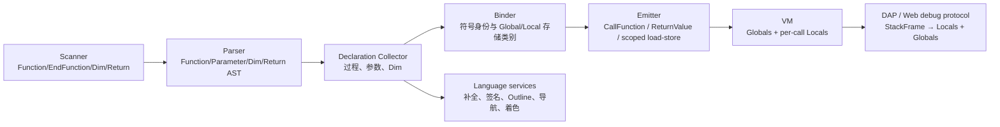

# 11 SmallBasic 语言扩展：Function、作用域、Dim 与 Return

> 调研与方案日期：2026-10-03  
> 状态：待实施的详细设计  
> 目标版本：Language Extension v1  
> 适用范围：C# / TypeScript 两套语言核心，JavaScript / C# / Blazor 三种运行与调试后端，Visual Studio / VS Code / Monaco Playground 三类编辑表面

## 0. 结论先行

本次扩展不只是增加四个关键字。当前 C# 与 TypeScript 引擎都只有一份全局变量内存，调用帧只记录模块和指令位置；要正确支持函数参数、局部变量、递归和返回值，必须同时升级词法、语法树、绑定器、运行时调用约定、调试快照和编辑器语义模型。

推荐方案是：

1. 先冻结一份两套编译器共同遵守的 Language Extension v1 语义契约，并用共享一致性用例锁定行为。
2. 保留现有 `Sub Name ... EndSub` 语法及其无参、无返回值语义；新增 `Function Name(parameters) ... EndFunction`。
3. 保留旧 Small Basic “未声明变量即全局变量”的行为。只有函数参数以及在 `Sub` / `Function` 中由 `Dim` 显式声明的变量进入当前调用帧的局部作用域。
4. 为每次 `Sub` / `Function` 调用创建独立帧内存，从而自然支持递归、嵌套调用和事件回调；不能把参数与返回值模拟成全局临时变量。
5. C# 与 TypeScript 分别实现同构的语法、符号和指令模型，不引入跨运行时桥接。Blazor 使用同一套 C# 编译器/VM，但其浏览器调试协议也必须同步升级。
6. 编辑器能力以编译器符号模型为唯一语义来源；TextMate、简单词法器和正则只负责即时兜底着色或缩进，不承担作用域判断。
7. 按“语言契约与测试夹具 → 语法/绑定 → VM → 调试 → 编辑器 → 打包”的顺序落地。估算总工作量约 24～35 人日；C# 与 TypeScript 两条线可在契约冻结后并行。

### 0.1 为什么不采用语法糖降级为 Sub

| 方案 | 优点 | 致命问题 | 结论 |
|---|---|---|---|
| 把 `Function F(A)` 改写为全局 `F_A`、`F_Result` 和 `Sub F` | 初期改动少 | 递归会覆盖参数；嵌套调用互相污染；事件重入不安全；调试器无法给出真实 Locals；函数名与全局临时变量冲突 | 否决 |
| 只扩展 C# 引擎，JS 后端转交 C# 执行 | 只有一套语义实现 | 破坏 VS Code Web / Playground 的纯 Web 能力；增加 IPC、部署和启动成本 | 否决 |
| 两套引擎增加同构的过程符号、局部帧和返回指令 | 递归、调试和作用域语义正确；保持现有宿主架构 | 需要双实现和一致性测试 | 推荐 |

## 1. 调研基线

### 1.1 仓库实际形态

仓库不是“两种 IDE 各有一个薄插件”，而是两套编译器、三类执行后端和多套编辑器适配层：

| 层 | TypeScript / JavaScript 侧 | C# / .NET 侧 |
|---|---|---|
| 语言核心 | `visual_studio_code_plugin/vendor/SmallBasicOnline/src/compiler` | `visual_studio_plugin/vendor/SmallBasicEditor/Source/SmallBasic.Compiler` |
| 再导出/共享服务 | `smallbasic-lang-core`、`smallbasic-language-services` | `SmallBasic.LanguageServices` |
| 运行 | Node/浏览器中的 `ExecutionEngine` | `SmallBasic.RunHost` 与 Blazor WASM 中的 `SmallBasicEngine` |
| 调试 | VS Code 内嵌 TS DAP、Web Inline DAP | `SmallBasic.RunHost` DAP、`SmallBasic.Blazor.RunHost` DAP |
| 编辑器 | VS Code Provider + Monaco Worker | VS 内置 LSP + MEF 分类/折叠/导航栏兼容层 |

因此，用户要求的“C# 及 JS 各运行时”在本仓库中对应两套源语言引擎；实际发布验收必须覆盖 JavaScript、C#、Blazor 三个后端。Blazor 不需要第三套编译器实现，但需要更新浏览器快照与宿主 DAP 的传输模型。

### 1.2 当前编译与执行模型的关键事实

直接阅读现有源码后，得到以下约束：

- 两侧 scanner 都通过不区分大小写的单词匹配识别关键字；新增关键字需要同步更新 TokenKind、显示文本、scanner 和编辑器兜底词法器。现有 TS scanner 的标识符只接受 ASCII 字母/数字/下划线，而 C# 使用 `char.IsLetter/IsLetterOrDigit` 接受 Unicode，且 C# 关键字匹配仍调用 `ToLower(CurrentCulture)`；这是现存的跨后端差异。
- C# parser 直接构造 `SubModuleStatementSyntax`；TS 先把每一行解析成 command，再由 `StatementsParser` 组合成 `SubModuleDeclarationSyntax`。两侧的改动位置不同，但目标 AST 必须同构。
- 两侧 binder 都预收集 Sub 名称，支持前向调用；现有 Sub 调用只接受 0 个实参，并且不能产生值。
- C# `SmallBasicEngine.Memory` 是唯一变量字典，`Frame` 只有 `RuntimeModule` 与 `InstructionIndex`；TS `ExecutionEngine.memory` 同样是唯一全局 `ArrayValue`，`StackFrame` 只有 `moduleName` 与 `instructionIndex`。
- `InvokeSubModuleInstruction` 只压入新帧；模块走到末尾后由执行循环直接弹帧，没有返回值通道。
- 当前三个 DAP 都只暴露一个 `Globals` scope，且 `scopes` 请求没有使用 `frameId`。Blazor 的 WebSocket 快照也只传一份全局 `Variables`。
- 编辑器能力已有良好基础，但作用域语义仍按“文件全局”推断：补全收集整个绑定树中的名字，定义/引用按文本名匹配，Outline 把变量放在其首次出现的 Sub 下，签名帮助只识别标准库 `Library.Method(...)`。
- C# AST、Bound Node、TokenKind 和 DiagnosticBag 是生成文件；当前 vendor 没有带入 `SmallBasic.Generators`，而上游明确要求修改生成文件后重新生成。直接长期手改这些文件会形成新的维护债。

### 1.3 外部规范给出的设计约束

- Small Basic 上游把 `SmallBasic.Compiler` 定位为编译器/主执行引擎，并保留生成器来生成大量 C#/TypeScript 结构代码；本方案沿用其“显式 AST → Bound Tree → 指令 VM”架构，而不另建旁路解析器。[smallbasic-editor 上游说明](https://github.com/sb/smallbasic-editor)
- Visual Basic 的 `Return expression` 会同时给出结果并立即退出函数；默认参数传递方式是 ByVal。Language Extension v1 借用这两个容易理解的规则，但仍使用用户指定的单词形式 `EndFunction`，不照搬 VB 的类型、`ByRef` 或 `End Function` 语法。[Function](https://learn.microsoft.com/en-us/dotnet/visual-basic/language-reference/statements/function-statement)、[Return](https://learn.microsoft.com/en-us/dotnet/visual-basic/language-reference/statements/return-statement)、[ByVal/ByRef](https://learn.microsoft.com/en-us/dotnet/visual-basic/programming-guide/language-features/procedures/passing-arguments-by-value-and-by-reference)
- DAP 的标准状态访问顺序是 `StackTrace → Scopes(frameId) → Variables(variablesReference)`，对象引用只在当前暂停状态有效。因此局部变量不能继续伪装成一个进程级 Globals 集合，三个适配器都要按栈帧生成 scope handle。[DAP Overview](https://microsoft.github.io/debug-adapter-protocol/overview)
- VS Code 将 TextMate 着色与语义令牌分成互补两层，并为 Signature Help、Document Symbol、Folding 等提供独立 Provider API。方案应让 TextMate 提供即时关键字颜色，让编译器驱动的语义令牌和 Provider 给出函数/参数/作用域信息。[Syntax Highlight Guide](https://code.visualstudio.com/api/language-extensions/syntax-highlight-guide)、[Programmatic Language Features](https://code.visualstudio.com/api/language-extensions/programmatic-language-features)
- Visual Studio 编辑器扩展以 MEF 为主要扩展方式；本仓库当前的 LSP + MEF 混合结构可以继续使用，不需要为这次语法扩展再次迁移框架。[Visual Studio Editor and Language Service Extensions](https://learn.microsoft.com/en-us/visualstudio/extensibility/editor-and-language-service-extensions)

## 2. Language Extension v1 语言契约

本节是实现和测试的共同真相源。若实施时希望改变其中任一语义，应先修改本节与共享用例，再改两套引擎。

### 2.1 语法

以下 EBNF 中关键字不区分大小写，换行仍是语句终止符：

```ebnf
function-declaration = "Function", identifier, "(", [ parameter-list ], ")", newline,
                       { statement }, "EndFunction", newline ;

parameter-list       = identifier, { ",", identifier } ;

dim-statement        = "Dim", identifier, { ",", identifier }, newline ;

return-statement     = "Return", expression, newline ;

function-call        = identifier, "(", [ argument-list ], ")" ;
argument-list        = expression, { ",", expression } ;
```

v1 的明确边界：

- `Function` 只能在文件顶层声明，与 `Sub` 一样不允许嵌套。
- 函数声明必须写括号；无参函数写成 `Function F()`。
- 函数调用必须写括号；不支持省略括号、命名参数、可选参数、默认值、参数类型或重载。
- 参数只允许标识符列表，实参数量必须精确匹配。
- `Dim` v1 不带初始化表达式；`Dim A = 1` 留给后续版本。
- `Return` v1 必须带表达式，而且只允许出现在 `Function` 内。`Sub` 中的裸 `Return` / `Exit Sub` 不属于本期范围。
- 保留现有无参 `Sub Name ... EndSub` 与 `Name()` 调用语法，不在本期给 Sub 增加参数。
- `Function` 不能作为事件处理器；标准库事件仍只能绑定无参 `Sub`。

### 2.2 作用域和名称解析

v1 的最小作用域单位是 Program、Sub 和 Function，不引入 If/For/While 块级作用域。

| 名称来源 | 作用域 | 生命周期 | 初始值 |
|---|---|---|---|
| 顶层 `Dim G` | 全局 Program | 整个程序 | 空字符串值 |
| 顶层未声明变量 | 全局 Program | 整个程序 | 首次读取仍为空字符串，保持旧行为 |
| Sub/Function 中 `Dim L` | 当前过程的本次调用帧 | 进入过程到返回 | 空字符串值 |
| Function 参数 | 当前函数的本次调用帧 | 进入函数到返回 | 对应实参值 |
| 过程内未由参数或 `Dim` 声明的名字 | 全局 Program | 整个程序 | 保持旧 Small Basic 隐式全局行为 |

解析顺序固定为：

1. 当前函数参数；
2. 当前 Sub/Function 的 `Dim` 局部变量；
3. 全局变量；
4. 在调用位置按过程符号和标准库符号解析可调用目标。

附加规则：

- Language Extension v1 的跨后端可移植标识符集明确为 `[A-Za-z_][A-Za-z0-9_]*`，在此集合内使用 ASCII/invariant case-fold；C# 新符号表使用 `StringComparer.OrdinalIgnoreCase`，scanner 关键字改用 invariant 匹配，不再依赖当前区域设置。C# 可暂时保留对旧 Unicode 标识符的兼容扩展，但它不属于 JS/C# 一致性承诺；若产品要求 Unicode 标识符跨后端等价，应在 M0 单列 scanner 对齐任务，而不能假定 JavaScript `toLowerCase()` 与 .NET Unicode 大小写规则天然一致。
- 局部变量/参数可以遮蔽同名全局变量；局部赋值不修改被遮蔽的全局变量。
- 同一过程内参数名重复、`Dim` 名重复、参数与 `Dim` 重名均为编译错误。
- `Sub` 与 `Function` 共用一个不区分大小写的过程名称空间，不允许同名。
- 过程名称与标准库类型名称冲突时给出明确诊断，避免 `Math(...)` 到底是用户函数还是库对象的歧义。
- 为给未来块级作用域留出演进空间，v1 的 `Dim` 只允许作为 Program、Sub 或 Function body 的直接子语句；写在 If/For/While 内给出诊断。未来可放宽为真正的块级 Dim，而不改变已有程序语义。
- `Dim` 是声明，不是运行时动作。Binder 在绑定过程正文前先收集全部直接子级 `Dim`，所以声明在过程内的文本位置不改变该名字的含义。

### 2.3 参数与数组语义

参数采用按值绑定：给参数重新赋值不会改变调用方变量。当前值系统中的字符串和数字是不可变值；数组由可变 `ArrayValue` 表示。为兼顾性能和熟悉的 ByVal 行为，v1 复制数组引用而不做深拷贝，因此：

- `P = 3` 只重绑参数 `P`；
- `P["x"] = 3` 会修改调用方传入的同一个数组对象。

这一点必须在 C#、JS 一致性测试和用户文档中明确；若未来需要数组深拷贝，应新增显式 API，而不是静默改变函数传参语义。

### 2.4 返回语义

- `Return expression` 先求值，然后立即退出当前函数，把一个值压回调用方的求值栈。
- 返回可出现在 If/For/While 的任意嵌套层级；它退出整个函数，而不只是当前控制块。
- 函数执行到 `EndFunction` 而未执行 `Return` 时，返回 Small Basic 的默认空字符串值。v1 不引入控制流“所有路径必须返回”的强制分析。
- 函数调用可出现在任何需要值的表达式中，包括实参、数组索引、条件和另一个函数的返回表达式。
- 函数调用单独作为语句时继续使用现有“表达式结果未使用”诊断，避免静默丢弃结果。
- `Sub` 仍不产生值；在值上下文调用 Sub 使用现有/等价的 “expected expression with a value” 诊断。

### 2.5 兼容性示例

用户给出的程序在 v1 中合法：

```smallbasic
Function MyFun(Arg1, Arg2, Arg3)
  Dim Local1, Local2
  Return Arg1
EndFunction

Result = MyFun(1, 2, 3)
TextWindow.WriteLine(Result)
```

旧程序继续保持全局共享行为：

```smallbasic
Counter = 0
Increment()
TextWindow.WriteLine(Counter)  ' 输出 1

Sub Increment
  Counter = Counter + 1        ' 没有 Dim，仍解析为全局变量
EndSub
```

显式局部变量每次调用独立，因而递归安全：

```smallbasic
Function Factorial(N)
  Dim Next
  If N <= 1 Then
    Return 1
  EndIf
  Next = N - 1
  Return N * Factorial(Next)
EndFunction
```

### 2.6 必须新增或细化的诊断

| 诊断场景 | 建议代码名 | 主要范围 |
|---|---|---|
| Function 缺名称、括号、参数或 EndFunction | 复用 token/EOL 诊断并增加 Function 上下文 | 缺失位置或错误 token |
| Function/Sub 嵌套 | `CannotDefineProcedureInsideProcedure` | 内层声明关键字 |
| Function 与 Sub/Function 重名 | `TwoProceduresWithTheSameName` | 后一个名称 |
| 过程名与库类型冲突 | `ProcedureConflictsWithLibrary` | 过程名称 |
| 参数重复 | `DuplicateParameter` | 后一个参数 |
| Dim 重复或与参数冲突 | `DuplicateLocalVariable` | 后一个声明符 |
| Dim 位于控制块内 | `DimMustBeAtProcedureLevel` | `Dim` 到行尾 |
| Return 位于 Main/Sub | `ReturnOutsideFunction` | `Return` 表达式 |
| Return 缺表达式 | `ReturnValueExpected` | 行尾 |
| Function 实参数量不符 | 复用 `UnexpectedArgumentsCount` | 整个调用 |
| Sub 被当作值 | 复用 `ExpectedExpressionWithAValue` / `UnexpectedVoid_ExpectingValue` | 调用 |
| Function 绑定给事件 | `FunctionCannotBeEventHandler` | 赋值右侧 |
| 函数结果未使用 | 复用 `UnassignedExpressionStatement` | 调用 |

两侧诊断名称可以遵守各自现有命名习惯，但测试必须对齐诊断类别、范围和用户可见含义。

## 3. 目标编译链路



核心原则是“名字在 Binder 中解析一次，运行时按已绑定的存储类别访问”，而不是让每条 Load/Store 在运行时猜测某个名字当前应落在局部还是全局。

## 4. 共享语义模型与 VM 调用约定

两套代码不要求共享实现语言，但应拥有等价的数据结构。

### 4.1 编译期模型

建议模型：

```text
ProcedureSymbol
  Name
  Kind: Sub | Function
  Parameters[]
  Locals[]
  DeclarationRange / SelectionRange
  Body

VariableSymbol
  Name / CanonicalName
  Storage: Global | Local | Parameter
  DeclarationRange
  Slot（可选；v1 可继续用名称字典）
```

Bound Variable 与 Bound Array Access 必须引用 `VariableSymbol` 或至少携带 `StorageKind + CanonicalName`。这使发射器、Outline、定义/引用、补全和调试器看到同一份作用域判定。

### 4.2 运行期模型

保留现有全局内存，再扩展调用帧：

```text
RuntimeModule
  Name
  Kind: Program | Sub | Function | DebugExpression
  Parameters[]
  Locals[]
  Instructions[]

Frame
  Module
  InstructionIndex
  LocalMemory
  EvaluationStackBase
  FrameId（调试暂停期间稳定）
```

`EvaluationStackBase` 用来保护嵌套调用：进入函数前，调用指令先从调用方栈顶逆序取出实参，再记录当前栈深；返回或异常退出时把栈恢复到该深度，然后只把返回值压给调用方。这样仍可复用现有标准库通过 engine push/pop 参数的机制，无需一次性重写全部库。

### 4.3 指令与执行循环

最小改动方案：

- 保留 `InvokeSubModuleInstruction`，让旧 Sub 和事件回调继续工作，但创建带独立 LocalMemory 的帧。
- 新增 `InvokeFunctionInstruction(name, argumentCount)`：实参按源码从左到右求值，指令从栈顶反向绑定参数，随后压入 Function 帧。
- 新增 `ReturnValueInstruction`：弹出返回表达式结果、结束当前 Function 帧、清理该帧临时值并把结果压入调用方。
- Variable/Array 的 Load/Store 指令携带 Global/Local 存储类别，统一调用 `ReadVariable` / `WriteVariable` / `ReadArray` / `WriteArray`。
- `Dim` 产生 Bound Declaration 供工具使用，但不发射可执行指令；局部初始化在建帧时完成。
- Function 自然走到模块末尾时，由执行循环按 `Module.Kind` 生成空字符串返回值。无需发射会干扰断点与单步的隐藏 Return 指令。
- 主模块结束仍终止程序；Sub 结束只弹帧；Function 结束必须向调用方返回一个值。

必须覆盖的执行序列包括 `F(G(), H())`、递归、函数在条件中返回、数组参数、从多层 If/Loop 中返回，以及事件回调中调用函数。

## 5. C# 编译器与运行时改动

本节以下未注明前缀的编译器文件，均相对 `visual_studio_plugin/vendor/SmallBasicEditor/Source/SmallBasic.Compiler/`。

### 5.1 先恢复生成源的可维护性

建议以仓库内 `official_repo/editor/Source/SmallBasic.Generators` 为种子，把其中与 TokenKind、SyntaxNodes、BoundNodes、Diagnostics 有关的代码和 XML 纳入 vendor/build tooling，并升级为当前 .NET SDK 可运行的工具；不需要带入 Bridge/Interop/Libraries 等本期无关任务。增加 `generate` 与 `verify-generated` 两种模式：前者更新文件，后者在 CI/本地门禁中确认生成结果没有漂移。

若为了 spike 临时手改 `*.Generated.cs`，只能作为短期验证分支，正式提交前必须补齐 XML 真相源和再生成步骤。

### 5.2 Scanner / Parser / AST

主要文件：

- `Scanning/Scanner.cs`、`Scanning/TokenKind.Generated.cs`
- `Parsing/Parser.cs`、`Parsing/SyntaxNodes.Generated.cs`
- 生成器的 `TokenKinds.xml`、`SyntaxNodes.xml`

改动：

- 增加 `Function`、`EndFunction`、`Dim`、`Return` token。
- 关键字匹配改成 invariant/ordinal 方式，并加入土耳其语等区域设置回归测试，避免 `Function` 等关键字随进程 culture 改变。
- 增加 Function declaration、Parameter、Dim statement、Variable declarator、Return statement AST。
- 顶层 parser 同时识别 Sub 与 Function；Function header 解析括号和逗号分隔参数。
- `ParseStatementsExcept` 的恢复集合加入 `Function` / `EndFunction`，确保缺失 EndFunction 时仍能构造可用树并继续提供编辑器功能。
- Return 仍由普通 statement parser 处理，所以可位于 If/For/While 内。

### 5.3 Binder / Bound Tree

主要文件：

- `Binding/Binder.cs`、`Binding/BoundNodes.Generated.cs`
- `Binding/Visitors/*`、`Parsing/Visitors/*`
- 生成器的 `BoundNodes.xml`、`Diagnostics.xml`

把当前 `definedSubModules` 升级为统一 `ProcedureSymbol` 表，并按以下顺序绑定：

1. 收集全部 Sub/Function 声明，建立不区分大小写的全局过程表；
2. 为每个 Function 收集参数；
3. 为每个 Program/Sub/Function 收集直接子级 Dim；
4. 建立全局变量与每过程局部符号表；
5. 在当前 procedure context 中绑定正文；
6. 绑定调用时检查目标种类、值上下文和参数个数；
7. Return 绑定时检查当前过程必须是 Function。

`VariablesAndSubModulesCollector`、`SubModuleNamesCollector` 和 `RuntimeAnalysis` 需要改为识别新的过程/声明节点；不要让服务层再从 Bound Tree 的赋值节点反推变量作用域。

### 5.4 Emitter / Engine

主要文件：

- `Runtime/ModuleEmitter.cs`
- `Runtime/RuntimeModule.cs`、`Runtime/Frame.cs`
- `Runtime/Instructions/MemoryInstructions.cs`、`OtherInstructions.cs`，建议新增 `CallInstructions.cs`
- `SmallBasicEngine.cs`、`DebuggerSnapshot.cs`

改动按第 4 节调用约定实现。`SmallBasicEngine.Memory` 可暂时保留为 Globals 的内部兼容别名，但新代码统一使用显式 Global/Local 访问 API。所有字典使用 `StringComparer.OrdinalIgnoreCase`。

`CompileExpression` / `EvaluateConditionAsync` 必须接受当前 frame context；条件断点在 Function 中引用参数或 Dim 变量时应读取该帧局部值。调试表达式的合成结果不要再固定写入全局字典，可让 DebugExpression 帧直接返回值，或使用不会泄漏的帧内结果槽。

## 6. TypeScript 编译器与 JavaScript VM 改动

本节以下未注明前缀的核心文件，均相对 `visual_studio_code_plugin/vendor/SmallBasicOnline/src/compiler/`。

### 6.1 Scanner / 两段式 Parser

主要文件：

- `syntax/tokens.ts`、`syntax/scanner.ts`
- `syntax/command-parser.ts`、`syntax/statements-parser.ts`
- `syntax/syntax-nodes.ts`
- `utils/compiler-utils.ts`、`utils/diagnostics.ts` 与本地化诊断资源

第一阶段 command parser 增加：

- `FunctionCommandSyntax`：包含名称、左右括号和参数 token；
- `EndFunctionCommandSyntax`；
- `DimCommandSyntax`；
- `ReturnCommandSyntax`。

第二阶段 `StatementsParser` 同时维护当前 Sub/Function 状态，生成 `FunctionDeclarationSyntax`，并对 EndSub/EndFunction 错配、嵌套声明和 EOF 恢复给出稳定诊断。`ParseTreeSyntax` 建议从单独的 `subModules` 扩展为统一 `procedures`，同时保留兼容 getter，减少语言服务一次性迁移风险。

### 6.2 Binder / Emitter / Engine

主要文件：

- `binding/modules-binder.ts`、`statement-binder.ts`、`expression-binder.ts`、`bound-nodes.ts`
- `emitting/module-emitter.ts`、`emitting/instructions.ts`
- `compilation.ts`、`execution-engine.ts`
- `smallbasic-lang-core/src/debug-expression.ts`

实施同 C# 侧的 ProcedureSymbol / VariableSymbol、存储类别、函数调用指令、Return 指令和帧局部内存。`Compilation.emit()` 当前只返回 instruction array map；建议升级为 `EmittedModule` map，包含 kind、参数、locals 和 instructions。若希望减少调用方改动，可保留 `modules` 指令视图并新增 metadata map，但不能让 VM 再从源码猜签名。

`StackFrame` 扩展 LocalMemory、EvaluationStackBase 和调试 frame identity。`engine.memory` 可保留为 globals 兼容访问器；新增 `engine.globals` 与 frame-aware 读写接口。`compileDebugExpression` / `evaluateDebugExpression` 与 C# 侧一样绑定并运行在选中帧上下文。

## 7. 调试支持

### 7.1 调试快照

将当前“调用栈 + 一份 Memory”的快照升级为不可变快照：

```text
DebuggerSnapshot
  CurrentSourceLine
  Frames[]
    FrameId
    ModuleName
    ProcedureKind
    SourceLine / SourceColumn
    Parameters[]
    Locals[]
  Globals[]
```

不要把运行时可变 `Frame` / dictionary 直接暴露给适配器；在暂停点复制快照可以避免继续运行后 DAP handle 指向已变化对象。

### 7.2 三个 DAP 的共同变化

涉及：

- TS：`visual_studio_code_plugin/packages/smallbasic-vscode/src/debug/engine-driver.ts`、`session.ts`
- C#：`visual_studio_plugin/src/SmallBasic.RunHost/Debug/DebugAdapter.cs`
- Blazor：`visual_studio_plugin/src/SmallBasic.Blazor.RunHost/Debug/BlazorDebugAdapter.cs`

共同规则：

- `stackTrace` 为每个真实调用帧分配当前暂停期内稳定的 frameId，递归调用即使 moduleName 相同也必须有不同 id。
- `scopes(frameId)` 对 Function/Sub 返回 `Locals` 和 `Globals` 两项；主程序只需要 `Globals`。Locals 先列参数、再列 Dim 变量。
- 每个 scope 和数组获得独立 variablesReference；继续执行时清空 handle 表，符合 DAP 对暂停状态引用生命周期的要求。
- `evaluate(expression, frameId)` 先在该帧局部作用域绑定/查找，再访问 globals。条件断点默认使用当前栈顶帧。
- 内联值依靠 DAP evaluate 时，应自动显示当前帧的参数与 locals；VS 的 DTE adornment 文案也从“current globals”修正为“current frame values”。
- Function 内 Step In 进入被调函数第一条可执行语句；Next 跳过整个函数调用；Step Out 返回调用方。判断条件应包含 frame identity/depth 与起始 source location，不能只看源码行，否则同一行嵌套函数调用会误停。
- `Dim` 不可执行，断点打在 Dim 行时应吸附到下一个真实指令；Return 行可断点。

### 7.3 Blazor / Web 协议

涉及：

- `visual_studio_plugin/src/SmallBasic.Blazor.Shared/Protocol.cs`
- `visual_studio_plugin/src/SmallBasic.Blazor.Client/Runtime/BrowserEngineSession.cs`
- `visual_studio_plugin/src/SmallBasic.Blazor.RunHost/Debug/BlazorDebugAdapter.cs`
- TS 镜像协议 `visual_studio_code_plugin/packages/smallbasic-vscode/src/web/debug-protocol.ts`

当前 BrowserMessage 把 Frames 与一份 Variables 分开传输，无法表示每帧 locals。把协议升级到 v2，在每个 DebugFrame 中携带 Parameters/Locals，并单独保留 Globals。宿主和页面由同一发布产物原子升级；若协议版本不匹配，启动时给出明确错误而不是展示错误变量。

## 8. 编辑器与语言服务支持

### 8.1 语法着色

VS Code / Monaco：

- `smallbasic.tmLanguage.json` 增加 `Function|EndFunction|Dim|Return`。
- 为 Function 声明名增加 `entity.name.function.smallbasic` 捕获；TextMate 只做词法着色，不试图解析作用域。
- `semantic-tokens.ts` 从 AST/符号表标注 Function 声明与调用为 `function`，参数为 `parameter`，Dim 声明和引用为 `variable`；增加 declaration modifier 后，主题可以区分声明与使用。
- Monaco 与 VS Code 共用同一 semantic token DTO 和 legend，避免 Playground 漂移。

Visual Studio：

- `SmallBasicSimpleLexer.Keywords` 加四个关键字，保证编译结果尚未准备好时也有即时颜色。
- `SmallBasicClassifier` 不再只缓存 Procedure name 字符串集合；从 compiler service 取得语义分类 span，至少区分 Function/Sub、参数、局部和普通变量。若暂不新增颜色种类，参数/局部可先沿用 identifier，Function 名沿用现有 function classification。

### 8.2 补全与代码片段

必须提供：

- 顶层 `Function` 模板：`Function ${1:name}(${2:parameters}) ... EndFunction`；
- 过程体内 `Dim`、Function 内 `Return`；
- 上下文闭合关键字 `EndFunction`；
- 用户 Function 调用项，label 为 `MyFun(Arg1, Arg2, Arg3)`，插入文本为带 tab stop 的 `MyFun(${1:Arg1}, ${2:Arg2}, ${3:Arg3})`；
- 当前作用域可见的参数、Dim locals 与 globals，局部优先且去重；
- Sub 补全仍插入 `Name()`，但不得把 Function 与普通变量都降级成相同的 Variable kind。

TS 侧改 `visual_studio_code_plugin/packages/smallbasic-language-services/src/completions.ts` 与 vendor completion metadata；C# 侧改 vendor 的 `Services/CompletionItemProvider.cs` 和 `visual_studio_plugin/src/SmallBasic.LanguageServices/Lsp` 中的 DTO 映射。VS 当前会把 snippet placeholder 摊平成普通文本，应确保 Function completion 在 VS 中至少插入 `MyFun(Arg1, Arg2)`，而 VS Code/Monaco 保留可跳转占位符。

### 8.3 签名帮助与 Hover

当前两侧签名帮助只匹配单行 `Library.Method(...)`。应改为基于 compilation + position 查找最内层 `InvocationExpression`：

- 标准库调用继续读 library metadata；
- 用户函数调用读取 ProcedureSymbol.Parameters；
- activeParameter 通过 AST argument range 判断，错误恢复树中再回退到括号/逗号扫描；
- Function 声明头的括号不触发调用签名帮助；
- Hover 在函数声明和调用处显示 `Function MyFun(Arg1, Arg2, Arg3)`，在参数/Dim 上显示作用域类别。

对应更新 VS LSP 的 `signatureHelpProvider`，以及 VS Code/Monaco 已有的 `registerSignatureHelpProvider`。

### 8.4 折叠、Outline、导航栏与导航

- `Function ... EndFunction` 是完整可折叠块；VS Code/Monaco 的 folding provider 与 VS 的 structure tagger 都要识别。
- Outline/DocumentSymbol 对 Function 使用 Function kind，detail 展示完整参数签名；Sub 保持过程项。
- Function 的 children 按“参数、Dim locals”顺序展示；主程序显示 globals。不要再用全文件首次出现位置推断变量归属。
- VS 原生导航栏第一列列出 `<主程序>`、Sub 和 Function；Function 显示参数。第二列只显示选中过程的参数/locals，主程序显示 globals。
- Go to Definition / References 必须按 `VariableSymbol` 身份匹配。两个不同函数中的同名 local 不是同一符号，不能像当前 TS 实现一样按文件级文本名合并。
- `language-configuration.json` 的缩进规则加入 Function/EndFunction；`contextual-completions.ts`、`folding.ts` 和 VS Code inline-values keyword set 同步增加四个关键字。
- snippets、Playground 复制资产和测试 fixtures 从源码构建生成，不能只改 `runhost/web/editor` 中的产物。

## 9. 文件级改动清单

### 9.1 TypeScript / VS Code / Monaco

| 区域 | 主要文件/目录 | 改动 |
|---|---|---|
| 词法语法 | `vendor/SmallBasicOnline/src/compiler/syntax/*` | token、command、Function/Dim/Return AST、错误恢复 |
| 绑定诊断 | `vendor/SmallBasicOnline/src/compiler/binding/*`、`vendor/SmallBasicOnline/src/compiler/utils/diagnostics.ts`、`vendor/SmallBasicOnline/src/strings/*` | procedure/local symbols、作用域、诊断 |
| 发射运行 | `vendor/SmallBasicOnline/src/compiler/emitting/*`、`vendor/SmallBasicOnline/src/compiler/execution-engine.ts`、`vendor/SmallBasicOnline/src/compiler/compilation.ts` | module metadata、帧 locals、调用/返回/存储指令 |
| 调试表达式 | `packages/smallbasic-lang-core/src/debug-expression.ts` | frame-aware bind/evaluate |
| 语言服务 | `packages/smallbasic-language-services/src/*` | completion、signature、hover、symbols、folding、navigation、semantic tokens |
| VS Code | `packages/smallbasic-vscode/src/language/*`、`packages/smallbasic-vscode/src/debug/*` | Provider 映射、DAP scopes/variables/evaluate/step |
| Monaco/Web | `packages/smallbasic-vscode/src/monaco/*`、`packages/smallbasic-vscode/src/playground/*`、`packages/smallbasic-vscode/src/web/*` | Provider、Worker、Inline DAP、协议 v2 |
| 声明资产 | `packages/smallbasic-vscode/syntaxes/*.json`、`packages/smallbasic-vscode/language-configuration.json`、`packages/smallbasic-vscode/snippets/*.json` | 着色、缩进、片段 |
| 测试 | vendor tests、各 package 的 `tests/*.spec.ts`、webview Playwright | 核心、服务、DAP、Web E2E |

### 9.2 C# / Visual Studio / Blazor

| 区域 | 主要文件/目录 | 改动 |
|---|---|---|
| 生成源 | 以 `official_repo/editor/Source/SmallBasic.Generators` 为种子，恢复相关子集到 vendor/build tooling | XML 真相源、生成与 verify |
| 词法语法 | `visual_studio_plugin/vendor/SmallBasicEditor/Source/SmallBasic.Compiler/Scanning/*`、`Parsing/*` | token、AST、parser、恢复 |
| 绑定诊断 | 同上编译器目录的 `Binding/*`、`Diagnostics/*`、visitors | procedure/local symbols、Return 校验 |
| 发射运行 | 同上编译器目录的 `Runtime/ModuleEmitter.cs`、`RuntimeModule.cs`、`Frame.cs`、`Instructions/*`、`SmallBasicEngine.cs` | 帧 locals、调用/返回/存储 |
| 编译 API | 同上编译器目录的 `SmallBasicCompilation.cs`、`CompiledExpression.cs` | procedure metadata、frame-aware debug expression |
| 服务 | 同上编译器目录的 `Services/CompletionItemProvider.cs`、`SignatureHelpProvider.cs`、`OutlineProvider.cs`、`HoverProvider.cs` | 参数化函数与真实作用域 |
| VS LSP | `visual_studio_plugin/src/SmallBasic.LanguageServices/Lsp/*`、`Outline/*` | LSP DTO/能力/符号映射 |
| VS MEF | `visual_studio_plugin/src/SmallBasic.Vsix/Editor/Classification`、`Outlining`、`NavigationBar`、`Debugging` | 着色、折叠、导航、内联变量 |
| C# DAP | `visual_studio_plugin/src/SmallBasic.RunHost/Debug/DebugAdapter.cs` | Locals/Globals、frame evaluate、step |
| Blazor | `visual_studio_plugin/src/SmallBasic.Blazor.Shared/Protocol.cs`、`visual_studio_plugin/src/SmallBasic.Blazor.Client`、`visual_studio_plugin/src/SmallBasic.Blazor.RunHost/Debug` | Web 协议 v2、逐帧 locals |
| 测试 | `visual_studio_plugin/tests/SmallBasic.Compiler.Tests`、`visual_studio_plugin/tests/SmallBasic.LanguageServices.Tests` | 核心、运行、LSP、DAP |

`dist/`、`playground-dist/`、`runhost/`、VSIX/vsix 和 WASM 压缩文件都是派生产物，最后通过现有构建脚本统一再生成，不直接编辑。

## 10. 分阶段实施计划

| 阶段 | 工作量估算 | 可并行性 | 交付与退出条件 |
|---|---:|---|---|
| M0 语义冻结与脚手架 | 2～3 人日 | 单线先行 | 本文语义转成测试 manifest；恢复 C# 生成源或确定可重复生成流程；两侧 baseline 全绿 |
| M1 Scanner / Parser / AST | 3～4 人日 | C#、TS 并行 | 示例可形成正确 AST；错误输入有稳定诊断；旧语法测试全绿 |
| M2 Binder / 符号模型 | 3～5 人日 | C#、TS 并行 | 参数、Dim、全局回退、遮蔽、冲突和调用 arity 的单测全绿 |
| M3 VM / 运行时 | 5～7 人日 | C#、TS 并行 | JS/C#/Blazor 运行一致；递归、嵌套、数组参数、早返回通过共享用例 |
| M4 调试 | 4～6 人日 | TS DAP、C# DAP、Blazor 协议可并行 | 三后端的栈帧、Locals/Globals、evaluate、条件断点和三种 step 正确 |
| M5 编辑器能力 | 5～7 人日 | VS Code/Monaco 与 VS 并行 | 着色、补全（带参数）、签名帮助、折叠、Outline/导航栏、定义/引用验收 |
| M6 回归、打包与文档 | 2～3 人日 | 测试与文档并行 | 全量测试、Build-All、三后端安装包与用户语法文档完成 |

关键路径是 M0 → M1 → M2 → M3 → M4；M5 中纯词法着色和片段可在 M1 后提前，语义补全/导航必须等 M2 的符号模型稳定。若由两名熟悉代码库的工程师分别负责 TS 与 C#，再共同完成一致性与打包，日历时间约 3～4 周；单人顺序实施约 5～7 周。

每个阶段都要保持“旧程序仍能在三个后端运行”，不接受先大面积破坏再在最后集中修复。

## 11. 测试与质量门禁

### 11.1 共享一致性测试

新增仓库级 `test/conformance/language-extension/`，每个案例由 `.sb` 源码和 JSON 期望组成；TS runner 与 C# runner 读取同一份数据。期望至少包含 diagnostics、stdout、最终 globals、暂停点序列和逐帧变量快照。

最小案例矩阵：

1. 无参/多参数 Function、嵌套函数调用、函数作为库方法实参；
2. 参数数量过多/过少、重复参数、ASCII 大小写调用，以及 C# 在非英语 culture 下的相同行为；
3. 顶层 Dim、Sub local、Function local、参数遮蔽 global；
4. 未 Dim 变量在过程内仍为 global 的旧行为；
5. 两个过程同名 local 互不影响；
6. 直接 Return、If/For/While 深层 Return、无 Return 的空字符串结果；
7. 递归 Factorial/Fibonacci 和互相调用；
8. 数组参数重绑定与元素修改的既定别名语义；
9. Return outside Function、Dim in nested block、Function event handler 等负例；
10. 旧 Sub、事件、Goto、输入、图形样例的回归。

### 11.2 编译器与服务测试

- scanner：四个关键字的任意大小写、关键字前后边界；
- parser：完整/残缺 Function header、缺 EndFunction、逗号与括号恢复；
- binder：符号表、存储类别、遮蔽、冲突、arity、返回上下文；
- emitter/VM：准确指令序列、栈平衡、帧销毁、递归深度；
- language service：当前作用域补全、函数 snippet、active parameter、DocumentSymbol hierarchy、Definition/References 不跨局部作用域；
- syntax/folding snapshots：TextMate、semantic tokens、Function folding 与缩进；
- C# generated verify：XML 与 `*.Generated.cs` 必须一致。

### 11.3 DAP 测试

把现有 TS `debug-session.spec.ts` 扩展为函数场景，并为 C# RunHost 建立同等的协议测试。三后端至少验证：

- 递归时存在多个同名 Function frame；
- 每个 frame 的 Locals 内容不同，Globals 相同；
- 切换 frame 后 evaluate 同名参数得到对应值；
- next 不进入函数，stepIn 进入，stepOut 回到调用点之后；
- 条件断点可以读取当前参数/local；
- 继续后旧 variablesReference 失效；
- Blazor v2 协议的 frame/locals/globals 往返无损。

### 11.4 建议门禁命令

```powershell
Set-Location visual_studio_code_plugin
npm run typecheck
npm test
npm run test:web

Set-Location ..
dotnet test visual_studio_plugin/SmallBasic.VisualStudio.slnx
./Build-All.ps1
```

Web E2E 与完整打包可作为合并门禁；开发内循环至少运行受影响 package tests、两个 .NET test project 和 generated verify。

## 12. 验收标准

功能完成必须同时满足：

1. 用户示例在 JavaScript、C#、Blazor 三后端输出相同结果。
2. 递归函数在三后端正确执行，退出后 locals 不泄漏到 globals。
3. VS Code、Visual Studio、Monaco 都能给 `Function/EndFunction/Dim/Return` 着色并折叠 Function 块。
4. 输入 `MyF` 时补全显示 `MyFun(Arg1, Arg2, Arg3)`；选中后 VS Code/Monaco 有参数占位符，VS 至少插入完整参数文本。
5. 在函数调用的每个参数位置都能显示正确 active parameter。
6. Outline 和 VS 导航栏显示 Function 签名、参数和 locals；两个函数中的同名 local 分属不同符号。
7. 调试递归函数时调用栈层级正确；选择任一 frame 均能看到该帧参数/locals 与共享 Globals。
8. 条件断点、Watch/Debug Console 求值可以读取当前帧局部变量。
9. 现有 Sub、标准库、事件、图形、输入和旧测试无回归。
10. 生成文件可重复生成，`npm run typecheck`、`npm test`、`dotnet test` 与 `Build-All.ps1` 全部通过。

## 13. 风险与缓解

| 风险 | 影响 | 缓解 |
|---|---|---|
| 双引擎语义漂移 | 同一程序在 JS/C# 结果不同 | 先冻结契约；共享 conformance；每个里程碑双侧同时过门禁 |
| 局部作用域破坏旧全局变量程序 | 旧 Sub 行为改变 | 只有参数与显式 Dim 是 local；未 Dim 始终回退 global |
| 递归造成求值栈污染 | 随机错误或返回值串位 | Frame 记录 EvaluationStackBase；返回/异常统一恢复；深度测试 |
| 数组参数别名不清 | 用户误解修改效果 | v1 明确浅传递规则；加入双引擎用例和用户文档 |
| 生成文件不可维护 | 后续重生成覆盖改动 | 恢复精简 generator + XML 真相源 + verify 门禁 |
| DAP frame/scope handle 复用错误 | 查看错帧变量 | 每次暂停重建不可变 snapshot 与 handle 表；继续即失效 |
| 行级单步遇到同一行嵌套调用 | Next/StepOut 错停 | 用 frame identity/depth + source location，而不是只比较行号 |
| Blazor 页面与宿主协议不匹配 | Web 调试变量丢失 | 协议版本升 v2并握手；同一构建原子发布 |
| 外部自定义 RunHost 版本过旧 | 编辑器接受语法但运行失败 | 增加 `--capabilities`/版本握手；缺少 `function-v1` 时给出明确升级提示 |
| 关键词新增改变旧变量名含义 | 旧代码把 Dim/Return 等当变量 | 这是不可避免的保留字兼容点；发行说明列出迁移方法和诊断 |
| TS/C# 标识符字符集既有差异 | Unicode 名称只能在部分后端工作 | v1 明确 ASCII 可移植子集；C# 去除 culture 依赖；如需 Unicode 等价则单列 scanner 对齐任务 |

## 14. 本期不做与后续演进

v1 不包含：Sub 参数、裸 Return、块级 Dim、类型声明、ByRef、默认/可选/命名参数、函数重载、跨文件模块、闭包、异步函数、尾调用优化。它们不应阻塞本期，但当前设计为其保留了扩展点：统一 ProcedureSymbol、显式 StorageKind、RuntimeModule metadata 与逐帧调试模型。

后续优先级建议：

1. Sub 参数与裸 Return；
2. 真正块级 Dim；
3. Rename / workspace symbols；
4. 更严格的控制流分析与“可能无返回值”提示；
5. 可选的数组复制 API，而不是改变既有参数语义。

## 15. 实施前检查单

- [ ] 产品/语言负责人确认第 2 节全部语义，尤其是隐式全局、Dim 位置、无 Return 与数组别名。
- [ ] 确认 C# 生成器恢复方案，不直接长期维护 Generated 文件。
- [ ] 建立至少 10 个共享 conformance 样例并让旧双引擎 runner 先跑通。
- [ ] 定义 ProcedureSymbol、VariableSymbol、RuntimeModule、DebuggerSnapshot 的两侧等价结构。
- [ ] 为 Blazor Web 协议分配 v2 并定义不兼容提示。
- [ ] 定义外部 RunHost capability 名 `function-v1` 与版本握手。
- [ ] M1～M6 每阶段明确负责人，并要求 C#/TS PR 成对合入或由 conformance 暂时阻止发散。
