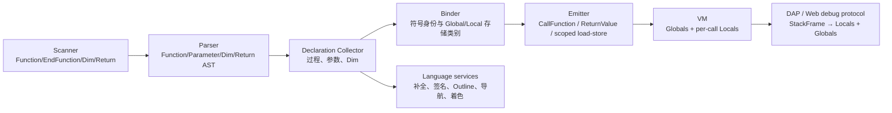

# 11 SmallBasic 语言扩展：过程、作用域、循环控制与算术运算符

> 调研与方案日期：2026-10-03
> 实施与验收日期：2026-10-03
> 文档补充日期：2026-10-05（追加 While/For 的 Break/Continue 设计）
> 实施日期：2026-10-05（v1.2 Break/Continue 已落地）
> 文档补充与实施日期：2026-10-06（v1.3 `\` / `Mod` 与 `Math.Div` / `Math.Mod` 已落地）
> 状态：v1 / v1.1 / v1.2 / v1.3 均已实施；v1.2 的宿主能力握手见 §17.3.3 与 §17.9 的说明
> 目标版本：Language Extension v1 / v1.1 / v1.2 / v1.3（已实施）
> 适用范围：C# / TypeScript 两套语言核心，JavaScript / C# / Blazor 三种运行与调试后端，Visual Studio / VS Code / Monaco Playground 三类编辑表面

## 0. 结论先行

初始 v1 扩展不只是增加四个关键字。当前 C# 与 TypeScript 引擎都只有一份全局变量内存，调用帧只记录模块和指令位置；要正确支持函数参数、局部变量、递归和返回值，必须同时升级词法、语法树、绑定器、运行时调用约定、调试快照和编辑器语义模型。

对已落地的 v1 / v1.1 范围，推荐方案是：

1. 先冻结一份两套编译器共同遵守的 Language Extension v1 语义契约，并用共享一致性用例锁定行为。
2. 保留现有 `Sub Name ... EndSub` 语法及其无参、无返回值语义；新增 `Function Name(parameters) ... EndFunction`。
3. 保留旧 Small Basic “未声明变量即全局变量”的行为。只有函数参数以及在 `Sub` / `Function` 中由 `Dim` 显式声明的变量进入当前调用帧的局部作用域。
4. 为每次 `Sub` / `Function` 调用创建独立帧内存，从而自然支持递归、嵌套调用和事件回调；不能把参数与返回值模拟成全局临时变量。
5. C# 与 TypeScript 分别实现同构的语法、符号和指令模型，不引入跨运行时桥接。Blazor 使用同一套 C# 编译器/VM，但其浏览器调试协议也必须同步升级。
6. 编辑器能力以编译器符号模型为唯一语义来源；TextMate、简单词法器和正则只负责即时兜底着色或缩进，不承担作用域判断。
7. 按“语言契约与测试夹具 → 语法/绑定 → VM → 调试 → 编辑器 → 打包”的顺序落地。估算总工作量约 24～35 人日；C# 与 TypeScript 两条线可在契约冻结后并行。

### 0.1 实施结论

Language Extension v1 已按本文契约落地。两套编译器现在共同支持 `Function/EndFunction`、带括号的参数与调用、过程级 `Dim`、`Return expression`、递归、前向/互相调用以及逐调用帧的参数和局部变量；未声明变量仍按旧规则访问全局内存。JavaScript、C#、Blazor 的运行与调试路径，VS Code、Visual Studio、Monaco 的编辑能力，以及派生发布产物均已同步升级。

为防止两套实现漂移，仓库新增共享一致性语料 `tests/conformance/language-extension/cases.json`，由 TypeScript 和 C# 测试读取同一份 16 案例数据。C# 生成器 XML 继续作为生成文件真相源，重新生成后与 vendor 镜像逐字节一致。外部 C# RunHost 使用 `--capabilities` 返回协议 v2 与 `function-v1`，VS Code 在运行或调试前执行握手，旧宿主会收到明确升级提示。

### 0.2 为什么不采用语法糖降级为 Sub

| 方案 | 优点 | 致命问题 | 结论 |
|---|---|---|---|
| 把 `Function F(A)` 改写为全局 `F_A`、`F_Result` 和 `Sub F` | 初期改动少 | 递归会覆盖参数；嵌套调用互相污染；事件重入不安全；调试器无法给出真实 Locals；函数名与全局临时变量冲突 | 否决 |
| 只扩展 C# 引擎，JS 后端转交 C# 执行 | 只有一套语义实现 | 破坏 VS Code Web / Playground 的纯 Web 能力；增加 IPC、部署和启动成本 | 否决 |
| 两套引擎增加同构的过程符号、局部帧和返回指令 | 递归、调试和作用域语义正确；保持现有宿主架构 | 需要双实现和一致性测试 | 推荐 |

### 0.3 v1.2 设计摘要：While/For 的 Break 与 Continue

本文同时记录已落地的 v1.2 设计，目标是在不改变既有循环与作用域模型的前提下，为 `While` / `For` 增加 `Break` 与 `Continue`：

1. 新增保留字 `Break` 与 `Continue`，都只作用于**最近一层** `While` 或 `For`。
2. `Break` 立即结束当前循环；`Continue` 在 `While` 中重新判断条件，在 `For` 中先执行本轮尾部 `Step` / 自增，再进行下一轮边界检查。
3. 不引入块级作用域、标签式 break/continue、多级跳出或 `Exit For` / `Exit While` 语法；locals / globals / `Return` 语义保持现状。
4. 绑定器只需增加循环上下文校验；发射器复用现有跳转指令，通过 loop target stack 生成 source-mapped jump，无需新增 VM 帧模型或 DAP scope 结构。
5. 调试器必须把 `Break` / `Continue` 当作可执行语句处理，且单步不能暴露内部合成的 loop labels、`For` 自增或边界检查细节。
6. 编辑器侧同步支持关键字着色、上下文补全、Hover/提示、诊断与 snippets；Outline/导航栏不新增 symbol kind。
7. 对外 CLI RunHost 的能力探测建议增加 `loop-control-v1`，防止编辑器先接受新语法而旧宿主仍按旧能力运行。

## 1. 调研基线

### 1.1 仓库实际形态

仓库不是“两种 IDE 各有一个薄插件”，而是两套编译器、三类执行后端和多套编辑器适配层：

| 层 | TypeScript / JavaScript 侧 | C# / .NET 侧 |
|---|---|---|
| 语言核心 | `visual_studio_code_plugin/vendor/SmallBasicOnline/src/compiler` | `visual_studio_plugin/vendor/SmallBasicEditor/Source/SmallBasic.Compiler` |
| 再导出/共享服务 | `smallbasic-lang-core`、`smallbasic-language-services` | `SmallBasic.LanguageServices` |
| 运行 | Node/浏览器中的 `ExecutionEngine` | `SmallBasic.RunHost` 与 Blazor WASM 中的 `SmallBasicEngine` |
| 调试 | VS Code 内嵌 TS DAP、Web Inline DAP | `SmallBasic.RunHost` DAP、`SmallBasic.Blazor.RunHost` DAP |
| 编辑器 | VS Code Provider + Monaco Worker | VS 内置 LSP + MEF 分类/折叠/导航栏兼容层 |

因此，用户要求的“C# 及 JS 各运行时”在本仓库中对应两套源语言引擎；实际发布验收必须覆盖 JavaScript、C#、Blazor 三个后端。Blazor 不需要第三套编译器实现，但需要更新浏览器快照与宿主 DAP 的传输模型。

### 1.2 当前编译与执行模型的关键事实

直接阅读现有源码后，得到以下约束：

- 两侧 scanner 都通过不区分大小写的单词匹配识别关键字；新增关键字需要同步更新 TokenKind、显示文本、scanner 和编辑器兜底词法器。现有 TS scanner 的标识符只接受 ASCII 字母/数字/下划线，而 C# 使用 `char.IsLetter/IsLetterOrDigit` 接受 Unicode，且 C# 关键字匹配仍调用 `ToLower(CurrentCulture)`；这是现存的跨后端差异。
- C# parser 直接构造 `SubModuleStatementSyntax`；TS 先把每一行解析成 command，再由 `StatementsParser` 组合成 `SubModuleDeclarationSyntax`。两侧的改动位置不同，但目标 AST 必须同构。
- 两侧 binder 都预收集 Sub 名称，支持前向调用；现有 Sub 调用只接受 0 个实参，并且不能产生值。
- C# `SmallBasicEngine.Memory` 是唯一变量字典，`Frame` 只有 `RuntimeModule` 与 `InstructionIndex`；TS `ExecutionEngine.memory` 同样是唯一全局 `ArrayValue`，`StackFrame` 只有 `moduleName` 与 `instructionIndex`。
- `InvokeSubModuleInstruction` 只压入新帧；模块走到末尾后由执行循环直接弹帧，没有返回值通道。
- 当前三个 DAP 都只暴露一个 `Globals` scope，且 `scopes` 请求没有使用 `frameId`。Blazor 的 WebSocket 快照也只传一份全局 `Variables`。
- 编辑器能力已有良好基础，但作用域语义仍按“文件全局”推断：补全收集整个绑定树中的名字，定义/引用按文本名匹配，Outline 把变量放在其首次出现的 Sub 下，签名帮助只识别标准库 `Library.Method(...)`。
- C# AST、Bound Node、TokenKind 和 DiagnosticBag 是生成文件；当前 vendor 没有带入 `SmallBasic.Generators`，而上游明确要求修改生成文件后重新生成。直接长期手改这些文件会形成新的维护债。

### 1.3 外部规范给出的设计约束

- Small Basic 上游把 `SmallBasic.Compiler` 定位为编译器/主执行引擎，并保留生成器来生成大量 C#/TypeScript 结构代码；本方案沿用其“显式 AST → Bound Tree → 指令 VM”架构，而不另建旁路解析器。[smallbasic-editor 上游说明](https://github.com/sb/smallbasic-editor)
- Visual Basic 的 `Return expression` 会同时给出结果并立即退出函数；默认参数传递方式是 ByVal。Language Extension v1 借用这两个容易理解的规则，但仍使用用户指定的单词形式 `EndFunction`，不照搬 VB 的类型、`ByRef` 或 `End Function` 语法。[Function](https://learn.microsoft.com/en-us/dotnet/visual-basic/language-reference/statements/function-statement)、[Return](https://learn.microsoft.com/en-us/dotnet/visual-basic/language-reference/statements/return-statement)、[ByVal/ByRef](https://learn.microsoft.com/en-us/dotnet/visual-basic/programming-guide/language-features/procedures/passing-arguments-by-value-and-by-reference)
- DAP 的标准状态访问顺序是 `StackTrace → Scopes(frameId) → Variables(variablesReference)`，对象引用只在当前暂停状态有效。因此局部变量不能继续伪装成一个进程级 Globals 集合，三个适配器都要按栈帧生成 scope handle。[DAP Overview](https://microsoft.github.io/debug-adapter-protocol/overview)
- VS Code 将 TextMate 着色与语义令牌分成互补两层，并为 Signature Help、Document Symbol、Folding 等提供独立 Provider API。方案应让 TextMate 提供即时关键字颜色，让编译器驱动的语义令牌和 Provider 给出函数/参数/作用域信息。[Syntax Highlight Guide](https://code.visualstudio.com/api/language-extensions/syntax-highlight-guide)、[Programmatic Language Features](https://code.visualstudio.com/api/language-extensions/programmatic-language-features)
- Visual Studio 编辑器扩展以 MEF 为主要扩展方式；本仓库当前的 LSP + MEF 混合结构可以继续使用，不需要为这次语法扩展再次迁移框架。[Visual Studio Editor and Language Service Extensions](https://learn.microsoft.com/en-us/visualstudio/extensibility/editor-and-language-service-extensions)

## 2. Language Extension v1 语言契约

本节是实现和测试的共同真相源。若实施时希望改变其中任一语义，应先修改本节与共享用例，再改两套引擎。

### 2.1 语法

以下 EBNF 中关键字不区分大小写，换行仍是语句终止符：

```ebnf
sub-declaration      = "Sub", identifier, [ "(", [ parameter-list ], ")" ], newline,
                       { statement }, "EndSub", newline ;

function-declaration = "Function", identifier, [ "(", [ parameter-list ], ")" ], newline,
                       { statement }, "EndFunction", newline ;

parameter-list       = identifier, { ",", identifier } ;

dim-statement        = "Dim", identifier, { ",", identifier }, newline ;

return-statement     = "Return", expression, newline ;

procedure-call       = identifier, [ "(", [ argument-list ], ")" ] ;
argument-list        = expression, { ",", expression } ;
```

v1 的明确边界：

- `Sub` / `Function` 只能在文件顶层声明，不允许嵌套。
- `Sub` 与 `Function` 都支持参数列表；解析器对参数括号与参数列表都做可选处理，因此 `Sub F`、`Sub F()`、`Sub F(A, B)` 以及 `Function F`、`Function F()`、`Function F(A, B)` 都合法。
- 无参过程既可以写成 `F` 也可以写成 `F()`：不带括号的裸名等价于零实参调用（`Sub` 用于语句，`Function` 用于表达式；`Answer = F` 等价于 `Answer = F()`）。带参数的过程必须写括号并传入精确数量的实参。
- 不支持命名参数、可选参数、默认值、参数类型或重载。
- `Dim` v1 不带初始化表达式；`Dim A = 1` 留给后续版本。
- `Return` v1 必须带表达式，而且只允许出现在 `Function` 内。`Sub` 中的裸 `Return` / `Exit Sub` 不属于本期范围。
- `Function` 不能作为事件处理器；标准库事件仍只能绑定 `Sub`。

### 2.2 作用域和名称解析

v1 的最小作用域单位是 Program、Sub 和 Function，不引入 If/For/While 块级作用域。

| 名称来源 | 作用域 | 生命周期 | 初始值 |
|---|---|---|---|
| 顶层 `Dim G` | 全局 Program | 整个程序 | 空字符串值 |
| 顶层未声明变量 | 全局 Program | 整个程序 | 首次读取仍为空字符串，保持旧行为 |
| Sub/Function 中 `Dim L` | 当前过程的本次调用帧 | 进入过程到返回 | 空字符串值 |
| Sub/Function 参数 | 当前过程的本次调用帧 | 进入过程到返回 | 对应实参值 |
| 过程内未由参数或 `Dim` 声明的名字 | 全局 Program | 整个程序 | 保持旧 Small Basic 隐式全局行为 |

解析顺序固定为：

1. 当前函数参数；
2. 当前 Sub/Function 的 `Dim` 局部变量；
3. 全局变量；
4. 在调用位置按过程符号和标准库符号解析可调用目标。

附加规则：

- Language Extension v1 的跨后端可移植标识符集明确为 `[A-Za-z_][A-Za-z0-9_]*`，在此集合内使用 ASCII/invariant case-fold；C# 新符号表使用 `StringComparer.OrdinalIgnoreCase`，scanner 关键字改用 invariant 匹配，不再依赖当前区域设置。C# 可暂时保留对旧 Unicode 标识符的兼容扩展，但它不属于 JS/C# 一致性承诺；若产品要求 Unicode 标识符跨后端等价，应在 M0 单列 scanner 对齐任务，而不能假定 JavaScript `toLowerCase()` 与 .NET Unicode 大小写规则天然一致。
- 局部变量/参数可以遮蔽同名全局变量；局部赋值不修改被遮蔽的全局变量。
- 同一过程内参数名重复、`Dim` 名重复、参数与 `Dim` 重名均为编译错误。
- `Sub` 与 `Function` 共用一个不区分大小写的过程名称空间，不允许同名。
- 过程名称与标准库类型名称冲突时给出明确诊断，避免 `Math(...)` 到底是用户函数还是库对象的歧义。
- 为给未来块级作用域留出演进空间，v1 的 `Dim` 只允许作为 Program、Sub 或 Function body 的直接子语句；写在 If/For/While 内给出诊断。未来可放宽为真正的块级 Dim，而不改变已有程序语义。
- `Dim` 是声明，不是运行时动作。Binder 在绑定过程正文前先收集全部直接子级 `Dim`，所以声明在过程内的文本位置不改变该名字的含义。

### 2.3 参数与数组语义

参数采用按值绑定：给参数重新赋值不会改变调用方变量。当前值系统中的字符串和数字是不可变值；数组由可变 `ArrayValue` 表示。为兼顾性能和熟悉的 ByVal 行为，v1 复制数组引用而不做深拷贝，因此：

- `P = 3` 只重绑参数 `P`；
- `P["x"] = 3` 会修改调用方传入的同一个数组对象。

这一点必须在 C#、JS 一致性测试和用户文档中明确；若未来需要数组深拷贝，应新增显式 API，而不是静默改变函数传参语义。

### 2.4 返回语义

- `Return expression` 先求值，然后立即退出当前函数，把一个值压回调用方的求值栈。
- 返回可出现在 If/For/While 的任意嵌套层级；它退出整个函数，而不只是当前控制块。
- 函数执行到 `EndFunction` 而未执行 `Return` 时，返回 Small Basic 的默认空字符串值。v1 不引入控制流“所有路径必须返回”的强制分析。
- 函数调用可出现在任何需要值的表达式中，包括实参、数组索引、条件和另一个函数的返回表达式。
- 函数调用单独作为语句时继续使用现有“表达式结果未使用”诊断，避免静默丢弃结果。
- `Sub` 仍不产生值；在值上下文调用 Sub 使用现有/等价的 “expected expression with a value” 诊断。

### 2.5 兼容性示例

用户给出的程序在 v1 中合法：

```smallbasic
Function MyFun(Arg1, Arg2, Arg3)
  Dim Local1, Local2
  Return Arg1
EndFunction

Result = MyFun(1, 2, 3)
TextWindow.WriteLine(Result)
```

旧程序继续保持全局共享行为：

```smallbasic
Counter = 0
Increment()
TextWindow.WriteLine(Counter)  ' 输出 1

Sub Increment
  Counter = Counter + 1        ' 没有 Dim，仍解析为全局变量
EndSub
```

显式局部变量每次调用独立，因而递归安全：

```smallbasic
Function Factorial(N)
  Dim Next
  If N <= 1 Then
    Return 1
  EndIf
  Next = N - 1
  Return N * Factorial(Next)
EndFunction
```

### 2.6 必须新增或细化的诊断

| 诊断场景 | 建议代码名 | 主要范围 |
|---|---|---|
| Function 缺名称、括号、参数或 EndFunction | 复用 token/EOL 诊断并增加 Function 上下文 | 缺失位置或错误 token |
| Function/Sub 嵌套 | `CannotDefineProcedureInsideProcedure` | 内层声明关键字 |
| Function 与 Sub/Function 重名 | `TwoProceduresWithTheSameName` | 后一个名称 |
| 过程名与库类型冲突 | `ProcedureConflictsWithLibrary` | 过程名称 |
| 参数重复 | `DuplicateParameter` | 后一个参数 |
| Dim 重复或与参数冲突 | `DuplicateLocalVariable` | 后一个声明符 |
| Dim 位于控制块内 | `DimMustBeAtProcedureLevel` | `Dim` 到行尾 |
| Return 位于 Main/Sub | `ReturnOutsideFunction` | `Return` 表达式 |
| Return 缺表达式 | `ReturnValueExpected` | 行尾 |
| Function 实参数量不符 | 复用 `UnexpectedArgumentsCount` | 整个调用 |
| Sub 被当作值 | 复用 `ExpectedExpressionWithAValue` / `UnexpectedVoid_ExpectingValue` | 调用 |
| Function 绑定给事件 | `FunctionCannotBeEventHandler` | 赋值右侧 |
| 函数结果未使用 | 复用 `UnassignedExpressionStatement` | 调用 |

两侧诊断名称可以遵守各自现有命名习惯，但测试必须对齐诊断类别、范围和用户可见含义。

## 3. 目标编译链路



核心原则是“名字在 Binder 中解析一次，运行时按已绑定的存储类别访问”，而不是让每条 Load/Store 在运行时猜测某个名字当前应落在局部还是全局。

## 4. 共享语义模型与 VM 调用约定

两套代码不要求共享实现语言，但应拥有等价的数据结构。

### 4.1 编译期模型

建议模型：

```text
ProcedureSymbol
  Name
  Kind: Sub | Function
  Parameters[]
  Locals[]
  DeclarationRange / SelectionRange
  Body

VariableSymbol
  Name / CanonicalName
  Storage: Global | Local | Parameter
  DeclarationRange
  Slot（可选；v1 可继续用名称字典）
```

Bound Variable 与 Bound Array Access 必须引用 `VariableSymbol` 或至少携带 `StorageKind + CanonicalName`。这使发射器、Outline、定义/引用、补全和调试器看到同一份作用域判定。

### 4.2 运行期模型

保留现有全局内存，再扩展调用帧：

```text
RuntimeModule
  Name
  Kind: Program | Sub | Function | DebugExpression
  Parameters[]
  Locals[]
  Instructions[]

Frame
  Module
  InstructionIndex
  LocalMemory
  EvaluationStackBase
  FrameId（调试暂停期间稳定）
```

`EvaluationStackBase` 用来保护嵌套调用：进入函数前，调用指令先从调用方栈顶逆序取出实参，再记录当前栈深；返回或异常退出时把栈恢复到该深度，然后只把返回值压给调用方。这样仍可复用现有标准库通过 engine push/pop 参数的机制，无需一次性重写全部库。

### 4.3 指令与执行循环

最小改动方案：

- 保留 `InvokeSubModuleInstruction`，让旧 Sub 和事件回调继续工作，但创建带独立 LocalMemory 的帧。
- 新增 `InvokeFunctionInstruction(name, argumentCount)`：实参按源码从左到右求值，指令从栈顶反向绑定参数，随后压入 Function 帧。
- 新增 `ReturnValueInstruction`：弹出返回表达式结果、结束当前 Function 帧、清理该帧临时值并把结果压入调用方。
- Variable/Array 的 Load/Store 指令携带 Global/Local 存储类别，统一调用 `ReadVariable` / `WriteVariable` / `ReadArray` / `WriteArray`。
- `Dim` 产生 Bound Declaration 供工具使用，但不发射可执行指令；局部初始化在建帧时完成。
- Function 自然走到模块末尾时，由执行循环按 `Module.Kind` 生成空字符串返回值。无需发射会干扰断点与单步的隐藏 Return 指令。
- 主模块结束仍终止程序；Sub 结束只弹帧；Function 结束必须向调用方返回一个值。

必须覆盖的执行序列包括 `F(G(), H())`、递归、函数在条件中返回、数组参数、从多层 If/Loop 中返回，以及事件回调中调用函数。

## 5. C# 编译器与运行时改动

本节以下未注明前缀的编译器文件，均相对 `visual_studio_plugin/vendor/SmallBasicEditor/Source/SmallBasic.Compiler/`。

### 5.1 先恢复生成源的可维护性

建议以仓库内 `official_repo/editor/Source/SmallBasic.Generators` 为种子，把其中与 TokenKind、SyntaxNodes、BoundNodes、Diagnostics 有关的代码和 XML 纳入 vendor/build tooling，并升级为当前 .NET SDK 可运行的工具；不需要带入 Bridge/Interop/Libraries 等本期无关任务。增加 `generate` 与 `verify-generated` 两种模式：前者更新文件，后者在 CI/本地门禁中确认生成结果没有漂移。

若为了 spike 临时手改 `*.Generated.cs`，只能作为短期验证分支，正式提交前必须补齐 XML 真相源和再生成步骤。

### 5.2 Scanner / Parser / AST

主要文件：

- `Scanning/Scanner.cs`、`Scanning/TokenKind.Generated.cs`
- `Parsing/Parser.cs`、`Parsing/SyntaxNodes.Generated.cs`
- 生成器的 `TokenKinds.xml`、`SyntaxNodes.xml`

改动：

- 增加 `Function`、`EndFunction`、`Dim`、`Return` token。
- 关键字匹配改成 invariant/ordinal 方式，并加入土耳其语等区域设置回归测试，避免 `Function` 等关键字随进程 culture 改变。
- 增加 Function declaration、Parameter、Dim statement、Variable declarator、Return statement AST。
- 顶层 parser 同时识别 Sub 与 Function；Function header 解析括号和逗号分隔参数。
- `ParseStatementsExcept` 的恢复集合加入 `Function` / `EndFunction`，确保缺失 EndFunction 时仍能构造可用树并继续提供编辑器功能。
- Return 仍由普通 statement parser 处理，所以可位于 If/For/While 内。

### 5.3 Binder / Bound Tree

主要文件：

- `Binding/Binder.cs`、`Binding/BoundNodes.Generated.cs`
- `Binding/Visitors/*`、`Parsing/Visitors/*`
- 生成器的 `BoundNodes.xml`、`Diagnostics.xml`

把当前 `definedSubModules` 升级为统一 `ProcedureSymbol` 表，并按以下顺序绑定：

1. 收集全部 Sub/Function 声明，建立不区分大小写的全局过程表；
2. 为每个 Function 收集参数；
3. 为每个 Program/Sub/Function 收集直接子级 Dim；
4. 建立全局变量与每过程局部符号表；
5. 在当前 procedure context 中绑定正文；
6. 绑定调用时检查目标种类、值上下文和参数个数；
7. Return 绑定时检查当前过程必须是 Function。

`VariablesAndSubModulesCollector`、`SubModuleNamesCollector` 和 `RuntimeAnalysis` 需要改为识别新的过程/声明节点；不要让服务层再从 Bound Tree 的赋值节点反推变量作用域。

### 5.4 Emitter / Engine

主要文件：

- `Runtime/ModuleEmitter.cs`
- `Runtime/RuntimeModule.cs`、`Runtime/Frame.cs`
- `Runtime/Instructions/MemoryInstructions.cs`、`OtherInstructions.cs`，建议新增 `CallInstructions.cs`
- `SmallBasicEngine.cs`、`DebuggerSnapshot.cs`

改动按第 4 节调用约定实现。`SmallBasicEngine.Memory` 可暂时保留为 Globals 的内部兼容别名，但新代码统一使用显式 Global/Local 访问 API。所有字典使用 `StringComparer.OrdinalIgnoreCase`。

`CompileExpression` / `EvaluateConditionAsync` 必须接受当前 frame context；条件断点在 Function 中引用参数或 Dim 变量时应读取该帧局部值。调试表达式的合成结果不要再固定写入全局字典，可让 DebugExpression 帧直接返回值，或使用不会泄漏的帧内结果槽。

## 6. TypeScript 编译器与 JavaScript VM 改动

本节以下未注明前缀的核心文件，均相对 `visual_studio_code_plugin/vendor/SmallBasicOnline/src/compiler/`。

### 6.1 Scanner / 两段式 Parser

主要文件：

- `syntax/tokens.ts`、`syntax/scanner.ts`
- `syntax/command-parser.ts`、`syntax/statements-parser.ts`
- `syntax/syntax-nodes.ts`
- `utils/compiler-utils.ts`、`utils/diagnostics.ts` 与本地化诊断资源

第一阶段 command parser 增加：

- `FunctionCommandSyntax`：包含名称、左右括号和参数 token；
- `EndFunctionCommandSyntax`；
- `DimCommandSyntax`；
- `ReturnCommandSyntax`。

第二阶段 `StatementsParser` 同时维护当前 Sub/Function 状态，生成 `FunctionDeclarationSyntax`，并对 EndSub/EndFunction 错配、嵌套声明和 EOF 恢复给出稳定诊断。`ParseTreeSyntax` 建议从单独的 `subModules` 扩展为统一 `procedures`，同时保留兼容 getter，减少语言服务一次性迁移风险。

### 6.2 Binder / Emitter / Engine

主要文件：

- `binding/modules-binder.ts`、`statement-binder.ts`、`expression-binder.ts`、`bound-nodes.ts`
- `emitting/module-emitter.ts`、`emitting/instructions.ts`
- `compilation.ts`、`execution-engine.ts`
- `smallbasic-lang-core/src/debug-expression.ts`

实施同 C# 侧的 ProcedureSymbol / VariableSymbol、存储类别、函数调用指令、Return 指令和帧局部内存。`Compilation.emit()` 当前只返回 instruction array map；建议升级为 `EmittedModule` map，包含 kind、参数、locals 和 instructions。若希望减少调用方改动，可保留 `modules` 指令视图并新增 metadata map，但不能让 VM 再从源码猜签名。

`StackFrame` 扩展 LocalMemory、EvaluationStackBase 和调试 frame identity。`engine.memory` 可保留为 globals 兼容访问器；新增 `engine.globals` 与 frame-aware 读写接口。`compileDebugExpression` / `evaluateDebugExpression` 与 C# 侧一样绑定并运行在选中帧上下文。

## 7. 调试支持

### 7.1 调试快照

将当前“调用栈 + 一份 Memory”的快照升级为不可变快照：

```text
DebuggerSnapshot
  CurrentSourceLine
  Frames[]
    FrameId
    ModuleName
    ProcedureKind
    SourceLine / SourceColumn
    Parameters[]
    Locals[]
  Globals[]
```

不要把运行时可变 `Frame` / dictionary 直接暴露给适配器；在暂停点复制快照可以避免继续运行后 DAP handle 指向已变化对象。

### 7.2 三个 DAP 的共同变化

涉及：

- TS：`visual_studio_code_plugin/packages/smallbasic-vscode/src/debug/engine-driver.ts`、`session.ts`
- C#：`visual_studio_plugin/src/SmallBasic.RunHost/Debug/DebugAdapter.cs`
- Blazor：`visual_studio_plugin/src/SmallBasic.Blazor.RunHost/Debug/BlazorDebugAdapter.cs`

共同规则：

- `stackTrace` 为每个真实调用帧分配当前暂停期内稳定的 frameId，递归调用即使 moduleName 相同也必须有不同 id。
- `scopes(frameId)` 对 Function/Sub 返回 `Locals` 和 `Globals` 两项；主程序只需要 `Globals`。Locals 先列参数、再列 Dim 变量。
- 每个 scope 和数组获得独立 variablesReference；继续执行时清空 handle 表，符合 DAP 对暂停状态引用生命周期的要求。
- `evaluate(expression, frameId)` 先在该帧局部作用域绑定/查找，再访问 globals。条件断点默认使用当前栈顶帧。
- 内联值依靠 DAP evaluate 时，应自动显示当前帧的参数与 locals；VS 的 DTE adornment 文案也从“current globals”修正为“current frame values”。
- Function 内 Step In 进入被调函数第一条可执行语句；Next 跳过整个函数调用；Step Out 返回调用方。判断条件应包含 frame identity/depth 与起始 source location，不能只看源码行，否则同一行嵌套函数调用会误停。
- `Dim` 不可执行，断点打在 Dim 行时应吸附到下一个真实指令；Return 行可断点。

### 7.3 Blazor / Web 协议

涉及：

- `visual_studio_plugin/src/SmallBasic.Blazor.Shared/Protocol.cs`
- `visual_studio_plugin/src/SmallBasic.Blazor.Client/Runtime/BrowserEngineSession.cs`
- `visual_studio_plugin/src/SmallBasic.Blazor.RunHost/Debug/BlazorDebugAdapter.cs`
- TS 镜像协议 `visual_studio_code_plugin/packages/smallbasic-vscode/src/web/debug-protocol.ts`

当前 BrowserMessage 把 Frames 与一份 Variables 分开传输，无法表示每帧 locals。把协议升级到 v2，在每个 DebugFrame 中携带 Parameters/Locals，并单独保留 Globals。宿主和页面由同一发布产物原子升级；若协议版本不匹配，启动时给出明确错误而不是展示错误变量。

## 8. 编辑器与语言服务支持

### 8.1 语法着色

VS Code / Monaco：

- `smallbasic.tmLanguage.json` 增加 `Function|EndFunction|Dim|Return`。
- 为 Function 声明名增加 `entity.name.function.smallbasic` 捕获；TextMate 只做词法着色，不试图解析作用域。
- `semantic-tokens.ts` 从 AST/符号表标注 Function 声明与调用为 `function`，参数为 `parameter`，Dim 声明和引用为 `variable`；增加 declaration modifier 后，主题可以区分声明与使用。
- Monaco 与 VS Code 共用同一 semantic token DTO 和 legend，避免 Playground 漂移。

Visual Studio：

- `SmallBasicSimpleLexer.Keywords` 加四个关键字，保证编译结果尚未准备好时也有即时颜色。
- `SmallBasicClassifier` 不再只缓存 Procedure name 字符串集合；从 compiler service 取得语义分类 span，至少区分 Function/Sub、参数、局部和普通变量。若暂不新增颜色种类，参数/局部可先沿用 identifier，Function 名沿用现有 function classification。

### 8.2 补全与代码片段

必须提供：

- 顶层 `Function` 模板：`Function ${1:name}(${2:parameters}) ... EndFunction`；
- 过程体内 `Dim`、Function 内 `Return`；
- 上下文闭合关键字 `EndFunction`；
- 用户 Function 调用项，label 为 `MyFun(Arg1, Arg2, Arg3)`，插入文本为带 tab stop 的 `MyFun(${1:Arg1}, ${2:Arg2}, ${3:Arg3})`；
- 当前作用域可见的参数、Dim locals 与 globals，局部优先且去重；
- Sub 补全仍插入 `Name()`，但不得把 Function 与普通变量都降级成相同的 Variable kind。

TS 侧改 `visual_studio_code_plugin/packages/smallbasic-language-services/src/completions.ts` 与 vendor completion metadata；C# 侧改 vendor 的 `Services/CompletionItemProvider.cs` 和 `visual_studio_plugin/src/SmallBasic.LanguageServices/Lsp` 中的 DTO 映射。VS 当前会把 snippet placeholder 摊平成普通文本，应确保 Function completion 在 VS 中至少插入 `MyFun(Arg1, Arg2)`，而 VS Code/Monaco 保留可跳转占位符。

### 8.3 签名帮助与 Hover

当前两侧签名帮助只匹配单行 `Library.Method(...)`。应改为基于 compilation + position 查找最内层 `InvocationExpression`：

- 标准库调用继续读 library metadata；
- 用户函数调用读取 ProcedureSymbol.Parameters；
- activeParameter 通过 AST argument range 判断，错误恢复树中再回退到括号/逗号扫描；
- Function 声明头的括号不触发调用签名帮助；
- Hover 在函数声明和调用处显示 `Function MyFun(Arg1, Arg2, Arg3)`，在参数/Dim 上显示作用域类别。

对应更新 VS LSP 的 `signatureHelpProvider`，以及 VS Code/Monaco 已有的 `registerSignatureHelpProvider`。

### 8.4 折叠、Outline、导航栏与导航

- `Function ... EndFunction` 是完整可折叠块；VS Code/Monaco 的 folding provider 与 VS 的 structure tagger 都要识别。
- Outline/DocumentSymbol 对 Function 使用 Function kind，detail 展示完整参数签名；Sub 保持过程项。
- Function 的 children 按“参数、Dim locals”顺序展示；主程序显示 globals。不要再用全文件首次出现位置推断变量归属。
- VS 原生导航栏第一列列出 `<主程序>`、Sub 和 Function；Function 显示参数。第二列只显示选中过程的参数/locals，主程序显示 globals。
- Go to Definition / References 必须按 `VariableSymbol` 身份匹配。两个不同函数中的同名 local 不是同一符号，不能像当前 TS 实现一样按文件级文本名合并。
- `language-configuration.json` 的缩进规则加入 Function/EndFunction；`contextual-completions.ts`、`folding.ts` 和 VS Code inline-values keyword set 同步增加四个关键字。
- snippets、Playground 复制资产和测试 fixtures 从源码构建生成，不能只改 `runhost/web/editor` 中的产物。

## 9. 文件级改动清单

### 9.1 TypeScript / VS Code / Monaco

| 区域 | 主要文件/目录 | 改动 |
|---|---|---|
| 词法语法 | `vendor/SmallBasicOnline/src/compiler/syntax/*` | token、command、Function/Dim/Return AST、错误恢复 |
| 绑定诊断 | `vendor/SmallBasicOnline/src/compiler/binding/*`、`vendor/SmallBasicOnline/src/compiler/utils/diagnostics.ts`、`vendor/SmallBasicOnline/src/strings/*` | procedure/local symbols、作用域、诊断 |
| 发射运行 | `vendor/SmallBasicOnline/src/compiler/emitting/*`、`vendor/SmallBasicOnline/src/compiler/execution-engine.ts`、`vendor/SmallBasicOnline/src/compiler/compilation.ts` | module metadata、帧 locals、调用/返回/存储指令 |
| 调试表达式 | `packages/smallbasic-lang-core/src/debug-expression.ts` | frame-aware bind/evaluate |
| 语言服务 | `packages/smallbasic-language-services/src/*` | completion、signature、hover、symbols、folding、navigation、semantic tokens |
| VS Code | `packages/smallbasic-vscode/src/language/*`、`packages/smallbasic-vscode/src/debug/*` | Provider 映射、DAP scopes/variables/evaluate/step |
| Monaco/Web | `packages/smallbasic-vscode/src/monaco/*`、`packages/smallbasic-vscode/src/playground/*`、`packages/smallbasic-vscode/src/web/*` | Provider、Worker、Inline DAP、协议 v2 |
| 声明资产 | `packages/smallbasic-vscode/syntaxes/*.json`、`packages/smallbasic-vscode/language-configuration.json`、`packages/smallbasic-vscode/snippets/*.json` | 着色、缩进、片段 |
| 测试 | vendor tests、各 package 的 `tests/*.spec.ts`、webview Playwright | 核心、服务、DAP、Web E2E |

### 9.2 C# / Visual Studio / Blazor

| 区域 | 主要文件/目录 | 改动 |
|---|---|---|
| 生成源 | 以 `official_repo/editor/Source/SmallBasic.Generators` 为种子，恢复相关子集到 vendor/build tooling | XML 真相源、生成与 verify |
| 词法语法 | `visual_studio_plugin/vendor/SmallBasicEditor/Source/SmallBasic.Compiler/Scanning/*`、`Parsing/*` | token、AST、parser、恢复 |
| 绑定诊断 | 同上编译器目录的 `Binding/*`、`Diagnostics/*`、visitors | procedure/local symbols、Return 校验 |
| 发射运行 | 同上编译器目录的 `Runtime/ModuleEmitter.cs`、`RuntimeModule.cs`、`Frame.cs`、`Instructions/*`、`SmallBasicEngine.cs` | 帧 locals、调用/返回/存储 |
| 编译 API | 同上编译器目录的 `SmallBasicCompilation.cs`、`CompiledExpression.cs` | procedure metadata、frame-aware debug expression |
| 服务 | 同上编译器目录的 `Services/CompletionItemProvider.cs`、`SignatureHelpProvider.cs`、`OutlineProvider.cs`、`HoverProvider.cs` | 参数化函数与真实作用域 |
| VS LSP | `visual_studio_plugin/src/SmallBasic.LanguageServices/Lsp/*`、`Outline/*` | LSP DTO/能力/符号映射 |
| VS MEF | `visual_studio_plugin/src/SmallBasic.Vsix/Editor/Classification`、`Outlining`、`NavigationBar`、`Debugging` | 着色、折叠、导航、内联变量 |
| C# DAP | `visual_studio_plugin/src/SmallBasic.RunHost/Debug/DebugAdapter.cs` | Locals/Globals、frame evaluate、step |
| Blazor | `visual_studio_plugin/src/SmallBasic.Blazor.Shared/Protocol.cs`、`visual_studio_plugin/src/SmallBasic.Blazor.Client`、`visual_studio_plugin/src/SmallBasic.Blazor.RunHost/Debug` | Web 协议 v2、逐帧 locals |
| 测试 | `visual_studio_plugin/tests/SmallBasic.Compiler.Tests`、`visual_studio_plugin/tests/SmallBasic.LanguageServices.Tests` | 核心、运行、LSP、DAP |

`dist/`、`playground-dist/`、`runhost/`、VSIX/vsix 和 WASM 压缩文件都是派生产物，最后通过现有构建脚本统一再生成，不直接编辑。

## 10. 分阶段实施计划

| 阶段 | 工作量估算 | 可并行性 | 交付与退出条件 |
|---|---:|---|---|
| M0 语义冻结与脚手架 | 2～3 人日 | 单线先行 | 本文语义转成测试 manifest；恢复 C# 生成源或确定可重复生成流程；两侧 baseline 全绿 |
| M1 Scanner / Parser / AST | 3～4 人日 | C#、TS 并行 | 示例可形成正确 AST；错误输入有稳定诊断；旧语法测试全绿 |
| M2 Binder / 符号模型 | 3～5 人日 | C#、TS 并行 | 参数、Dim、全局回退、遮蔽、冲突和调用 arity 的单测全绿 |
| M3 VM / 运行时 | 5～7 人日 | C#、TS 并行 | JS/C#/Blazor 运行一致；递归、嵌套、数组参数、早返回通过共享用例 |
| M4 调试 | 4～6 人日 | TS DAP、C# DAP、Blazor 协议可并行 | 三后端的栈帧、Locals/Globals、evaluate、条件断点和三种 step 正确 |
| M5 编辑器能力 | 5～7 人日 | VS Code/Monaco 与 VS 并行 | 着色、补全（带参数）、签名帮助、折叠、Outline/导航栏、定义/引用验收 |
| M6 回归、打包与文档 | 2～3 人日 | 测试与文档并行 | 全量测试、Build-All、三后端安装包与用户语法文档完成 |

关键路径是 M0 → M1 → M2 → M3 → M4；M5 中纯词法着色和片段可在 M1 后提前，语义补全/导航必须等 M2 的符号模型稳定。若由两名熟悉代码库的工程师分别负责 TS 与 C#，再共同完成一致性与打包，日历时间约 3～4 周；单人顺序实施约 5～7 周。

每个阶段都要保持“旧程序仍能在三个后端运行”，不接受先大面积破坏再在最后集中修复。

## 11. 测试与质量门禁

### 11.1 共享一致性测试

仓库级 `tests/conformance/language-extension/cases.json` 保存共享源码和期望；TS runner 与 C# runner 读取同一份数据。运行语义语料包含 diagnostics、stdout 与最终 globals，暂停点序列和逐帧变量快照由各 DAP/调试协议测试覆盖。

最小案例矩阵：

1. 无参/多参数 Function、嵌套函数调用、函数作为库方法实参；
2. 参数数量过多/过少、重复参数、ASCII 大小写调用，以及 C# 在非英语 culture 下的相同行为；
3. 顶层 Dim、Sub local、Function local、参数遮蔽 global；
4. 未 Dim 变量在过程内仍为 global 的旧行为；
5. 两个过程同名 local 互不影响；
6. 直接 Return、If/For/While 深层 Return、无 Return 的空字符串结果；
7. 递归 Factorial/Fibonacci 和互相调用；
8. 数组参数重绑定与元素修改的既定别名语义；
9. Return outside Function、Dim in nested block、Function event handler 等负例；
10. 旧 Sub、事件、Goto、输入、图形样例的回归。

### 11.2 编译器与服务测试

- scanner：四个关键字的任意大小写、关键字前后边界；
- parser：完整/残缺 Function header、缺 EndFunction、逗号与括号恢复；
- binder：符号表、存储类别、遮蔽、冲突、arity、返回上下文；
- emitter/VM：准确指令序列、栈平衡、帧销毁、递归深度；
- language service：当前作用域补全、函数 snippet、active parameter、DocumentSymbol hierarchy、Definition/References 不跨局部作用域；
- syntax/folding snapshots：TextMate、semantic tokens、Function folding 与缩进；
- C# generated verify：XML 与 `*.Generated.cs` 必须一致。

### 11.3 DAP 测试

把现有 TS `debug-session.spec.ts` 扩展为函数场景，并为 C# RunHost 建立同等的协议测试。三后端至少验证：

- 递归时存在多个同名 Function frame；
- 每个 frame 的 Locals 内容不同，Globals 相同；
- 切换 frame 后 evaluate 同名参数得到对应值；
- next 不进入函数，stepIn 进入，stepOut 回到调用点之后；
- 条件断点可以读取当前参数/local；
- 继续后旧 variablesReference 失效；
- Blazor v2 协议的 frame/locals/globals 往返无损。

### 11.4 建议门禁命令

```powershell
Set-Location visual_studio_code_plugin
npm run typecheck
npm test
npm run test:web

Set-Location ..
dotnet test visual_studio_plugin/SmallBasic.VisualStudio.slnx
./Build-All.ps1
```

Web E2E 与完整打包可作为合并门禁；开发内循环至少运行受影响 package tests、两个 .NET test project 和 generated verify。

## 12. 验收标准

功能完成必须同时满足：

1. 用户示例在 JavaScript、C#、Blazor 三后端输出相同结果。
2. 递归函数在三后端正确执行，退出后 locals 不泄漏到 globals。
3. VS Code、Visual Studio、Monaco 都能给 `Function/EndFunction/Dim/Return` 着色并折叠 Function 块。
4. 输入 `MyF` 时补全显示 `MyFun(Arg1, Arg2, Arg3)`；选中后 VS Code/Monaco 有参数占位符，VS 至少插入完整参数文本。
5. 在函数调用的每个参数位置都能显示正确 active parameter。
6. Outline 和 VS 导航栏显示 Function 签名、参数和 locals；两个函数中的同名 local 分属不同符号。
7. 调试递归函数时调用栈层级正确；选择任一 frame 均能看到该帧参数/locals 与共享 Globals。
8. 条件断点、Watch/Debug Console 求值可以读取当前帧局部变量。
9. 现有 Sub、标准库、事件、图形、输入和旧测试无回归。
10. 生成文件可重复生成，`npm run typecheck`、`npm test`、`dotnet test` 与 `Build-All.ps1` 全部通过。

## 13. 风险与缓解

| 风险 | 影响 | 缓解 |
|---|---|---|
| 双引擎语义漂移 | 同一程序在 JS/C# 结果不同 | 先冻结契约；共享 conformance；每个里程碑双侧同时过门禁 |
| 局部作用域破坏旧全局变量程序 | 旧 Sub 行为改变 | 只有参数与显式 Dim 是 local；未 Dim 始终回退 global |
| 递归造成求值栈污染 | 随机错误或返回值串位 | Frame 记录 EvaluationStackBase；返回/异常统一恢复；深度测试 |
| 数组参数别名不清 | 用户误解修改效果 | v1 明确浅传递规则；加入双引擎用例和用户文档 |
| 生成文件不可维护 | 后续重生成覆盖改动 | 恢复精简 generator + XML 真相源 + verify 门禁 |
| DAP frame/scope handle 复用错误 | 查看错帧变量 | 每次暂停重建不可变 snapshot 与 handle 表；继续即失效 |
| 行级单步遇到同一行嵌套调用 | Next/StepOut 错停 | 用 frame identity/depth + source location，而不是只比较行号 |
| Blazor 页面与宿主协议不匹配 | Web 调试变量丢失 | 协议版本升 v2并握手；同一构建原子发布 |
| 外部自定义 RunHost 版本过旧 | 编辑器接受语法但运行失败 | 增加 `--capabilities`/版本握手；缺少 `function-v1` 时给出明确升级提示 |
| 关键词新增改变旧变量名含义 | 旧代码把 Dim/Return 等当变量 | 这是不可避免的保留字兼容点；发行说明列出迁移方法和诊断 |
| TS/C# 标识符字符集既有差异 | Unicode 名称只能在部分后端工作 | v1 明确 ASCII 可移植子集；C# 去除 culture 依赖；如需 Unicode 等价则单列 scanner 对齐任务 |

## 14. 本期不做与后续演进

v1 不包含：裸 Return、块级 Dim、类型声明、ByRef、默认/可选/命名参数、函数重载、跨文件模块、闭包、异步函数、尾调用优化。它们不应阻塞本期，但当前设计为其保留了扩展点：统一 ProcedureSymbol、显式 StorageKind、RuntimeModule metadata 与逐帧调试模型。

（Sub 参数与过程声明/无参调用的可选括号已在 v1.1 补齐，见 §16.3。）

While/For 的 `Break` / `Continue` 已在 v1.2 交付，见 §17 及其 §17.9 的实施记录。

后续优先级建议：

1. While/For 的 `Break` / `Continue`（见 §17）；
2. 裸 Return；
3. 真正块级 Dim；
4. Rename / workspace symbols；
5. 更严格的控制流分析与“可能无返回值”提示；
6. 可选的数组复制 API，而不是改变既有参数语义。

## 15. 实施完成检查单

- [x] 第 2 节语义已冻结为 Language Extension v1，并由正反例测试锁定隐式全局、Dim 位置、无 Return 和数组别名。
- [x] C# 生成器 XML 已恢复为真相源，不长期手工维护 Generated 文件。
- [x] 已建立 16 个共享 conformance 案例，两套 runner 使用相同语料。
- [x] 两侧已实现等价的过程符号、变量存储类别、RuntimeModule 元数据和逐帧 DebuggerSnapshot。
- [x] Blazor Web 调试协议已升级到 v2，并在页面/宿主不兼容时明确报错。
- [x] 外部 RunHost capability 已定义为 `function-v1`；C# 与 JS 宿主均实现 `--capabilities`，VS Code C# 后端执行版本握手。
- [x] M1～M6 已全部完成；共享 conformance、全量回归和构建门禁共同阻止 C#/TS 语义发散。

## 16. 实施结果与验证记录

### 16.1 已落地能力

| 层级 | 实施结果 |
|---|---|
| Scanner / Parser / AST | 两侧新增四个关键字、Function 声明与参数、函数调用表达式、Dim、Return，并保留旧 Sub 错误码和恢复行为 |
| Binder / 符号 | 预收集 Function/Sub 以支持前向和互相调用；检查重复名、重复参数、参数数量、Return 上下文；参数与 Dim 变量绑定到过程作用域 |
| VM / 运行时 | 每次调用拥有独立参数/locals、求值栈基线和返回通道；支持递归、深层提前 Return、空返回值和既定数组浅别名；顶层 Dim 初始化全局变量 |
| 调试 | TS DAP、C# DAP、Blazor/浏览器协议均提供逐帧 Parameters/Locals 与共享 Globals；evaluate 使用选中帧；Next/StepIn/StepOut 按调用深度和源码行工作 |
| 编辑器 | TextMate/简单词法器着色，关键字/函数补全与片段，带参数签名帮助，hover，语义 parameter token，Function 折叠，DocumentSymbol/Outline/导航栏完整签名 |
| 宿主兼容 | C#/JS RunHost 声明 `protocolVersion: 2` 和 `function-v1`；自定义 C# 宿主缺失能力时阻止启动并提示升级 |
| 生成与发布 | 上游 XML 生成源、vendor 生成文件、诊断资源同步；VS Code/Visual Studio VSIX、三类 RunHost、Web/WASM 与 Tauri 桌面包均重新生成 |

### 16.2 自动化验证

2026-10-03 在 Windows / .NET 10 SDK（项目目标框架保持原值）/ Node.js 环境完成以下验证：

| 门禁 | 结果 |
|---|---|
| `npm run typecheck` | 4 个 workspace 全部通过 |
| `npm test` | 32 个测试文件、662 个用例全部通过；包含 453 个旧编译器用例、共享 conformance、三类 JS/Web 调试和 C# CLI DAP/能力协议 |
| `npm run test:web` | 12 项通过，1 项 VS Code Web 工作台用例按本机环境条件跳过 |
| `dotnet test visual_studio_plugin/SmallBasic.VisualStudio.slnx --no-restore -m:1` | 编译器/运行时 597 项、语言服务 55 项全部通过 |
| C# generator 重跑与哈希比较 | 7 份相关 Generated/资源文件全部与 vendor 镜像一致 |
| RunHost 能力探测 | JavaScript、net48、net8.0、net8.0-windows 均返回协议 v2 与 `function-v1` |
| 用户示例宿主冒烟测试 | `user-sample.sb` 在 JavaScript、C# portable、Blazor 三个发布宿主均输出 `language-extension-v1` 并以 0 退出 |
| `Build-All.ps1` | Release 全量成功；生成 RunHost、Web/WASM、VS Code VSIX、Visual Studio VSIX、桌面便携版、MSI 与 NSIS 安装包 |

构建仍会输出仓库既有的 NuGet 兼容性、nullable、StyleCop、VS threading 等警告，但本次门禁没有编译错误或测试失败。`official_repo/editor/global.json` 固定旧 SDK，因此生成器从仓库根目录调用当前 SDK；该调用方式已验证可重复生成。

### 16.3 v1.1：Sub 参数、可选括号与局部变量着色

在 v1 基础上补齐了三项能力，两套编译器与编辑器表面同步实现：

| 能力 | 说明 |
|---|---|
| Sub 参数 | `Sub Name(A, B) ... EndSub` 与 `Function` 完全同构：参数进入过程符号表与逐调用帧局部内存，实参数量精确校验（`UnexpectedArgumentsCount`），重复参数报 `DuplicateParameter`；运行/调试时参数与 `Dim` 局部变量都出现在该帧的 Locals。 |
| 可选括号 | 过程声明对括号与参数列表做可选处理（`Sub F` ≡ `Sub F()`，`Function F` ≡ `Function F()`）；无参过程调用同样可省略括号（`Increment` ≡ `Increment()`，`answer = F` ≡ `answer = F()`），带参数的过程仍必须写括号。 |
| 局部变量着色 | `Dim` 声明的变量与过程参数使用同一种语义着色：VS Code/Monaco 语义令牌映射为 `parameter`（声明与引用一致），VS 端签名、补全、大纲、Hover 同步显示参数签名。 |

验证记录（2026-10-04，Windows / Node.js / .NET 10 SDK）：

| 门禁 | 结果 |
|---|---|
| `npm run typecheck` | 全部 workspace 通过 |
| `npm test` | 33 个测试文件、677 项全部通过；新增 Sub 参数、可选括号一致性用例与 `parameter` 着色断言；此前因预置 `runhost/playground` C# 侧车二进制未重建而失败的 2 项 `cli-debug-contract` 用例，在按源码重建全部宿主后已通过 |
| `dotnet build SmallBasic.VisualStudio.slnx` | 0 错误 |
| `dotnet test SmallBasic.VisualStudio.slnx` | 编译器/运行时 604 项、语言服务 55 项全部通过（含读取同一份 20 案例共享语料的一致性测试） |
| 共享语料 | `tests/conformance/language-extension/cases.json` 由 16 例扩充到 20 例，TS 与 C# runner 同时验证 |
| `sample/hello/hello.sb` 冒烟（2026-10-05） | 带 `Sub` 参数递归、`Function` 参数递归与 `Return` 的样例在三后端（`runhost/javascript`、`runhost/net8.0`、`runhost/blazor`）编译零诊断，输出逐行一致；C# 宿主 `--capabilities` 返回协议 v2 与 `function-v1` |
| 派生产物重建（2026-10-05） | `runhost/{net48,net8.0-windows,net8.0,javascript,blazor,web}`、VS Code VSIX、Visual Studio VSIX、`runhost/playground`（win-x64 侧车 + 便携 exe + MSI/NSIS 安装包）均按当前源码重新生成；`bundles\` 中 2026-10-03 产出的 Linux/Android 跨平台安装包仍为旧编译器，如需分发须重跑 `Build-PlaygroundApp.ps1 -BundleTargets …` |

## 17. v1.2 设计与实施：While/For 的 Break 与 Continue

本节原先为后续语言扩展的设计说明，现已按同一契约落地（实施记录见 §17.9）。目标是在不引入新作用域层级、不改变现有 `While` / `For` 求值方式的前提下，为三个运行后端、三类调试链路与全部编辑表面同步补齐循环控制语句。

### 17.1 目标、范围与非目标

目标：

- 新增 `Break` 与 `Continue` 两个关键字；
- 语义在 TypeScript 与 C# 两套编译器、JavaScript / C# / Blazor 三后端中完全一致；
- 调试器支持断点、单步、调用栈、局部变量与条件断点场景；
- 编辑器支持着色、补全、Hover/提示、实时诊断与 snippets。

范围限定：

- 只支持 `While ... EndWhile` 与 `For ... EndFor`；
- 两个关键字都只影响**最近一层** enclosing loop；
- `Continue` 在 `For` 中必须走现有尾部自增 / `Step` 路径，而不是直接跳回循环头部；
- 不新增块级作用域，不改变 `Dim`、隐式全局、`Return`、`GoTo` 的既有定义。

本期明确不做：

- 标签式 `Break outerLoop` / `Continue outerLoop`；
- `Exit For`、`Exit While`、`Continue For`、`Continue While` 等同义语法；
- `Do/Loop`、`ForEach` 等新循环形态；
- 基于 `Break` / `Continue` 的可达性分析、unreachable code 提示或自动修复。

### 17.2 语法与语义

#### 17.2.1 语法契约

新增两条语句：

```text
BreakStatement    ::= "Break"
ContinueStatement ::= "Continue"
```

约束：

- `Break` / `Continue` 都不带表达式、不带标签、不带目标名称；
- 关键字后若仍有多余 token，复用现有“行尾前存在意外 token”类诊断；
- 它们可以出现在 `If` / `ElseIf` / `Else` / `While` / `For` 的任意嵌套层级中，但最终必须被某个 enclosing `While` 或 `For` 包裹；
- 它们既可出现在 Main，也可出现在 `Sub` / `Function` 内，只要语法位置位于循环体内部即可。

#### 17.2.2 运行语义

- `Break`：立即结束最近一层 `While` 或 `For`，控制流移动到对应 `EndWhile` / `EndFor` 之后的第一条用户语句。
- `Continue`（`While`）：立即跳到当前 `While` 的条件重算位置；若条件仍为真则继续下一轮，否则退出该循环。
- `Continue`（`For`）：等价于“跳过本轮剩余语句，继续执行现有 `EndFor` 尾部的变量递增与边界检查逻辑”；若下一轮仍成立则继续，否则退出循环。
- 二者都只影响当前最近一层 loop；在多层嵌套中不会直接跳出外层 loop。
- `Return expression` 仍优先退出整个函数；`Break` / `Continue` 不能跨函数边界，也不会产生值。
- 二者都不引入新作用域，也不改变局部变量和隐式全局的查找顺序。

示例：

```smallbasic
While True
  If ShouldStop() Then
    Break
  EndIf

  If ShouldSkip() Then
    Continue
  EndIf

  TextWindow.WriteLine("tick")
EndWhile
```

```smallbasic
For I = 1 To 10 Step 2
  If I = 5 Then
    Continue
  EndIf

  If I > 7 Then
    Break
  EndIf

  Sum = Sum + I
EndFor
```

#### 17.2.3 新增诊断

| 诊断场景 | 建议代码名 | 说明 |
|---|---|---|
| `Break` 位于任何 loop 之外 | `BreakOutsideLoop` | 关键字范围 |
| `Continue` 位于任何 loop 之外 | `ContinueOutsideLoop` | 关键字范围 |
| `Break` / `Continue` 后带多余 token | 复用现有 unexpected token / EOL 诊断 | 额外 token 范围 |
| 老代码把 `Break` / `Continue` 当标识符使用 | 复用保留字诊断 | 标识符范围 |

### 17.3 编译器、运行时与宿主

#### 17.3.1 Scanner / Parser / AST / Binder

两套编译器都需要做同构改动：

- scanner / token kind / display string / fallback simple lexer 新增 `Break`、`Continue`；
- TS 两段式 parser 新增 `BreakCommandSyntax` / `ContinueCommandSyntax`，并把它们作为普通 statement 进入 block；
- C# parser 新增对应 statement syntax 节点；生成器 XML / Generated 文件同步扩展；
- binder 增加显式 `LoopContext` 栈（至少区分 `While`、`For`），进入循环体时 push，退出时 pop；
- `Break` / `Continue` 绑定成显式 `BoundBreakStatement` / `BoundContinueStatement`，而不是在 binder 阶段直接改写成 `GoTo`，这样调试器和语言服务还能保留原始源位置信息；
- 因为它们不声明名字、不求值、不产生结果，也不需要新增 symbol 种类或存储类别。

#### 17.3.2 发射与执行模型

推荐继续复用现有 jump lowering，而不是新增 VM opcode。实现方式：

```text
LoopEmitContext
  Kind: While | For
  BreakLabel
  ContinueLabel
```

- emitter 在进入 `While` / `For` 时压入一条 `LoopEmitContext`；
- `Break` 直接发射到 `BreakLabel` 的 unconditional jump，source range 取关键字本身；
- `Continue` 发射到 `ContinueLabel` 的 unconditional jump，source range 同样取关键字本身；
- `While` 的 `ContinueLabel` 就是当前循环的条件重算入口；
- `For` 的 `ContinueLabel` 必须是**尾部自增 / `Step` / 边界检查之前**的新显式 label，而不能直接复用现有 `beforeCheckLabel`，否则会跳过本轮应执行的自增逻辑；
- `For` 的 `BreakLabel` 仍指向退出循环后的目标位置，且必须绕过自增逻辑；
- 负 `Step`、缺省 `Step = 1`、`Step = 0` 的行为与今天完全一致，`Continue` 只是走已有尾部路径，不改变其数学语义。

这意味着：

- 不需要新增 `Frame`、`RuntimeModule`、Globals/Locals 结构；
- 不需要修改 `ReturnValueInstruction`、调用栈或逐帧变量模型；
- 只要 jump 指令的 source range 保持在 `Break` / `Continue` 行，调试器就能把它们视为普通可执行语句。

#### 17.3.3 RunHost 与能力探测

- DAP 协议版本与 Blazor v2 浏览器调试快照结构都可保持不变，因为变量作用域模型没有新增维度；
- 外部 CLI RunHost 的 `--capabilities` 建议增加 `loop-control-v1`；
- VS Code 在运行或调试前，若发现目标宿主缺少 `loop-control-v1`，应阻止启动并给出明确升级提示；
- Visual Studio 与 Blazor 由于编译器/宿主通常同仓发版，不需要额外协议升级，但 smoke test 仍应验证编译器和宿主来自同一构建。

> 实施说明：本项未随 v1.2 一并落地，理由与后续步骤见 §17.9.7。

### 17.4 调试器要求

Break/Continue 虽然只是控制流跳转，但对用户可见的调试行为必须明确：

- `setBreakpoints` / executable-line 探测要把 `Break` / `Continue` 所在行视为可停靠语句；
- 运行时内部为 loop lowering 生成的 labels、边界比较和 `For` 自增路径，不应额外暴露为新的用户可见停点；
- 在 `Break` 行执行 `next`，应像执行一条普通语句一样，直接停在当前 loop 之后的下一条用户语句；
- 在 `Continue` 行执行 `next`，应与“自然落到 `EndWhile` / `EndFor` 后继续下一轮”的既有单步体验一致：
  - `While`：重新判断条件，若继续循环则停在下一轮第一条用户语句，否则停在 loop 之后；
  - `For`：先执行既有 increment / `Step` / 边界检查，再决定停在下一轮还是 loop 之后；
- `stepIn` 对 `Break` / `Continue` 不应制造新的栈帧；它们不是调用点；
- `stepOut` 行为保持现状，因为 loop 不创建新 frame；
- 条件断点、Watch、Debug Console evaluate、inline values 在下一次暂停时应看到更新后的 loop variable / locals；
- 递归函数中的 `Break` / `Continue` 只影响当前 frame 内的 loop，不改变调用栈层级。

### 17.5 编辑器与语言服务要求

#### 17.5.1 着色与词法体验

- VS Code / Monaco 的 TextMate grammar、VS 的 `SmallBasicSimpleLexer` 都要把 `Break` / `Continue` 视为关键字；
- 由于它们不是声明也不是引用，不需要新增 semantic token type；词法关键字着色即可；
- Playground、web worker、`runhost/web/editor` 复制资产与 VSIX 打包产物必须从源码统一再生成，避免不同表面出现关键字不一致。

#### 17.5.2 补全、snippets 与 Hover

- 在 `While` / `For` 的语句上下文内，把 `Break` / `Continue` 作为高优先级关键字补全项；
- 顶层或非 loop 语句上下文中，不主动推荐它们，避免制造“看起来能用、落地立刻报错”的体验；
- snippets 至少提供纯关键字插入，必要时补上带说明的 completion detail（例如 “Exit current loop”、“Skip to next iteration”）；
- Hover 可以直接显示简短语义说明：`Break` = “退出最近一层 While/For”，`Continue` = “跳到最近一层 While/For 的下一轮”；
- 签名帮助、DocumentSymbol hierarchy、导航栏主体结构不需要新增新种类，只要不要把 `Break` / `Continue` 误识别为标识符即可。

#### 17.5.3 实时诊断与导航

- 语言服务在用户键入 `Break` / `Continue` 时，应立即给出“是否位于 loop 内”的语义诊断；
- Outline / 导航栏 / Folding 不因为它们新增条目，但 `getExecutableLines`、inline values keyword set、contextual completion keyword list 都要同步加入这两个保留字；
- 定义/引用、rename、workspace symbols 不需要专门支持 `Break` / `Continue`，因为它们不是符号。

### 17.6 测试、门禁与验收建议

#### 17.6.1 共享一致性案例

建议把共享语料至少补到以下矩阵：

1. `While` 中 `Break` 立即退出；
2. `While` 中 `Continue` 跳过本轮剩余语句；
3. `For` 中 `Break` 退出且不执行尾部自增；
4. `For` 中 `Continue` 仍执行尾部自增与边界检查；
5. 正 `Step`、负 `Step`、省略 `Step` 三种 `For` 语义；
6. 嵌套 `While` / `For` 中 `Break` / `Continue` 只作用于最近一层 loop；
7. `Break` / `Continue` 位于 `If` 分支、`Function`、`Sub`、Main 中的组合场景；
8. `BreakOutsideLoop`、`ContinueOutsideLoop`、保留字兼容性等负例。

#### 17.6.2 调试专项

三后端（JS / C# / Blazor）至少验证：

- 断点可以直接命中 `Break` / `Continue` 行；
- 在 `Continue` 行 `next` 后，不会停在内部合成 label 或 `For` 尾部隐藏指令上；
- `For` 中 `Continue` 之后下一次暂停时，loop variable 已是递增后的值；
- 嵌套循环里 `Break` / `Continue` 不会错误改变调用栈或 frame 变量视图；
- 条件断点与 evaluate 在 loop 下一轮依旧读取正确 locals / globals。

#### 17.6.3 验收标准

完成实现时，至少满足：

1. 同一份 `Break` / `Continue` 程序在 JavaScript、C#、Blazor 三后端输出一致；
2. VS Code、Visual Studio、Monaco 都能正确着色并在 loop body 内补全 `Break` / `Continue`；
3. 不在 loop 内时，实时诊断能明确指出错误位置；
4. 调试 `For` + `Continue` 时，单步行为与自然落到 `EndFor` 的体验一致，不暴露内部 lowering 细节；
5. 共享 conformance、TS 测试、.NET 测试和打包门禁全部通过；
6. 外部宿主能力不足时，运行/调试前会收到明确升级提示，而不是在执行中失败。

### 17.7 预计改动面

| 表面 | 主要文件/目录 | 说明 |
|---|---|---|
| TS 编译器 | `visual_studio_code_plugin/vendor/SmallBasicOnline/src/compiler/syntax/*`、`binding/*`、`emitting/*`、`utils/diagnostics.ts` | token、语法节点、loop binder、jump lowering、诊断 |
| TS 语言服务/VS Code/Monaco | `packages/smallbasic-language-services/src/*`、`packages/smallbasic-vscode/src/language/*`、`src/debug/*`、`src/web/*`、`syntaxes/*.json`、`snippets/*.json` | 补全、Hover、诊断、可执行行、DAP 单步、着色与片段 |
| C# 编译器/运行时 | `visual_studio_plugin/vendor/SmallBasicEditor/Source/SmallBasic.Compiler/Scanning/*`、`Parsing/*`、`Binding/*`、`Runtime/*`、生成器 XML/Generated 文件 | token、AST、bound nodes、emitter、运行时语义 |
| C# 语言服务/VS/Blazor | `visual_studio_plugin/src/SmallBasic.LanguageServices/*`、`SmallBasic.Vsix/Editor/*`、`SmallBasic.RunHost/Debug/*`、`SmallBasic.Blazor.*` | 实时诊断、补全、着色、可执行行、三类调试后端 |
| 共享测试 | `tests/conformance/language-extension/*`、TS tests、`visual_studio_plugin/tests/*` | conformance、运行时、语言服务、DAP、Blazor 协议回归 |

### 17.8 建议工期、风险与待实施检查单

若复用当前 `function-v1` 的调用帧、DAP v2 与语言服务基础设施，`Break` / `Continue` 属于一项中等规模增量，建议拆成四个短里程碑：

| 里程碑 | 估算 | 退出条件 |
|---|---:|---|
| L1 词法/语法/绑定 | 1～2 人日 | 两侧 parser/binder 均能产出 loop-control AST/diagnostics |
| L2 发射/运行时 | 2～3 人日 | JS/C#/Blazor 在共享样例上行为一致，尤其 `For` 的 `Continue` 不跳过自增 |
| L3 调试 | 1～2 人日 | 三后端断点、next/stepIn/stepOut、evaluate 与条件断点通过 |
| L4 编辑器/回归/打包 | 2～3 人日 | 着色、补全、Hover、门禁测试、能力握手与文档同步完成 |

主要风险与缓解：

| 风险 | 影响 | 缓解 |
|---|---|---|
| `For` 的 `Continue` 误跳到检查前，导致跳过自增 | 运行语义错误，可能形成死循环或重复值 | 显式 `ContinueLabel` 放在尾部 increment 入口前，并用正/负/零 `Step` 用例锁定 |
| debugger 把内部 lowering 暴露成额外停点 | 单步体验混乱 | jump 保留 `Break` / `Continue` 源位置信息，新增 next/step 回归 |
| 宿主能力与编辑器语法版本不一致 | 编辑器可写、运行失败 | `--capabilities` 增加 `loop-control-v1`，启动前握手 |
| 新关键字改变旧变量名含义 | 旧程序兼容点变化 | 发行说明与诊断明确提示，提供关键字迁移说明 |

实施检查单（2026-10-05 落地结果）：

- [x] `Break` / `Continue` 语义契约冻结，并补入共享 conformance manifest（`tests/conformance/language-extension/cases.json` 新增 12 例，TS 与 C# runner 共同消费）
- [x] TS 与 C# scanner/parser/binder 产出同构节点与同名诊断（`BreakOutsideLoop` / `ContinueOutsideLoop`）
- [x] `For` 中 `Continue` 的 increment / `Step` 路径被正 `Step`、负 `Step`、省略 `Step` 用例锁定（`Step 0` 属既有死循环风险，未新增可执行用例）
- [x] JS / C# 后端的断点与单步回归全部通过；Blazor 后端与 C# 共用 `SmallBasicEngine`、`GetExecutableLines()` 与 DAP 基类，随同一改动生效
- [x] VS Code / Visual Studio / Monaco 的关键字着色、补全、Hover 与实时诊断全部覆盖
- [ ] 对外 RunHost 能力探测（`loop-control-v1`）：**本次未实施**，理由与后续步骤见 §17.9.7
- [x] `npm test`、`dotnet test` 的受影响门禁全部纳入实现完成标准并通过；`Build-All.ps1` 的完整打包（VSIX / MSI / Tauri 安装包）仍需在发版前执行

### 17.9 v1.2 实施记录与验证（2026-10-05）

#### 17.9.1 语言契约

- `Break` / `Continue` 为单关键字语句，只作用于最近一层 `While` / `For`，不引入新作用域层级；
- Token：TS `TokenKind.BreakKeyword` / `ContinueKeyword`，C# `TokenKind.Break` / `Continue`（两侧均按大小写不敏感匹配单词，沿用既有 scanner 约定）；
- 语法/绑定节点：TS `BreakCommandSyntax` / `ContinueCommandSyntax` → `BoundLoopControlStatement { loopKind: "break" | "continue" }`；C# `LoopControlStatementSyntax { ControlToken }` → `BoundLoopControlStatement { Kind }`；
- 循环外使用报 `BreakOutsideLoop` / `ContinueOutsideLoop`，作用域为单个过程体（`Sub` / `Function` / Main 各自独立）；
- `Continue` 在 `For` 中仍执行尾部 increment / `Step` 与边界检查；`Break` 不执行。

#### 17.9.2 发射（lowering）

- `ModuleEmitter` 增加循环上下文栈（TS `_loopContexts`，C# `breakLabels` / `continueLabels`）：
  - `While`：`Break` → 循环出口 label；`Continue` → 条件重算入口 label；
  - `For`：`Break` → `endOfBlockLabel`；`Continue` → 新增的 `continueLabel`，位于尾部 increment / `Step` 之前；
- `Break` / `Continue` 一律发射为单条无条件跳转（TS `TempJumpInstruction`，C# `TransientUnconditionalGoToInstruction`），`sourceRange` 取关键字自身范围；
- 循环外（已被诊断）时不发射任何指令，保证语言服务仍可安全调用 emitter 计算可执行行。

#### 17.9.3 调试

- 可执行行集合无需改动：跳转指令携带关键字范围，断点自动落在 `Break` / `Continue` 行；
- 单步复用既有「调用栈深度 + 行号」实现：
  - 在 `While` 的 `Break` 行 `next` 会直接停在循环之后的第一条语句；
  - 在 `For` 的 `Continue` 行 `next` 不会停在内部合成 label 上；
- 新增回归：`packages/smallbasic-vscode/tests/debug-session.spec.ts` 两个 DAP 用例（`Break` 断点 + `next` 出循环、`Continue` 断点 + 自增仍执行）；C# 侧 `BreakAndContinueLinesAreExecutableForTheDebugger` 锁定 `GetExecutableLines()` 覆盖。

#### 17.9.4 编辑器

| 表面 | 落点 |
|---|---|
| TextMate 着色 | `packages/smallbasic-vscode/syntaxes/smallbasic.tmLanguage.json` 关键字 alternation |
| Monaco / VS Code 语义着色 | `packages/smallbasic-language-services/src/semantic-tokens.ts` 的 `keywordKinds` |
| 上下文补全 | `contextual-completions.ts` 在 `For` / `While` 块内推荐 `Continue` / `Break`（带说明文案），循环外不推荐 |
| 基础补全 / 片段 | TS `compiler/services/completion-service.ts`、`snippets/smallbasic.json`；VS `Services/CompletionItemProvider.cs` |
| Hover | TS `compiler/services/hover-service.ts`、C# `Services/HoverProvider.cs` 增加 `Break` / `Continue` 语义说明 |
| 实时诊断 | 两侧 binder 上报 `BreakOutsideLoop` / `ContinueOutsideLoop`，编辑器按既定诊断通道展示 |
| VS 即时着色 | `src/SmallBasic.Vsix/Editor/Classification/SmallBasicSimpleLexer.cs` 关键字集合 |

#### 17.9.5 生成文件与真相源

- 真相源：`official_repo/editor/Source/SmallBasic.Generators/{Scanning/TokenKinds.xml, Parsing/SyntaxNodes.xml, Binding/BoundNodes.xml, Diagnostics/Diagnostics.xml}`，新增 `Break` / `Continue`、`LoopControlStatementSyntax`、`BoundLoopControlStatement` 与两个诊断；
- 顺带修复了既有的「生成文件与 XML 不一致」问题：`SubModuleStatementSyntax` 的可选参数括号、`FunctionStatementSyntax` 的可选括号、`BoundSubModuleInvocationExpression` 的 `Syntax` 类型原先只存在于生成文件里；现已补回 XML，并放宽生成器对可选 Token 成员的命名校验（允许保留 `Token` 后缀），使 5 个 `*.Generated.cs` 可由 XML 逐字节重现；
- 重跑生成器后与 vendor 镜像对比，差异仅为本功能新增行；
- `SmallBasic.Utilities/Resources/DiagnosticsResources.resx`（+ `Designer.cs`）同步新增两条诊断文案。

#### 17.9.6 验证记录

| 门禁 | 命令 | 结果 |
|---|---|---|
| TS 类型检查 | `npm run typecheck`（`visual_studio_code_plugin`） | 通过 |
| TS 全量测试 | `npx vitest run` | 33 个文件 / 704 个用例通过（含共享 conformance 32 例） |
| C# 编译器与运行时 | `dotnet test visual_studio_plugin/tests/SmallBasic.Compiler.Tests` | 613 个用例通过 |
| C# 语言服务 | `dotnet test visual_studio_plugin/tests/SmallBasic.LanguageServices.Tests` | 55 个用例通过 |
| 生成器可重复性 | 重跑 `SmallBasic.Generators` 并对比 vendor 镜像 | 仅本功能新增行 |
| 宿主与编辑器产物 | `runhost/Build-RunHost.ps1` | net48 / net8.0 / net8.0-windows / javascript / blazor / web 全部重建成功 |
| 跨后端功能校验 | 对 7 个已打包宿主运行 `Break` / `Continue` 样例 | 运行时输出与循环外诊断全部 PASS，见 §17.9.8 |
| 官方门禁 | `Build-Plugin.ps1 -SkipBuild -VerifyE2E` | 全部 PASS（含 Playwright 5/5），见 §17.9.8 |

保留字兼容性（把 `Break` 当变量名，如 `Break = 1`）两后端给出的诊断码不同（TS `UnexpectedToken_ExpectingEOL`、C# `UnexpectedStatementInsteadOfNewLine`），因此不放进共享 conformance，而是分别由 TS 的 `language-extension.spec.ts` 与 C# 的 `ItTreatsBreakAndContinueAsReservedWords` 断言。

#### 17.9.7 范围说明：宿主能力握手

§17.3.3 提出的 `loop-control-v1` 能力位与「启动前阻断」本次未实施。原因：`runhost/playground/bin` 的桌面 sidecar 与 `runhost/playground/resources` 的 .NET Framework 4.8 宿主由 `Build-PlaygroundApp.ps1`（Tauri 打包）产出，改动能力位必须同步重建并重新归档安装包；在未重建这些产物前新增能力位会让 `cli-debug-contract` 的 `--capabilities` 精确断言失败。当前行为：

- 编辑器与内置宿主同仓发版，`Break` / `Continue` 直接可用；
- 外部或旧版宿主缺少支持时，会在编译阶段收到明确的语法诊断，而不是运行期崩溃；
- 后续在发版流程中重建桌面产物时，可一并加入 `loop-control-v1` 与升级提示文案。

### 17.10 全量打包与校验记录（2026-10-05，版本 0.1.7）

#### 17.10.1 打包产物

`Build-All.ps1`（Release）产出的载荷全部重建：

| 产物 | 结果 |
|---|---|
| `runhost/{net48, net8.0, net8.0-windows, javascript, blazor}` | 全部重建 |
| `runhost/web` 静态站点（JavaScript + Blazor WASM） | 重建 |
| `visual_studio_code_plugin/build/SmallBasic.VSCode-0.1.7.vsix` | 生成 |
| `visual_studio_plugin/build/SmallBasic.Vsix.0.1.7.vsix` | 生成 |

桌面 Playground 安装包（`runhost/playground/bundles/`）：

| 平台 | 产物 | 状态 |
|---|---|---|
| `x86_64-pc-windows-msvc` | `.msi` + `-setup.exe` + 便携版 `SmallBasic.Playground.exe` | ✅ |
| `aarch64-pc-windows-msvc` | `.msi` + `-setup.exe` | ✅ |
| `x86_64-unknown-linux-gnu` | `.deb` + `.rpm` | ✅ |
| `aarch64-linux-android` | `.apk` + `.aab` | ✅ |
| `x86_64-unknown-linux-gnu` | `.AppImage` | ⚠️ 未产出：`linuxdeploy` 打包在本机 WSL 中失败（deb/rpm 已成功），属环境问题 |
| `macos-*` / `ios-*` | `.app` / `.dmg` / `.ipa` | ⚠️ 需 macOS 宿主；Windows 上按脚本设计只做暂存交接 |

暂存根 `runhost/playground/` 最终保持 `x86_64-pc-windows-msvc`（本机 dev 形态：便携版 exe + `bin/smallbasic-csharp-net8-x86_64-pc-windows-msvc.exe` + `resources/dotnet/csharp-net48/`）。

#### 17.10.2 跨后端功能校验

使用同一份样例（含 `While`/`For` 的 `Break`/`Continue`、负 `Step`、嵌套循环）与一份循环外误用样例，对上表每个已打包宿主执行 `run --file`：

| 宿主 | 运行时输出 | 循环外诊断 |
|---|---|---|
| `runhost/net8.0` | PASS | PASS |
| `runhost/net8.0-windows` | PASS | PASS |
| `runhost/net48` | PASS | PASS |
| `runhost/blazor`（CLI） | PASS | PASS |
| `runhost/javascript`（Node） | PASS | PASS |
| 桌面 sidecar（net8 单文件） | PASS | PASS |
| 桌面 net48 文件夹宿主 | PASS | PASS |

浏览器侧由 Playwright 覆盖：JavaScript 与 Blazor WASM 两个后端都能断点命中、`next` 单步、`#console` 可见且无控制台/CSP 错误。

#### 17.10.3 打包过程中修复的两个缺陷

1. **`runhost/Build-PlaygroundApp.ps1`：Linux 交叉打包拿不到 WSL 发行版名。** `Build-LinuxViaWsl` 在 `.GetNewClosure()` 的脚本块里直接引用脚本级参数 `$WslDistro`；闭包只捕获函数局部变量，导致 `wsl.exe -d` 收到空名字并报 `WSL_E_DISTRO_NOT_FOUND`。改为先复制到函数局部变量 `$distro` 再进闭包。
2. **`tools/stage-samples.mjs`：默认样例写成名称而非路径。** `shell-core.js` 的 `loadProgramManifest()` 按 `path` 解析 `default`，脚本却写入 `name`（`sample/hello/hello.sb`），于是页面静默回退到 `items[0]`（`accumulate.sb`，输出 `120`）——这正是 Playwright 中 4 个用例失败的原因（含两个调试用例的断点行错位）。改为写入解析后的 `path` 后，`runhost/web` 与桌面 Playground 都能正确加载 `hello.sb`，E2E 由 4 失败 / 1 通过变为 **5/5 通过**（10 秒内完成，此前因超时耗时 7 分钟）。

#### 17.10.4 最终门禁结果

`Build-Plugin.ps1 -SkipBuild -VerifyE2E`：

```text
[PASS] TypeScript typecheck (npm run typecheck)
[PASS] Unit tests (npm test)
[PASS] Rust tests (cargo test --lib)
[PASS] .NET language-service tests (dotnet test)
[PASS] VS Code VSIX
[PASS] Visual Studio VSIX
[PASS] RunHost distribution
[PASS] runhost\web static site
[PASS] Staged desktop playground
[PASS] Playwright page E2E      (5 passed)
All checks passed.
```

> 构建环境备注：本机终端注入了 `safe-delete` 钩子（`NODE_OPTIONS` 的 `node-language-shim` 与 PowerShell 的 `Remove-Item` 包装），会让 tsup 删除旧 bundle、`manifest.json` 覆写以及 `Remove-Item -Recurse` 间歇性失败。本次通过清空 `NODE_OPTIONS` 并使用 `Microsoft.PowerShell.Management\Remove-Item` 规避；这是环境问题，不影响仓库脚本与产物。

## 18. v1.3 整除与取余扩展（2026-10-06）

### 18.1 语言契约

v1.3 增加两组等价入口：运算符 `A \ B` / `A Mod B`，以及标准库方法 `Math.Div(A, B)` / `Math.Mod(A, B)`。它们使用 Small Basic 既有数字转换规则，但只借用 Visual Basic 的符号和优先级；不会照搬 VB 在不同数值类型之间的隐式舍入规则。

| 入口 | 定义 | 示例 |
|---|---|---|
| `A \ B`、`Math.Div(A, B)` | 先计算实数商，再向零截断：`Truncate(A / B)` | `7 \ 2 = 3`、`-7 \ 2 = -3`、`7.9 \ 2.9 = 2` |
| `A Mod B`、`Math.Mod(A, B)` | 截断余数，符号跟随被除数：`A - Truncate(A / B) * B` | `7 Mod -2 = 1`、`-7 Mod 2 = -1` |
| 任一入口且 `B = 0` | 返回数字 `0`，不终止程序 | `Math.Mod(9, 0) = 0` |

补充约束：

- `Mod` 按既有语言规则大小写不敏感，`MOD` / `mOd` 都有效；它同时成为保留字，不能再作为普通变量名。
- `Math.Mod` 是保留字作为成员名的特例：扫描后仍得到 `Mod` token，但解析器在点号后明确接受它作为库成员。
- 本节冻结的是数值操作数契约；数值字符串按各运行时既有转换规则参与计算。非数字字符串与数组继续沿用各编译器既有的算术转换/诊断行为，本期不借新增运算符改写旧运行时的类型兼容规则。
- 现有 `Math.Remainder` API 保持不变；v1.3 没有以新契约悄悄改写旧方法。

### 18.2 优先级与结合性

两套解析器使用同一条从高到低的优先级阶梯：

```text
* /  >  \  >  Mod  >  + -
```

同级运算符从左向右结合。因此：

- `6 Mod 4 * 2` 等价于 `6 Mod (4 * 2)`，结果为 `6`；
- `7 \ 2 * 3` 等价于 `7 \ (2 * 3)`，结果为 `1`；
- `12 \ 4 Mod 3` 等价于 `(12 \ 4) Mod 3`，结果为 `0`；
- `8 \ 2 \ 2` 等价于 `(8 \ 2) \ 2`，结果为 `2`。

### 18.3 双编译器与三运行后端

| 层 | TypeScript / JavaScript | C# / .NET |
|---|---|---|
| 扫描 | `TokenKind.Backslash` 与大小写不敏感的 `TokenKind.Mod` | `TokenKind.Backslash` 与 `TokenKind.Mod` |
| 解析 | 二元运算符 AST；点号后的 `Mod` 可作为 `Math.Mod` 成员名 | 同构的 `BinaryOperatorExpressionSyntax` 与成员名特例 |
| 绑定 | `BoundIntegerDivideExpression` / `BoundModuloExpression` | 同构 bound nodes |
| 发射 | `IntegerDivideInstruction` / `ModuloInstruction` | 同构 VM instructions |
| 运行时 | `NumberValue` 执行向零截断与 `%`；String/Array 走既有转换或诊断 | decimal 算术执行同一契约 |
| 标准库 | `Math.Div` / `Math.Mod` 元数据、实现、参数说明 | 生成的 library metadata/interface + `MathLibrary` 实现与资源 |

JavaScript 宿主直接使用 TypeScript 编译器与 VM；C# CLI、Windows C# 宿主和 Blazor 共用 C# 编译器与 `SmallBasicEngine`。因此并未为各宿主复制第三套算术语义，跨后端一致性由共享用例验证。

### 18.4 调试器与可执行行

- 两类运算符仍属于普通表达式指令，赋值或调用所在行会进入 `GetExecutableLines()` / DAP 可执行行集合，可直接吸附断点并进行 `next` / `stepIn` / `stepOut`。
- `CompileExpression`、JS DAP evaluate、C# `EvaluateExpressionAsync` 与条件断点共用正式 parser/binder/emitter，因此 `Value \ 5`、`Value Mod 5`、`Math.Mod(Value, 5)` 和 `Value Mod 2 = 1` 都能在暂停态求值。
- 新指令不建立栈帧、不引入隐藏用户停点，也不改变 Locals / Globals、调用栈或 Blazor 调试协议。

### 18.5 编辑器与语言服务

- TextMate grammar、Monaco / VS Code semantic tokens 与 Visual Studio 简单词法器识别 `Mod` 关键字；VS Code 的 `wordPattern` 同时把反斜杠排除在单词之外。
- `\` 与运算符 `Mod` 提供独立 Hover，解释向零截断、余数符号和零除数行为。
- `Math.Div` / `Math.Mod` 从标准库 metadata 取得补全、签名帮助、参数文档与 Hover。
- `Mod` 的双重身份需要 AST 消歧：语义着色与 Hover 仅在 `BinaryOperatorExpression` 的 operator token 上把它视为关键字；位于 `ObjectAccessExpression` 的 `Math.Mod` 则视为函数。Visual Studio 的即时词法兜底也在点号后把 `Mod` 保留为成员标识符。
- 编译器诊断继续通过 VS Code、Visual Studio 进程内 LSP 与 Playground worker 的既有通道发布，无需新增诊断协议。

### 18.6 一致性与回归覆盖

共享语料 `tests/conformance/language-extension/cases.json` 现有 44 个案例，由 TypeScript 与 C# runner 共同消费。v1.3 覆盖：正负被除数、正负除数、小数、零除数、大小写、左结合、VB 风格优先级、方法/运算符等价、函数局部变量以及循环内分类。

专项回归还包括：

- TS parser/runtime、语言服务 Hover、`Math.Mod` 语义着色、`Math.Div` / `Math.Mod` 签名帮助；
- JS DAP 的断点、单步、Debug Console evaluate 与方法调用求值；
- C# 运行时、库方法、可执行行、Hover、暂停态表达式与条件求值；
- `sample/base/arithmetic.sb` 作为所有已打包 RunHost 的同源 smoke sample。

本节落地时的定向门禁为：TypeScript 6 个相关测试文件全部通过（其中编辑器/运行时 67 例，共享 conformance 44 例），C# 算术与调试表达式测试 20 例通过，C# conformance runner 完整执行 44 个共享案例并通过。

v1.3 全量验收结果：

| 门禁 | 结果 |
|---|---|
| `npm run typecheck` | 通过 |
| `npm test` | 33 个测试文件 / 748 个用例通过 |
| `dotnet test SmallBasic.VisualStudio.slnx` | Compiler 628 个 + Language Services 55 个用例通过 |
| `runhost/Build-RunHost.ps1 -Configuration Release` | net48 / net8.0 / net8.0-windows / JavaScript / Blazor / Web 全部重建成功 |
| 同一 `sample/base/arithmetic.sb` CLI smoke | JavaScript、net48、net8.0、net8.0-windows、Blazor CLI 输出逐行一致 |
| `runhost-web.spec.ts` | 6/6 通过；新增用例在 JavaScript 与 Blazor WASM 两个浏览器后端验证运算符、方法及零除数 |

构建只有仓库既有的 NU1701、nullable、StyleCop / code-analysis 警告，没有新增编译错误或测试失败。以上是 v1.3 当前构建记录，不复用历史 §17.9/§17.10 的通过数字。
