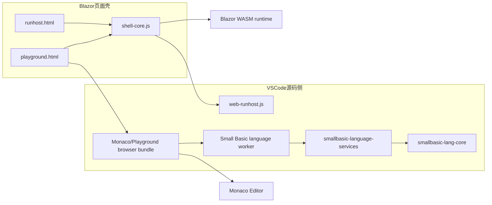

# 12 Web Playground 与 Monaco 集成设计

> **2026-10-01 新增，同日实施落地。**
>
> 目标是在 `runhost/web` 产物中新增 `playground.html`，提供“浏览器内编辑 + 运行”入口；把当前 `index.html` 的纯运行职责沉淀为 `runhost.html`；Monaco 编辑器与 Small Basic 语言能力统一从 `visual_studio_code_plugin/` 下的源码构建并复制过来，避免再造一套网页版语言层。Playground 专属的 Monaco / TextMate / Worker 资源只进入 `runhost/web`，不默认塞入 CLI 与 VSIX 共用的 `runhost/blazor` 载荷。
>
> 关联文档：
>
> - [03-VSCode插件设计.md](./03-VSCode插件设计.md)
> - [05-调试架构设计.md](./05-调试架构设计.md)
> - [09-Blazor后端与RunHost.md](./09-Blazor后端与RunHost.md)
> - [10-WebRunHost.md](./10-WebRunHost.md)
>
> **实施状态（2026-10-01）**：第 15 节实施顺序的 1–5 步与第 6 步的折叠、定义跳转、引用查找均已落地——
>
> - 入口重构：`runhost.html`（原 `index.html`）、薄路由 `index.html`、`shell-core.js` + `runhost-page.js` 拆分、CLI 会话显式指向 `runhost.html`；
> - 共享语言层：`smallbasic-language-services` 中立包（补全 / 悬停 / 签名帮助 / 诊断 / 文档符号 / 语义令牌 / 折叠 / 导航）+ `language.worker.ts` 专用 Worker；
> - Monaco 集成：TextMate + Oniguruma 桥接、language-configuration / snippets 适配、全部 provider 注册、`playground.html` 编辑 + 运行；
> - 构建链：`npm run build:playground` 产出 `playground-dist/**`，`Build-RunHost.ps1` 硬校验并做负向载荷检查；
> - 测试：language-services 单元测试 + `tests/webview/runhost-web.spec.ts` 页面级 E2E；
> - 界面提示按浏览器语言本地化：偏好语言列表中出现任意 `zh-*` 即显示页面内置中文，否则显示英文；页头提供 中/EN 切换按钮，选择存入 `localStorage`（`smallbasic.uiLocale`）并优先于检测（机制见 `shell-core.js` 的 `SmallBasicRunHostShell.applyStaticText` 与各页面文案字典）；语言 Worker 通过 `configure` 请求接收同一 locale 决定，调用 `setDocumentationLocale` 让悬停/补全的 API 文档同步切换；状态栏短关键词（Loaded/Running/Completed 等）保持语言中立。
>
> 页内调试仍为后续阶段（见第 11 节），重命名与常驻 Outline 面板按第 8.2 节边界暂缓。

## 1. 目标与非目标

### 1.1 目标

1. 在最终分发目录 `runhost/web/` 中新增 `playground.html`，作为静态站点默认的“编辑 + 运行”页面。
2. 将当前 `index.html` 的运行页职责下沉为 `runhost.html`，保留其现有 UI、后端选择、输出面板、输入行、JS/Blazor 运行能力。
3. 让 `playground.html` 在视觉和交互上**复用现有 RunHost 页面逻辑与 UI**，只增量叠加 Monaco 编辑器，而不是再做第二套网页壳子。
4. Small Basic 语言能力统一复用 `visual_studio_code_plugin/` 下的源码与构建产物，并通过独立语言 Worker 接入 Monaco，至少覆盖：
   - 语法着色
   - 语义着色
   - 诊断
   - 补全
   - 悬停
   - 签名帮助
   - 文档符号 / Quick Outline
5. 明确折叠、定义跳转、引用、重命名、页内调试等能力的**可行性、边界与分阶段落地方式**，不夸大当前已有能力。
6. 保持构建链单向：**源码只改源目录，不手改 `runhost/web/` 生成物**。
7. 保持载荷边界：Playground 专属依赖不随 `runhost/blazor` 进入 VS Code VSIX，除非未来明确决定让 CLI 宿主也提供 Playground。

### 1.2 非目标

1. 本阶段**不实现** `playground.html`、`runhost.html`、Monaco 集成或页内调试，仅编写设计文档。
2. 本阶段不修改 VS Code / Visual Studio 扩展的现有运行与调试行为。
3. 本阶段不承诺 Small Basic 语言立即支持 Monaco 所有可承接的高级特性；Monaco 提供的是“可挂接能力槽位”，是否可用取决于我们是否提供对应 provider。
4. 本阶段不引入“内嵌完整 VS Code 工作台”作为默认方案；目标是一个轻量、静态、可离线部署的浏览器页面，而不是把网页变成缩小版 vscode.dev。
5. 本阶段不把 `runhost/blazor` 的 CLI 会话入口改成 Playground；CLI 仍直接进入纯运行页。

## 2. 调研结论速览

结合仓库现状、官方历史实现与外部文档，先给出结论，免得后文看着像连续剧：

1. **Monaco 原生可以承接大量编辑能力，但不是完整 IDE，也不是调试器。**
   Monaco 官方 `languages` 命名空间提供了 `registerCompletionItemProvider`、`registerHoverProvider`、`registerSignatureHelpProvider`、`registerDefinitionProvider`、`registerReferenceProvider`、`registerRenameProvider`、`registerFoldingRangeProvider`、`registerDocumentSemanticTokensProvider`、`registerDocumentSymbolProvider` 等 API；这意味着 provider 挂接点齐全。但 `DocumentSymbolProvider` 不会凭空生成 VS Code 那样的常驻 Outline 侧栏，Monaco 也**没有内置 DAP UI、变量窗、调用栈、断点面板**，这些产品界面都要自己做或明确不做。

2. **当前仓库里的 VS Code 插件并没有“全套语言特性”现成可复用。**
   现在已落地的主要是：补全、悬停、签名帮助、语义令牌、文档符号和诊断。折叠 provider、定义跳转、引用、重命名并未实现，因此 `playground.html` 不能靠“接 Monaco 就自动有”。Monaco 在没有 folding provider 时可回退到缩进折叠，但这不等同于 Small Basic 语法感知折叠。

3. **当前代码库已经有两条 Monaco 经验可借鉴，但都不能直接照搬。**
   - `official_repo/online`：旧版 React + Monaco 网页编辑器，已直接注册 Monaco 的 completion / hover provider；优点是轻，缺点是年代老、能力少、与现有插件分叉。
   - `official_repo/editor`：旧版 Blazor + Monaco 方案，也走 Monaco 直连，但围绕旧 C# 编译器与互操作生成代码，和当前 `runhost/web` 的页面壳与构建链不一致。

4. **“直接在网页里运行现有 VS Code 扩展 API”并非不可能，但不应作为第一选择。**
   `@codingame/monaco-vscode-api` 可以把 VS Code service / extension host 能力带入 `monaco-editor`，甚至允许浏览器侧 `import * as vscode from 'vscode'`。但它需要 service override、虚拟文件系统、worker / iframe、本地 extension host 初始化等额外复杂度；对一个静态 RunHost 页面来说，作为保底或二阶段增强方案更合理，而不是基线方案。

5. **页内调试 technically 可行，但不应和“先把编辑器放上去”绑成一坨。**
   当前仓库已经有：
   - JS 侧宿主无关的 `src/debug/engine-driver.ts`
   - 浏览器侧 JS 调试会话 `src/runhost/web-debug.ts`
   - Web 调试协议 `src/web/debug-protocol.ts`
   - Blazor 侧 `Protocol.cs` / `BrowserEngineSession` / `DispatchDebugCommand`
   因此页内调试不是从零开始；但 Monaco 本身不提供原生调试 UI，必须做自定义 gutter、当前行高亮、工具条、变量/调用栈面板，因此建议明确分期。

6. **“复用 VS Code 资产”不等于“原文件可直接交给 Monaco”。**
   `language-configuration.json` 中的正则是 JSON 字符串，而 Monaco 的 `setLanguageConfiguration` 要求 `RegExp`；VS Code snippets 也需要转换成 Monaco completion item。TextMate grammar 则要通过 `vscode-textmate` + `vscode-oniguruma`（或等价桥接）注册 tokenizer，并正确装载 `onig.wasm`。这些都应落在一层可测试的适配代码中。

7. **语言分析必须移出页面主线程。**
   现有 VS Code provider 运行在扩展宿主中；如果照搬到 Monaco 页面，`Compilation`、诊断与语义令牌会默认在 UI 线程执行。Playground 应使用专用 Small Basic language Worker，并用 model URI + version 过滤过期结果；Monaco 自带的 editor worker 不能替代这层语言 Worker。

## 3. 当前基线与约束

### 3.1 现有页面与构建来源

| 产物 / 源码 | 当前职责 | 备注 |
|---|---|---|
| `visual_studio_plugin/src/SmallBasic.Blazor.Client/wwwroot/index.html` | 当前网页入口源码 | 通过 `dotnet publish` 进入 `runhost/blazor/wwwroot`，再被 `runhost/Build-RunHost.ps1` 复制到 `runhost/web/index.html`；当前同时承担 CLI 会话与静态站点入口 |
| `visual_studio_plugin/src/SmallBasic.Blazor.Client/wwwroot/shell.js` | 当前网页壳逻辑 | 管理示例选择、本地文件、后端切换、Run/Stop、输入输出、Blazor 启动 |
| `runhost/web/index.html` | 生成物 | **不是源码，不应直接手改** |
| `visual_studio_code_plugin/packages/smallbasic-vscode/dist/web-runhost.js` | 浏览器 JS 后端 bundle | 被 `runhost/Build-RunHost.ps1` 复制为 `runhost/web/smallbasic-js.js` |
| `runhost/Build-RunHost.ps1` | 组装最终分发 | 先 `dotnet publish` Blazor，再复制 JS bundle，再复制样例 |

### 3.2 当前 VS Code 语言能力真实状态

从 `visual_studio_code_plugin/packages/smallbasic-vscode/src/language/providers.ts` 等源码可确认：

| 能力 | 当前状态 | 现有实现来源 |
|---|---|---|
| 补全 | 已实现 | `CompletionService` + `contextual-completions` |
| 悬停 | 已实现 | `HoverService` |
| 签名帮助 | 已实现 | `signature-help.ts` |
| 诊断 | 已实现 | `Compilation.diagnostics` |
| 文档符号 | 已实现 | `document-symbols.ts`；VS Code 用它展示 Outline，Monaco 侧仍需决定是只提供 Quick Outline，还是另做常驻面板 |
| 语义着色 | 已实现 | `registerDocumentSemanticTokensProvider` |
| 语法感知折叠 | **未实现** | 当前插件没有 `registerFoldingRangeProvider`；编辑器可有缩进折叠回退 |
| 定义跳转 | **未实现** | 当前插件没有 `registerDefinitionProvider` |
| 引用查找 | **未实现** | 当前插件没有 `registerReferenceProvider` |
| 重命名 | **未实现** | 当前插件没有 `registerRenameProvider` |

这点非常重要：后续 `playground.html` 的设计必须严格区分“Monaco 原生可承接的能力”和“Small Basic 语言层已经实现的能力”，不能把两者混成一句“Monaco 全支持”。

### 3.3 历史 Monaco 实现现状

仓库自带的上游历史代码给出两个事实：

1. `official_repo/online/src/app/components/common/custom-editor/` 已证明 Small Basic 语言核心曾直接接入 Monaco，且当年至少落地了：
   - `registerCompletionItemProvider`
   - `registerHoverProvider`
   - `glyphMargin`
   - `deltaDecorations`（诊断与当前行高亮）
2. 这些代码基于旧 UI 和旧工程结构，不能直接拿来当新的网页入口，但可以作为“Monaco 直连轻量方案”的历史参考。

### 3.4 当前语言代码的真实耦合边界

不能把 `providers.ts` 整体当作“可复用语言层”：

- 已经基本中立：`completion-span.ts`、`contextual-completions.ts`、`document-symbols.ts`、`method-signatures.ts`；
- 直接依赖 `vscode`：`providers.ts`、`signature-help.ts`、`compilation-cache.ts`、位置映射与 diagnostics 发布；
- 已经中立且可被浏览器 bundle 使用：`smallbasic-lang-core` 暴露的 `Compilation`、`CompletionService`、`HoverService`、token / syntax / runtime 元数据；
- 仍需抽取：语义令牌分类、诊断 DTO、签名帮助 DTO、缓存与请求协议。

因此实施时应先形成一个不依赖 `vscode` / `monaco` 的语言服务包，再写两个薄适配器，而不是让 Monaco 适配层反向 import `providers.ts`。

## 4. 入口文件与兼容性设计

### 4.1 目标页面角色

| 页面 | 角色 | 是否直接暴露给用户 |
|---|---|---|
| `playground.html` | `runhost/web` 的浏览器内编辑 + 运行主入口 | 是，静态站点默认入口 |
| `runhost.html` | 纯运行页面（保留现有 `index.html` 逻辑和 UI） | 是，也是 CLI 会话入口 |
| `index.html` | 仅 `runhost/web` 需要的轻量分发入口 / 兼容路由页 | 是，保持静态站点根路径稳定 |

### 4.2 `index.html` 的处理原则

用户诉求是“将原来的 `index.html` 改为 `runhost.html`”。如果机械地只做重命名，会直接打断下面这些现有路径：

- `run.bat` / `run.ps1` / `serve.mjs` 默认打开的根页面
- `runhost/Build-RunHost.ps1` 的校验逻辑
- CLI / Blazor 宿主的 fallback 与会话 URL
- 文档中大量“访问 `index.html`”的既有描述

因此设计上建议：

1. **原有页面源码改名为 `runhost.html`**，满足“原始运行页职责被明确命名”的要求。
2. **CLI 宿主显式改用 `runhost.html`**：`BlazorRuntimeServer.GetSessionUrl()` 生成 `/runhost.html?session=...`，`MapFallbackToFile` 也指向 `runhost.html`。这样 CLI 不依赖静态站点路由，更不会因为 Playground 资源未打入 `runhost/blazor` 而进入重定向循环。
3. **`runhost/web` 新增一个极薄的 `index.html`** 作为稳定入口，而不是彻底删掉根入口。
4. `index.html` 只做路由，不承载实际运行逻辑，并用 `location.replace` 保留原 query/hash：
   - 兼容旧链接：`?session=...` 跳转到 `runhost.html`；
   - 显式 `?view=runhost` 时跳转到 `runhost.html`；
   - 其余情况跳转到 `playground.html`；
   - 同时提供 `<noscript>` 下的两个普通链接。

这样既满足“原来运行页改名为 `runhost.html`”，又保持静态站点根入口兼容。CLI 与静态站点的默认页从此不再隐式绑在一起。

### 4.3 源码落点

虽然用户表述的是 `runhost/web/playground.html`，但 `runhost/web/` 仍是生成目录，不接受手工编辑。源码建议按载荷边界拆开：

- `visual_studio_plugin/src/SmallBasic.Blazor.Client/wwwroot/runhost.html`：原 `index.html` 改名，继续进入 `runhost/blazor` 与 `runhost/web`；
- `visual_studio_plugin/src/SmallBasic.Blazor.Client/wwwroot/app.css`、`shell-core.js`、`runhost-page.js`：两页共享的运行壳与纯运行页绑定；
- `visual_studio_code_plugin/packages/smallbasic-vscode/src/playground/`：`playground.html`、薄 `index.html`、Playground 页面入口、Monaco 适配与 Worker 源码；统一构建为 `playground-dist/**`；
- `runhost/Build-RunHost.ps1`：先复制 Blazor 发布的共享壳，再把 `playground-dist/**` 叠加到 `runhost/web`，不叠加到 `runhost/blazor/wwwroot`。

若实现时更希望 HTML 留在 `visual_studio_plugin`，也必须通过项目文件排除 Playground 专属文件的普通 Blazor publish，再由 `Build-RunHost.ps1` 显式复制；不能让 Monaco 资源无意中跟随 VSIX 的 `runhost/blazor/**` 膨胀。

## 5. 方案比较与最终选型

### 5.1 备选方案

| 方案 | 描述 | 复用度 | 复杂度 | 适配 `runhost/web` 静态站点 | 结论 |
|---|---|---:|---:|---:|---|
| A. Monaco Standalone + 共享语言服务 + 专用 Worker + TextMate 桥接 | 页面直接使用 `monaco-editor`；Small Basic 语言算法提取为中立包并在 Worker 中运行；语法着色复用现有 grammar，language config / snippets 经适配后复用 | 高 | 中 | 高 | **推荐** |
| B. Monaco + `@codingame/monaco-vscode-api` 跑最小 VS Code service / extension host | 在浏览器里提供 `vscode` API 兼容层，尽量原样复用现有 `providers.ts` 和扩展注册逻辑 | 很高 | 高 | 中 | 作为增强 / 兜底方案保留 |
| C. 页面内嵌完整 VS Code 工作台 | 把网页做成简化版 vscode.dev | 最高 | 很高 | 低 | 否决 |

### 5.2 选择方案 A 的原因

#### 一、最符合“高效、结构清晰、复用优先”

- Monaco 只负责编辑器壳与 provider 注册；
- Small Basic 语言能力由共享源码与专用 Worker 负责；
- RunHost 壳逻辑继续保留并复用；
- 构建链仍然是“`visual_studio_code_plugin` 统一产出、`Build-RunHost.ps1` 复制到网页分发”，不会在生成目录另起炉灶。

#### 二、不会把 `runhost/web` 变成“半个 vscode.dev”

`runhost/web` 的核心价值是：

- 静态部署
- 无后端依赖
- 双后端（JS / Blazor）浏览器运行
- 页面职责单纯

直接引入完整 VS Code service / workbench 会明显放大心智负担、构建复杂度与静态资源体积。

#### 三、语法着色可以复用现有资产，不必手写第二套规则

方案 A 的“TextMate 桥接”意味着：

- `syntaxes/smallbasic.tmLanguage.json` 继续作为词法高亮来源；
- `language-configuration.json` 继续作为缩进 / 注释 / 配对规则来源，但由构建期或启动期适配器把正则字符串转换成 Monaco 所需的 `RegExp`；
- `snippets/smallbasic.json` 经转换后注册为 completion item，不假设 Monaco 会自动读取 VS Code contribution；
- 语义着色仍来自 Small Basic 自己的语义令牌 provider；
- 网页侧不需要维护一份独立的 Monarch 语法并长期双修。

#### 四、为后续切换到方案 B 保留余地

如果未来强需求是“尽可能一行不改地运行更多现有 VS Code provider / contribution 逻辑”，可以再引入 `@codingame/monaco-vscode-api`。方案 A 的页面壳、运行逻辑、文件结构与构建拷贝流程都不需要推倒重来；变化主要集中在语言层 bootstrap。

### 5.3 不直接选方案 B 的原因

`@codingame/monaco-vscode-api` 的 README 明确说明了它可以把“full VSCode functionality”带进 `monaco-editor`，甚至允许在浏览器里 `import * as vscode from 'vscode'`。但它同时带来了以下结构成本：

1. 需要 service override 初始化，且 `initialize()` 只能调用一次；
2. 建议使用 overlay filesystem / `createModelReference`，模型生命周期比单页 playground 更复杂；
3. 需要额外处理 worker、CSS、TextMate、主题、扩展宿主等问题；
4. README 还专门提到调试 demo 需要额外 debug server，说明“编辑器 + 扩展兼容层”与“运行/调试壳”是两层复杂度；
5. 对 Windows 主开发环境而言，这条路并非不能走，但不适合作为最小闭环的第一步。

一句话概括：**它很强，但不够轻。**

## 6. 源码归属与目录规划

### 6.1 最终产物与源码一一对应

| 最终产物 | 源码归属 | 说明 |
|---|---|---|
| `runhost/web/runhost.html` | `visual_studio_plugin/src/SmallBasic.Blazor.Client/wwwroot/runhost.html` | 现有运行页，保留原逻辑与 UI；同时进入 CLI Blazor 载荷 |
| `runhost/web/playground.html` | `visual_studio_code_plugin/packages/smallbasic-vscode/src/playground/playground.html` | 新增编辑 + 运行页，只进入静态 Web 分发 |
| `runhost/web/index.html` | `visual_studio_code_plugin/packages/smallbasic-vscode/src/playground/index.html` | 轻量兼容路由页，只进入静态 Web 分发 |
| `runhost/web/app.css` | `visual_studio_plugin/src/SmallBasic.Blazor.Client/wwwroot/app.css` | 共享外壳样式 |
| `runhost/web/shell-core.js` | `visual_studio_plugin/src/SmallBasic.Blazor.Client/wwwroot/shell-core.js` | 从现有 `shell.js` 拆出的共享运行壳逻辑 |
| `runhost/web/runhost-page.js` | `visual_studio_plugin/src/SmallBasic.Blazor.Client/wwwroot/runhost-page.js` | 纯运行页绑定逻辑 |
| `runhost/web/playground.js` | `visual_studio_code_plugin/packages/smallbasic-vscode/src/playground/entry.ts` | Playground 页面绑定 + Monaco 入口 |
| `runhost/web/smallbasic-js.js` | `visual_studio_code_plugin/packages/smallbasic-vscode/dist/web-runhost.js` | 现有浏览器 JS 后端 bundle |
| `runhost/web/editor/**` | `visual_studio_code_plugin/packages/smallbasic-vscode/playground-dist/editor/**` | Monaco worker、Small Basic language worker、TextMate / Oniguruma 与字体等资源 |

> 说明：上表里的 `shell-core.js` / `runhost-page.js` 是推荐命名，不要求与当前文件名一模一样；关键是把“共享运行壳”和“页面专属绑定”拆开，并保持 Playground 专属载荷只进入 `runhost/web`。

### 6.2 推荐新增模块

建议新增一个真正中立的 workspace package，避免“共享层”住在扩展包里却不小心 import `vscode`：

```text
visual_studio_code_plugin/packages/
├── smallbasic-lang-core/                 # 现有：编译器、运行时与基础服务
├── smallbasic-language-services/         # 新增：不依赖 vscode / monaco / DOM
│   └── src/
│       ├── service.ts                    # 按 source/version 建 Compilation 与缓存
│       ├── protocol.ts                   # Worker 请求/响应 DTO
│       ├── diagnostics.ts
│       ├── completions.ts
│       ├── hover.ts
│       ├── signature-help.ts
│       ├── document-symbols.ts
│       ├── semantic-tokens.ts
│       ├── folding.ts                    # 后续新增
│       └── navigation.ts                 # 后续新增
└── smallbasic-vscode/
    └── src/
        ├── language/
        │   └── providers.ts              # VS Code 适配层
        ├── monaco/
        │   ├── register-language.ts      # config / grammar / snippets 适配
        │   ├── register-providers.ts     # Monaco 适配层
        │   ├── language-client.ts        # Worker RPC、取消与版本校验
        │   └── textmate.ts
        └── playground/
            ├── entry.ts
            ├── language.worker.ts
            ├── bridge.ts
            ├── playground.html
            └── index.html
```

#### 设计原则

1. `smallbasic-language-services` 不依赖 `vscode`、`monaco`、DOM 或 Node API；只返回可结构化克隆的 DTO。
2. `providers.ts` 继续负责把中性 DTO 映射到 VS Code API。
3. `monaco/register-providers.ts` 负责通过 Worker client 把同一套 DTO 映射到 Monaco API。
4. `language.worker.ts` 是唯一在 Playground 中创建 `Compilation` 的语言分析入口；主线程不直接编译。
5. VS Code 与 Monaco 的坐标边界各自显式转换：编译器 0-based，Monaco 1-based，协议 DTO 固定使用编译器的 0-based 坐标。
6. Worker 返回值必须带 model URI + version；主线程丢弃与当前 model version 不匹配的结果。

## 7. 页面与运行时架构



### 7.1 页面职责拆分

#### `runhost.html`

- 完整保留现有 `index.html` 的结构与逻辑：
  - Program 选择
  - 选择本地 `.sb`
  - Backend 切换
  - Run / Stop
  - 状态栏
  - 输出 / 输入 / Blazor 图形面板
- 继续承担 CLI 会话模式（`?session=`）的宿主页。
- 不加载 Monaco 相关静态资源。

#### `playground.html`

- 复用 `runhost.html` 的页头、运行控制、输出面板、输入行与 Blazor 图形面板。
- 在主体区域新增 Monaco 编辑器 pane。
- 运行来源改为“当前编辑器 model 文本”，而不是仅依赖 `state.program.source`。
- 示例选择、本地打开行为从“直接运行文件”改为“把文件装入编辑器”。
- 通过 `type="module"` 加载 `playground.js`；所有 Worker 与 WASM URL 以 `import.meta.url` 解析，保证子目录部署不依赖站点根路径。

### 7.2 UI 布局建议

建议采用“两栏 + 响应式回退”布局：

- 宽屏：左侧 Monaco 编辑器，右侧输出 / 图形 pane；
- 窄屏：上编辑器、下输出；
- 页头沿用现有 `web-header` 风格，新增的 editor 操作放在 Program / Backend / Run 之间，不重做整套导航；
- 主体使用稳定的 CSS Grid 尺寸约束，编辑器容器设明确 `min-width` / `min-height`，并通过 `ResizeObserver` 调用 `editor.layout()`，避免输出或图形内容变化时挤压错位；
- New / Open / Save 优先使用熟悉的图标按钮，并提供 `aria-label`、tooltip 与可见焦点；Run / Stop 保留现有语义与禁用状态。

#### 建议新增按钮

| 按钮 | 作用 |
|---|---|
| `New` | 清空编辑器并装入模板 |
| `Open` | 打开本地 `.sb` 文件到编辑器 |
| `Save` | 把当前内容下载为 `.sb` |
| `Run` / `Stop` | 完全沿用当前运行行为 |

其中 `Open` / `Run` 可以复用现有本地文件选择和程序装载逻辑；`Save` 只是 `playground.html` 新增。

### 7.3 运行逻辑复用方式

当前 `shell.js` 已经管理了：

- Program 列表
- 本地文件装载
- JS / Blazor 后端切换
- 输出镜像
- 输入阻塞
- Stop 行为
- Blazor 按需启动

推荐把这些逻辑提炼成 `shell-core.js`，通过工厂创建页面实例，避免把更多可变状态挂到 `window`。接口语义例如：

- `createRunHostController({ getProgramSnapshot, outputView, diagnosticsView })`
- `controller.loadProgramList()`
- `controller.selectBackend()`
- `controller.run()`
- `controller.stop()`
- `controller.dispose()`

这样：

- `runhost-page.js` 只负责把“示例列表 / 本地文件”的数据源传给核心；
- `playground.js` 只负责把 Monaco model 的**运行时快照**交给核心，并在语言 diagnostics 变化时更新 markers / 摘要。

运行开始时必须一次性抓取 `{ name, source, modelVersion }`。运行期间继续编辑不会改变正在执行的源码；状态栏应提示“运行的是 version N”。如果未来启用页内调试，则编辑会导致行号映射失效，设计上应在首次修改时自动终止调试会话，而不是让断点继续绑定旧源码。

## 8. 语言能力复用设计

### 8.1 总体策略

语言能力的单一事实来源（single source of truth）放在 `visual_studio_code_plugin/packages/smallbasic-language-services/`，而不是 `runhost/web/` 或 Monaco adapter。

复用链路如下：

1. `smallbasic-lang-core` 继续承载编译器、运行时、Completion/Hover 等核心能力；
2. `smallbasic-language-services` 承载中性 DTO、缓存与面向编辑器的组合算法；
3. VS Code 适配层在扩展宿主中直接消费该包；
4. Monaco 适配层通过 `language.worker.ts` 消费该包；
5. `playground.html` 主线程只加载 Monaco adapter，编译与索引留在 Worker。

### 8.2 能力矩阵

| 能力 | Monaco 原生是否有挂接点 | 当前仓库 Small Basic 是否已有实现 | `playground.html` 目标策略 |
|---|---|---|---|
| 语言注册 | 有 | 有（VS Code `language id = smallbasic`） | 复用同一语言标识与配置 |
| 注释 / 缩进 / 括号规则 | 有（`setLanguageConfiguration`） | 有（`language-configuration.json`） | 经 adapter 把正则字符串转换为 `RegExp` 后复用 |
| 词法高亮 | 有（TokensProvider / Monarch；TextMate 需桥接） | 有（VS Code TextMate grammar） | 用 `vscode-textmate` + `vscode-oniguruma` 桥接 grammar，不维护第二套规则 |
| 语义高亮 | 有（`registerDocumentSemanticTokensProvider`） | 有 | 提取 shared 令牌映射并复用 |
| 补全 | 有 | 有 | 直接共享核心算法 |
| 悬停 | 有 | 有 | 直接共享核心算法 |
| 签名帮助 | 有 | 有 | 直接共享核心算法 |
| 诊断 | 有（`setModelMarkers`） | 有 | Worker 计算 DTO，主线程按独立 owner 写 markers |
| 文档符号 | 有 | 有 | 共享核心算法；一阶段提供 Quick Outline / Go to Symbol，不承诺常驻 Outline 面板 |
| Snippets | 通过 completion item 承接 | 有（VS Code snippet JSON） | 转换 snippet body / prefix / description 后注册，不会自动生效 |
| 折叠 | 有，且无 provider 时可按缩进回退 | **无语法 provider** | 一阶段接受缩进折叠；二阶段新增 shared folding provider 以获得 VS Code / Monaco 一致性 |
| 定义跳转 | 有 | **无** | 新增 shared navigation provider |
| 引用查找 | 有 | **无** | 新增 shared navigation provider |
| 重命名 | 有 | **无** | 依赖 navigation + workspace edit，再决定是否做 |
| 选择范围 / 高亮同名 | 有 | 无 | 可作为后续增强 |
| 断点 gutter / 当前行高亮 | Monaco 有 decorations / glyph margin 基础能力 | 调试协议已有，页面 UI 未做 | 调试研究阶段处理 |
| 变量 / 调用栈 / Debug Console | Monaco **无内置原生 UI** | VS Code 调试链已有 | 必须自定义，不在编辑器原生范围内 |

### 8.3 现有代码的抽取边界

推荐把以下能力从“VS Code API 直接拼装”改为“先产出中性结果，再分别映射”：

| 现有位置 | 现状 | 建议改造 |
|---|---|---|
| `providers.ts` 补全拼装 | 直接 new `vscode.CompletionItem` | 抽出排序、去重、替换区间与 DTO；VS Code / Monaco 只映射 API 类型 |
| `CompletionService` / `HoverService` | 核心计算已中立，包装仍在 `providers.ts` | 在 language-services 中统一返回 completion / hover DTO |
| `signature-help.ts` | 直接依赖 `vscode.TextDocument` / `vscode.SignatureHelp` | 复用中立的 `method-signatures.ts`，把结果 DTO 移到 language-services |
| `document-symbols.ts` | 已基本独立 | 移到 language-services 或由其导出，两个适配器共用 |
| `CompilationCache` | 以 `vscode.TextDocument.version` 为键 | 抽成以 URI + version + source 为输入的中立缓存；Worker 与 VS Code 各自管理生命周期 |
| semantic tokens 构造 | 直接 `vscode.SemanticTokensBuilder` | 抽出语义分类与 0-based token DTO；VS Code / Monaco 各自组装数据 |
| diagnostics 发布 | 直接创建 `vscode.Diagnostic` | 抽出 range / message / severity DTO；两端分别映射 |

### 8.4 语法着色推荐策略

#### 推荐：复用现有 TextMate grammar + 语义令牌

原因：

1. 当前 VS Code 已有 `syntaxes/smallbasic.tmLanguage.json`；
2. Small Basic 关键字集合不大，但如果再维护一份 Monarch 规则，长期一定会漂移；
3. `playground.html` 追求的是和 VS Code 插件**尽量同感**，而不是“差不多”。

因此建议：

- 词法层：用 `vscode-textmate` 读取现有 `tmLanguage`，用 `vscode-oniguruma` 加载随包分发的 `onig.wasm`，注册 Monaco tokens provider；
- 语义层：继续由 Small Basic 编译器判定 `class/function/variable`；
- 主题层（实施修订，2026-10-02）：**不要**给 TextMate registry 配独立 `IRawTheme` 并 `setColorMap`——颜色字符串不带 `#` 时 vscode-textmate 会丢弃整张表（实测 `getColorMap()` 回退为 `[null, "#000000", "#FFFFFF"]`），而 Monaco `Color.fromHex` 对非法值静默回退 `Color.red`，两张表极易漂移。实际落地为：TextMate 只产出 scope（取最内层 scope 字符串，Monaco 主题匹配只消费点分字符串），颜色统一由 `monaco.editor.defineTheme` 的 rules + colors 决定（Dark Modern 编辑器配色 + Dark+ token 色），单一颜色来源；
- 配置层：构建时校验、启动时读取 `language-configuration.json`，显式转换 `wordPattern`、`indentationRules` 等正则字段；
- snippets 层：读取 `snippets/smallbasic.json`，转换为 Monaco snippet completion item，并与语义补全做大小写不敏感去重；
- 离线边界：以上脚本、字体、grammar、snippet 与 WASM 都随 `runhost/web` 分发，运行时不访问 CDN。

启动顺序应是：注册 language id 与配置，加载 `onig.wasm` / grammar / token color map，注册 providers，最后创建 model 与 editor。初始化期间显示固定尺寸的 loading 状态，避免先按纯文本渲染再闪烁重排。

#### 备选：Monarch 兜底

如果 TextMate 桥接在工程上超出预期，也可以先用一份很小的 Monarch 规则做词法高亮，再叠加语义令牌；但这只作为落地兜底，不作为长期推荐路径。

### 8.5 Small Basic language Worker 协议

Monaco 的 editor worker 只负责编辑器内部服务，不会替我们运行 Small Basic 编译器。建议单独构建 `language.worker.js`，最小协议如下：

| 请求 | 输入 | 输出 |
|---|---|---|
| `sync` | `uri`、`version`、完整 `source` | 对应版本的 diagnostics / semantic tokens 就绪通知 |
| `completion` | `uri`、`version`、0-based position | completion DTO |
| `hover` | `uri`、`version`、0-based position | hover DTO |
| `signature` | `uri`、`version`、0-based position | signature DTO |
| `symbols` | `uri`、`version` | document symbol DTO |
| `dispose` | `uri` | 释放 Compilation 与索引缓存 |

第一阶段是单 model，全文 `sync` 足够简单可靠；不必过早实现增量文本协议。主线程对 `sync` 做约 150ms debounce，但 completion / hover 等交互请求必须先确保 Worker 已同步到当前 version。所有响应带 `requestId`、`uri`、`version`：Monaco cancellation token 被取消，或 model version 已变化时，adapter 直接丢弃响应。Worker 异常时清空该 owner 的 markers、禁用语言增强并显示一次可恢复错误，不能影响 Run / Stop。

### 8.6 生命周期与 provider 细节

- 所有 `register*Provider`、model listener、Worker client 都保存 `IDisposable`，页面卸载时统一释放；
- semantic tokens provider 实现 Monaco 要求的结果释放回调，不长期持有旧 token 数组；
- markers 使用固定 owner（例如 `smallbasic.language`），运行期错误使用另一个 UI 通道，互不清除；
- 页面生命周期内只创建一个 URI 为 `file:///program.sb` 的 model；逻辑文件名作为独立元数据用于状态栏、运行名与下载名，不能为改名重建同 URI / 同 version 的 model；
- completion provider 只把 `.` 作为 Monaco trigger character，普通标识符输入依赖 Monaco 的 quick suggestions；不要照搬 VS Code 适配层把 A-Z / a-z 全注册为 trigger；
- provider 返回 Markdown 时默认禁止原始 HTML / command URI，只展示受控文本。

## 9. 构建与复制链路

### 9.1 总体原则

- **所有共用编辑器能力都从 `visual_studio_code_plugin/` 统一构建出来。**
- `runhost/web/` 只接收复制结果，不持有手写业务源码。
- Playground 专属的 Monaco / TextMate / Worker 资源只复制到 `runhost/web/`。`runhost/blazor/wwwroot/` 是 CLI 与 VSIX 共用载荷，维持纯运行页，避免把大型编辑器依赖重复打入扩展。

### 9.2 推荐构建产物

建议在 `visual_studio_code_plugin/packages/smallbasic-vscode/` 新增一个独立 browser build 输出目录，例如：

```text
playground-dist/
├── index.html
├── playground.html
├── third-party-notices.txt
├── playground.js
└── editor/
    ├── editor.worker.js
    ├── language.worker.js
    ├── onig.wasm
    ├── language-configuration.json
    ├── grammar/...
    ├── snippets/...
    └── fonts/...
```

说明：

- 现有 `dist/` 继续放扩展 bundle（`extension.js` / `web/extension.js` / `runhost.js` / `web-runhost.js`）；
- `playground-dist/` 放仅供静态网页消费的编辑器资源，避免把所有 Monaco 静态资源都塞进 VSIX 的 `dist/**` 或 `runhost/blazor/**`；
- `monaco-editor`、`vscode-textmate`、`vscode-oniguruma` 使用锁定版本，并把适用的许可证汇总到 `third-party-notices.txt`；
- 当前工程使用 tsup/esbuild，不假设 Vite 的 `?worker` 语义。Monaco editor worker 与 Small Basic language worker 应作为显式 entry 构建，入口用 `new URL(..., import.meta.url)` 或构建生成的 manifest 定位。
- 增加专用 `build:playground` 脚本：先清理 `playground-dist`，再构建 ESM 主入口与两个 Worker，最后复制 HTML、grammar、language configuration、snippets、`onig.wasm`、字体和 notices；任何静态资产缺失都使构建失败。不要依赖 tsup 自动复制非代码资源。

### 9.3 `Build-RunHost.ps1` 的目标复制顺序

推荐的最终装配顺序：

1. `dotnet publish SmallBasic.Blazor.RunHost` 生成 `runhost/blazor/`；其 `wwwroot` 保留纯运行页、共享壳、启动脚本与 Blazor runtime，但不包含 Playground 专属资产；
2. 只要没有 `-SkipWeb`，就执行 Web 前端构建，生成 `dist/web-runhost.js` 与 `playground-dist/**`。这不能受当前 `-SkipJavaScript` 分支控制，否则一次干净构建可能得到缺少 Playground bundle 的 `runhost/web`；
3. 新建 `runhost/web/`，复制 `runhost/blazor/wwwroot/**` 作为共享运行基础；
4. 把 `dist/web-runhost.js` 复制为 `runhost/web/smallbasic-js.js`；
5. 把 `playground-dist/index.html`、`playground.html`、`playground.js`、`editor/**` 和 notices 叠加到 `runhost/web/`；
6. 最后复制样例并生成 `samples/index.json`；
7. 对所有必需资源做硬校验；缺少 Web bundle 时构建失败，不再只 warning 后产出半功能站点。

当前 `-SkipJavaScript` 同时承担“跳过 Node.js 宿主”和“跳过 npm build”两种含义，不适合新增 Playground 后继续沿用。实现时应拆成明确语义：Web 分发需要前端构建；该开关最多只跳过 `runhost/javascript` 的 Node.js 产物。

### 9.4 构建产物校验

`runhost/Build-RunHost.ps1` 在未来应把关键文件校验从当前的：

- `index.html`
- `shell.js`
- `app.css`
- `run.bat`
- `run.ps1`
- `samples/index.json`
- `_framework/blazor.webassembly.js`

扩展为：

- `index.html`
- `runhost.html`
- `playground.html`
- `app.css`
- `shell-core.js`
- `runhost-page.js`
- `playground.js`
- `smallbasic-js.js`
- `editor/editor.worker.js`
- `editor/language.worker.js`
- `editor/onig.wasm`
- `editor/language-configuration.json`
- grammar / snippets / fonts / third-party notices
- `samples/index.json`
- `_framework/blazor.webassembly.js`

另加一条负向校验：`runhost/blazor/wwwroot` 不应出现静态站点路由 `index.html`、`playground.html`、`editor/**` 或 `onig.wasm`。这条测试能阻止 CLI fallback 再次被路由页接管，也能防止 Playground 依赖无意间膨胀 VSIX。

## 10. `playground.html` 页面行为设计

### 10.1 编辑器模型

建议用“单活动模型”作为第一阶段设计：

- 示例选择：把示例文件内容装入当前 model；
- 打开本地文件：把本地文件内容装入当前 model；
- 运行：永远运行当前 model 内容；
- Save：把当前 model 内容导出。

页面启动时创建唯一的 `file:///program.sb` model，并在整个页面生命周期内复用；装入示例或本地文件时清理 markers、用 `model.setValue()` 更新内容，再立即把新的递增 version 同步给 Worker。逻辑文件名独立保存，不参与缓存键。只有页面卸载时才 dispose model / Worker 缓存，这样旧响应不可能因“同 URI + 重置后的同 version”撞到新文件。页面维护 `dirty` 状态：示例 / 本地文件刚装入时为 clean，用户编辑后为 dirty；New、Open 或切换示例覆盖未保存内容前都需要确认。

这样能最大限度复用现有“单页单程序”假设，不急着引入多标签、多文件工作区。

### 10.2 程序来源优先级

`playground.html` 中，程序来源从高到低建议为：

1. 当前 Monaco model 文本（真正运行源）
2. 最近选择的样例或本地文件名（仅作显示名 / 下载名 / 状态提示）
3. 没有文件名时回退为 `program.sb`

也就是说，“程序选择器”在 Playground 里变成“装入模板/样例”的入口，而不是“直接运行该文件”的入口。

点击 Run 时获取一次不可变快照；运行结束前后续编辑只影响下一次运行。Save 使用当前 model，不使用运行快照。

### 10.3 诊断与运行时错误显示

页面中的 diagnostics 区域继续承担两类错误：

1. **编辑期诊断**：来自 language Worker，显示为 Monaco markers + 页面顶部/侧边摘要；
2. **运行期错误**：来自 JS/Blazor 后端，与当前 `runhost.html` 一样显示在 diagnostics 区域。

两者不能互相覆盖：

- 编译错误优先属于“编辑期”；
- 运行异常属于“执行期”；
- 页面上应该能区分来源，不要都挤成同一段纯文本。

markers 只接受当前 model version 的结果；装入新内容、Worker 重启或 model dispose 时立即清理。Run 不必强制等待防抖诊断，但运行后端仍以自己的编译结果为准，避免“界面显示无错误”被误当成执行许可。

## 11. 调试研究：页面支持是否可行

### 11.1 结论

**可行，但不是 Monaco 原生能力。**

更准确地说：

- **页内调试能力本身可做**；
- **Monaco 可以承载断点图标、当前行高亮、跳转定位等编辑器表面能力**；
- **但 Monaco 不自带 DAP UI，不自带变量窗/调用栈/Debug Console**；
- 因此要做页内调试，必须在 Monaco 之外补一套轻量调试壳。

### 11.2 可复用的现有调试资产

#### JavaScript 后端

当前仓库已有：

- `visual_studio_code_plugin/packages/smallbasic-vscode/src/debug/engine-driver.ts`
- `visual_studio_code_plugin/packages/smallbasic-vscode/src/runhost/web-debug.ts`

这意味着：

- JS 后端在浏览器页内已经有“调试驱动 + 浏览器会话”这套组合；
- `smallbasic-js.js` 已导出 `SmallBasicWeb.debugStart` / `debugCommand` / `debugStop`，`playground.html` 若要接页内调试，不需要重写执行引擎；
- 仍需新增页面侧 debug controller，消费 `SmallBasicWebHost.notify` 的 ready / stopped / input / terminated / breakpoint validation 事件；现有 `shell.js` 只更新少量状态，不能直接充当完整调试 UI。

#### Blazor 后端

当前仓库已有：

- `visual_studio_code_plugin/packages/smallbasic-vscode/src/web/debug-protocol.ts`
- `visual_studio_plugin/src/SmallBasic.Blazor.Shared/Protocol.cs`
- `SmallBasic.Blazor.Client/Runtime/WebRunHost.cs`
- `BrowserEngineSession` / `WebShellTransport`

这意味着：

- Blazor WASM 侧已经有“页面内引擎 + 调试协议 + 宿主命令通道”的基础设施；
- VS Code Webview 调试只是它当前最成熟的消费者；
- `playground.html` 将来可以成为第二个消费者，但要复用/抽取 `vscode-webview.js` 中的协议胶水，不能让页面各自复制一份 JSON 分支；
- JS / C# 两端协议类型当前分别存在，真正落地前应增加共享协议契约测试，保证 version、事件字段与行号基准一致。

### 11.3 页面若支持调试，需要新增的 UI 与协议对接

| 组件 | 是否 Monaco 原生提供 | 需要我们做什么 |
|---|---|---|
| 行号 gutter 断点图标 | 否（但有 glyph margin / decorations 基础能力） | 自己处理点击、断点状态与样式 |
| 当前执行行高亮 | 否（但有 decorations） | 自己维护当前行装饰 |
| Continue / Pause / Step In / Step Over / Step Out | 否 | 自己做工具条，调用现有 debug command |
| Variables 面板 | 否 | 展示当前快照中的变量树 |
| Call Stack 面板 | 否 | 展示当前帧栈 |
| 程序输入 | 否 | 复用现有 TextWindow 输入通道 |
| Debug Console / 表达式求值 | 否 | 当前 Web 协议没有通用 evaluate 命令；一阶段最多查询 stopped snapshot 中已有变量，完整表达式求值需扩协议 |
| 断点吸附回显 | 否 | 按运行时返回的已校验行更新断点显示 |

行号转换必须集中在页面 debug adapter：Monaco 行号是 1-based，现有 Web 调试协议内部是 0-based。断点发送、当前行 decoration、调用栈跳转都不能各自散落 `+1/-1`。

### 11.4 推荐定位

推荐把“页内调试”定义为 **Playground 的二阶段增强能力**，而不是和“先把编辑器加上”同阶段完成。

#### 原因

1. 编辑器接入本身已经涉及：
   - 页面入口改造
   - 语言能力抽取
   - 构建产物新增
   - 静态资源复制链变化
2. 页内调试还要再叠加：
   - 自定义调试 UI
   - JS / Blazor 两套调试入口接驳
   - 会话状态机与错误恢复
3. 当前 VS Code Web 调试已经可用；页内调试的价值在“脱离 IDE 的单页体验”，而不是替代 IDE。

#### 建议边界

- 一阶段：`playground.html` 只做**编辑 + 运行**；
- 二阶段：新增断点与单步；
- 三阶段：再考虑变量树 / 调用栈 / 条件断点 UI。当前条件断点只有 JavaScript 后端执行，Blazor 后端尚不支持，UI 必须按 backend 明示能力而不是静默忽略。

### 11.5 与 10 号文档的关系

[10-WebRunHost.md](./10-WebRunHost.md) 当前明确写的是：独立静态站点继续只提供 Run/Stop，不增加断点、单步、变量、调用栈等调试 UI。

本文对这一点的处理是：

- **当前实现不变**；
- **本文只证明未来可行性并给出设计预案**；
- 如果后续确认要做页内调试，应以本文为基础，届时同步修订 10 号文档中的产品边界描述。

## 12. 性能与加载策略

### 12.1 强制要求

1. `runhost.html` 不能因为新增 Playground 而变慢。
2. `playground.html` 之外的页面不加载 Monaco 资源。
3. Blazor WASM 仍保持按需加载；Monaco 的引入不能破坏当前 JS/Blazor backend 的 lazy-load 边界。
4. Small Basic 编译、诊断、语义令牌与文档符号不在页面主线程执行。
5. `runhost/blazor` 与 VSIX 不携带 Playground 专属资源。

### 12.2 具体策略

| 项 | 策略 |
|---|---|
| Monaco 主包 | 仅 `playground.html` 引入 |
| Monaco editor worker | 独立产物，按需由编辑器拉起；URL 相对 bundle 解析 |
| Small Basic language worker | 独立产物；维护单 model Compilation 缓存，响应带 version |
| TextMate / Oniguruma 资源 | 仅 `playground.html` 引入 |
| Blazor WASM | 保持当前仅在选择 / 自动切换到 Blazor backend 时加载 |
| 编译/诊断 | Worker 内缓存 + 150ms 左右防抖；丢弃旧 version 结果 |
| 样例文件读取 | 继续按需 fetch，不在首屏一次性全量加载源码 |
| 离线运行 | 禁止 CDN；Playwright 记录并断言没有跨源网络请求 |
| 体积回归 | 构建日志记录 Playground 主 bundle、Worker、WASM 的原始与 Brotli 大小；评审时对异常增长设门槛，不把未使用的 Monaco 内置语言打包进来 |

## 13. 测试与验收建议

### 13.1 单元测试

建议在 `visual_studio_code_plugin` 侧新增测试，验证 shared 语言层与两个适配器的一致性：

- 同一份源码输入，VS Code 适配器与 Monaco 适配器得到同语义补全项；
- 同一份源码输入，hover / signature / diagnostics / document symbols 结果一致；
- folding / navigation 新增后也要进 shared 层测试，而不是只测某个 UI 壳。
- `language-configuration.json` 的所有正则字段都被正确转换，非法正则在构建期失败；
- snippet 转换保留 tab stop / placeholder，并与语义补全按 Small Basic 大小写不敏感规则去重；
- Worker 响应乱序时，旧 model version 的 diagnostics / semantic tokens 不会覆盖新结果；
- Monaco / Worker 的 1-based 与 0-based 坐标转换覆盖首行、行尾和多行 range。

### 13.2 页面级测试

建议覆盖：

1. `index.html` 路由：
   - 默认进入 `playground.html`
   - `?session=` 进入 `runhost.html`
   - query/hash 与子目录部署保持正确
2. `runhost.html` 回归：
   - 现有样例选择、Run/Stop、JS/Blazor 输出行为不变
3. `playground.html`：
   - Monaco 成功加载
   - 示例装入编辑器后运行成功
   - 本地文件装入编辑器后运行成功
   - 编辑后重新运行的是新文本而不是旧缓存
   - 诊断与运行错误显示不互相踩踏
   - 连续快速输入不会出现旧 diagnostics 回写
   - 编辑期间页面主线程保持可交互
   - `New` / `Open` 覆盖 dirty model 前会确认，Save 导出当前文本
4. 分发边界：
   - `runhost/web` 包含完整 editor / worker / WASM 资源且无跨源请求
   - `runhost/blazor/wwwroot` 不包含薄 `index.html` 或 Playground 专属资源
   - 干净目录下用 `-SkipJavaScript` 但不 `-SkipWeb` 时，仍能构建完整 Web 站点

### 13.3 验收标准

| 维度 | 验收条件 |
|---|---|
| 入口兼容 | 静态站点的原 `run.bat` / `run.ps1` / `serve.mjs` 仍可从根入口工作；CLI 会话显式进入 `runhost.html` |
| 运行回归 | `runhost.html` 行为与旧 `index.html` 一致 |
| 编辑器基础能力 | 至少有着色、诊断、补全、悬停、签名帮助、文档符号 |
| 共享源码 | 语言能力来源于 `visual_studio_code_plugin/`，没有网页侧手写第二套业务逻辑 |
| 构建链清晰 | `runhost/web` 继续为生成目录，不需要手工维护 |
| 交互性能 | 语言分析在 Worker 中完成，快速编辑不会被同步 Compilation 阻塞或被旧结果覆盖 |
| 分发体积 | Playground 专属依赖不进入 `runhost/blazor` / VSIX |

## 14. 风险与对策

| 风险 | 影响 | 对策 |
|---|---|---|
| 手工改了 `runhost/web` 生成物 | 下次构建全丢失 | 文档中明确 `wwwroot` / `visual_studio_code_plugin` 才是源码源头 |
| 为 Monaco 再写一套语言逻辑 | VS Code / 网页结果漂移 | 抽 shared 层，VS Code / Monaco 只保留适配器 |
| 语法高亮维护两套（TextMate + Monarch） | 长期漂移 | 优先复用现有 grammar，Monarch 只作兜底 |
| 把 VS Code JSON contribution 当成 Monaco 配置直接加载 | 正则、snippet 或主题行为失效 | 对 language config / snippets / TextMate theme 分别做显式 adapter 与契约测试 |
| 在页面主线程构建 `Compilation` | 输入卡顿、语义结果乱序 | 专用 language Worker + URI/version/requestId + cancellation |
| 把页内调试和编辑器接入同时做 | 范围失控 | 明确分阶段，先编辑+运行，后调试 |
| 入口直接从 `index.html` 改名 | 破坏已有脚本 / 文档 / 会话链路 | 保留薄 `index.html` 兼容路由 |
| 把 editor 复制进 `runhost/blazor` | CLI 与 VSIX 体积显著增加 | Playground 资源只叠加到 `runhost/web`，增加负向分发测试 |
| `-SkipJavaScript` 跳过了 Web 前端构建 | 干净构建产出半功能站点 | 将 Web 前端构建条件与 Node.js 宿主开关拆开，缺资源时硬失败 |
| 直接引入完整 VS Code service 层 | 资源体积与初始化复杂度飙升 | 第一阶段用轻量 Monaco 直连方案，兼容层只做保底 |

## 15. 推荐实施顺序（后续真正开发时）

1. **入口重构**
   - 把现有 `index.html` 源码改名为 `runhost.html`
   - CLI 会话 URL 与 fallback 显式改为 `runhost.html`
   - 在 Playground 构建产物中新增薄 `index.html`
   - 把 `shell.js` 拆成共享核心 + 页面绑定
2. **共享语言服务与 Worker**
   - 建立 `smallbasic-language-services` 中立包
   - 把 diagnostics / completion / hover / signature / symbols / semantic tokens 抽成 DTO
   - 建立 Worker 协议、version / cancellation 与异常降级
3. **编辑器最小闭环**
   - 加入 Monaco
   - 先复用现有：诊断、补全、悬停、签名帮助、文档符号、语义令牌
   - 让 `playground.html` 能编辑并运行
4. **语法与配置对齐**
   - 通过显式 adapter 复用 grammar、language configuration、snippets 与主题色图
5. **构建与分发收口**
   - 修正 `-SkipJavaScript` 与 Web 前端构建条件
   - editor 资源只进入 `runhost/web`
   - 加入许可证、完整性与负向载荷校验
6. **缺失语言特性补齐**
   - 折叠
   - 定义跳转 / 引用 / 重命名（如确有价值）
7. **调试预研落地**
   - 先 JS 页内断点 / 单步
   - 再 Blazor 页内断点 / 单步
   - 最后再看变量树 / 调用栈 / 条件断点 UI

## 16. 最终建议（一句话版）

**推荐把 `playground.html` 做成“现有 RunHost 页面 + Monaco 编辑器 + 独立语言 Worker + VS Code/Monaco 共用语言服务”的增量演进，而不是把 `runhost/web` 直接升级成一套迷你 VS Code。**

这样既满足：

- 页面能编辑、着色、提示、运行；
- 共用 VS Code 插件源码与构建产物；
- 结构清晰、维护成本可控；
- 输入过程不被同步编译阻塞，且不会把 Monaco 载荷塞进 CLI / VSIX；
- 将来如果真要做页内调试，也能沿用现有 Web 调试协议继续长出来。

## 17. 外部调研参考

以下外部资料已用于本设计评估：

1. [Monaco Editor API：`languages` 命名空间](https://microsoft.github.io/monaco-editor/typedoc/modules/editor_editor_api.languages.html)：确认 completion、hover、definition、reference、rename、folding、semantic tokens、document symbols、signature help 等 provider 挂接点。
2. [Monaco Editor API：`LanguageConfiguration`](https://microsoft.github.io/monaco-editor/typedoc/interfaces/editor_editor_api.languages.LanguageConfiguration.html)：`wordPattern` 与 indentation rules 使用 `RegExp`，因此 VS Code JSON 中的字符串正则需要转换。
3. [Monaco 官方 `integrate-esm.md`](https://github.com/microsoft/monaco-editor/blob/main/docs/integrate-esm.md)：确认 Monaco worker 需要由 bundler 显式产出并通过 `MonacoEnvironment` 定位。
4. [Monaco Editor API：`setTokensProvider`](https://microsoft.github.io/monaco-editor/typedoc/functions/editor_editor_api.languages.setTokensProvider.html)：确认词法 tokens provider 可以与 document semantic tokens provider 叠加。
5. [`vscode-textmate`](https://github.com/microsoft/vscode-textmate) 与 [`vscode-oniguruma`](https://github.com/microsoft/vscode-oniguruma)：确认 TextMate grammar 的加载方式、Oniguruma binding 与 `onig.wasm` 依赖。
6. [`@codingame/monaco-vscode-api` README](https://github.com/CodinGame/monaco-vscode-api)：确认它可以提供 VS Code API、扩展与 service override，同时也带来 overlay filesystem、extension host、worker / iframe 与一次性初始化等额外复杂度。

---

如果后续真的开始实现，建议先锁定本文第 4、6、8、9 节的入口、包边界、Worker 协议与分发规则，再进入 UI 开发。这样可以避免在页面做完后才发现语言服务占用主线程，或 Monaco 资源已经被无意打进整个 VSIX。
